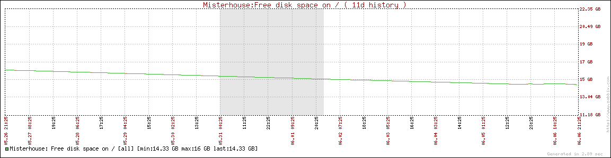

Lesson learned today: always monitor a machine you intend to let run without interruptions for a long time. And that includes home automation hardware.

I have described [elsewhere](/smartbuildings/debian-installation-on-a-soekris-embedded-pc) the steps to install Debian on an embedded PC. I'm still working on this project and intend to soon install the open-source Misterhouse software on it. But first I wanted to get a feel for how the machine's resources (mainly disk and memory) evolve over time.

So I scouted for open-source monitoring software. There's a great [comparison](http://en.wikipedia.org/wiki/Network_monitoring_comparison) on Wikipedia of different monitoring software (some proprietary), but my feeling was that it essentially boiled down to [Cacti](http://www.cacti.net/) and [Zabbix](http://www.zabbix.com/), both of which are variations on the PHP+MySQL+Agent theme. I knew Cacti from a previous project so I installed Zabbix on my Soekris box.

Good thing that I did. As you can see on the graph below, over a period of just 10 days the available disk space had shrunk by almost 2 Gb. Now this sort of thing happens almost always somewhere under /var, and indeed, it was caused by MySQL's habit of logging every single data-altering statement in so-called bin files under /var/log/mysql.

After commenting out the relevant lines in /etc/mysql/my.cnf the problem went away, but I had to restart the Zabbix server (without loss of data of course). And I'm sure the reader will notice the irony of MySQL being the cause of this decrease of disk space, when MySQL was installed together with Zabbix in order to monitor the system for such problems. Oh well.

