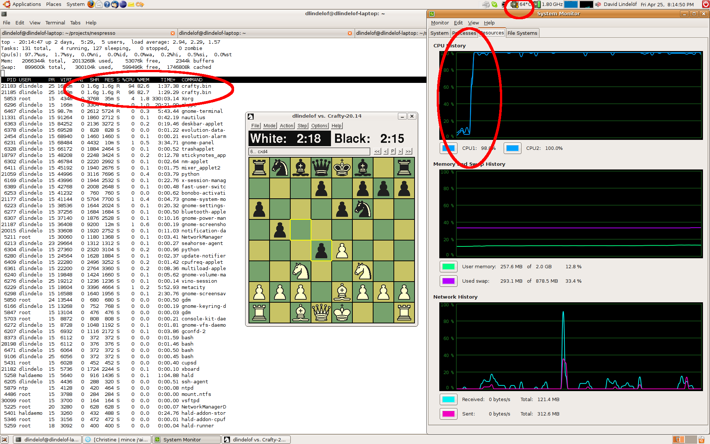

Kinda offtopic, but I'm also an avid chessplayer, so...

[Crafty](http://www.craftychess.com/) is [recognized](http://www.linux.com/feature/60859) as one of the strongest open-source chess engines available, having once achieved a rating of 2792 on the internet chess server and having an [estimated 2608 ELO rating](http://en.wikipedia.org/wiki/Crafty). A default installation on Ubuntu 8.04 (e.g. aptitude install crafty and aptitude install crafty-books-medium) will pack firepower enough to plunge anyone of us mere mortals into despair as we see it effortlessly pondering the game 13 moves ahead. But it's actually quite easy to push the envelope even more and take full advantage of your computer's hardware. Here's what I did to turn my Dell Latitude D830 into, basically, an unbeatable (by me) chess opponent that almost burned my lap.

There are three things we are going to give [Crafty](http://en.wikipedia.org/wiki/Crafty "Crafty") to make it stronger:

- more memory for its transposition/refutation hash table
- more memory for its pawn structure/king safety hash table
- the second core of my Intel Centrino Duo processor.

My machine has about 2Gb RAM and we are going to use as much of that as we can for the transposition/refutation hash table, this being the most critical of the two. It can only be set to certain allowed values, and after some experimentation I found that the highest value I could give it before paging was 1536Mb. The pawn structure/king safety hash table gets the rest of my 2Gb RAM, or 128Mb.

Make sure you exit all (and I mean _all_) non-essential applications before you do this. I also had to stop my local MySQL and Apache servers to make this work without paging. You'll also have to run the following command or Linux will not let you allocate that much memory:

`sudo sh -c "echo 2000000000 > /proc/sys/kernel/shmmax"`

How many threads to use on a multi-processor machine is set with the smpmt parameter, which I set to 2.

For reference, here is my complete .craftyrc file:

```
  hash=1536M
  hashp=128M
  smpmt=2
  exit

```

(And I'm not covering the almost 1Gb of openings database I have installed. I refer you to Crafty's website on how to do that.)

You're now all ready to start [XBoard](http://www.tim-mann.org/xboard.html "XBoard"), and enjoy many fine chess games indeed. On the screenshot below you'll see both crafty.bin processes share close to 1.6Gb RAM and how both cores jumped up to almost 100% usage. And just for fun, notice also how the CPU's temperature climbed up to 64 celsius from an intial 44 celsius (it would later climb beyond 70 celsius). Don't you just love it when a computer is used to its full potential instead of running screensavers?

[](http://www.visnet.ch/smartbuildings/wp-content/uploads/2009/04/crafty_pushed.png)
