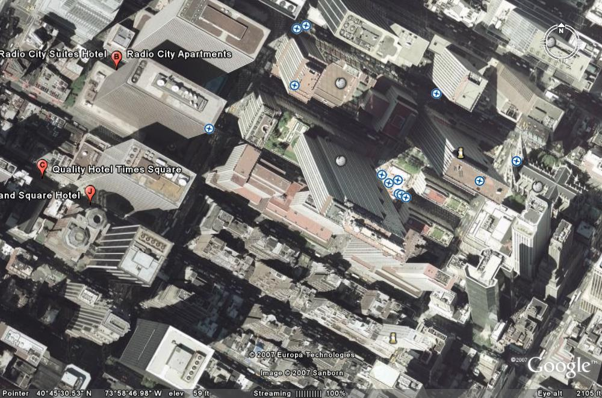

Several [home automation](http://en.wikipedia.org/wiki/Home_automation "Home automation") enthusiasts met again at LESO-PB to discuss recent developments in the field. There were four of us this time, [Adil](http://www.adilrasheed.com/), [Friedrich](http://people.epfl.ch/friedrich.linhart), [David](http://people.epfl.ch/david.daum) and yours truly.

Friedrich openened the discussion by telling us about his ongoing work on the **influence of light**, especially its color, on **human health**. Early results suggest that proper daylighting control will not only help us save oodles of energy but will actually make us healthier. For more details we will, however, have to wait for his thesis to be complete.

Adil showed us his recent work on the **large-scale physical modeling of cities**. He showed us how, from publicly available data (including data from Google Earth) one could derive a fairly realistic model of a city's impact on its environment.

He told us also that he was considering analyzing shadows on pictures from Google Earth to derive **3D models of entire cities**. This idea has great potential, provided he finds a way around Google's tendency to stitch together satellite images taken at different times of the day.

We also discussed the recently announced [Google Powermeter](http://www.google.org/powermeter/) project, whereby Google aggregates measurements remotely taken on your utility meters and presents the information to you. We were all amazed that Google managed to pull this one off (and frankly we have no idea how they do it) but some of us also expressed concern about privacy issues. How long will it be until we start getting email telling us that "People taking their baths while watching TV usually buy this-or-that book. Click here to buy it now" ?

And finally the evening concluded with me asking the assembly for advice on some building simulation software issues I had been having lately. Friedrich, in particular, suggested I tried solving the problem in [Fourier space](http://en.wikipedia.org/wiki/Frequency_domain "Frequency domain") instead of time space, something I would indeed never have thought about. I'll definitely have a look and see if this could help for my open-source [Heartbreak](http://smartbuildings.sourceforge.net/heartbreak/) building simulation project.

[![Reblog this post \[with Zemanta\]](images/reblog_e.png)](http://reblog.zemanta.com/zemified/3c85e539-dc19-47d0-a5d5-960b391afd4e/ "Zemified by Zemanta")

