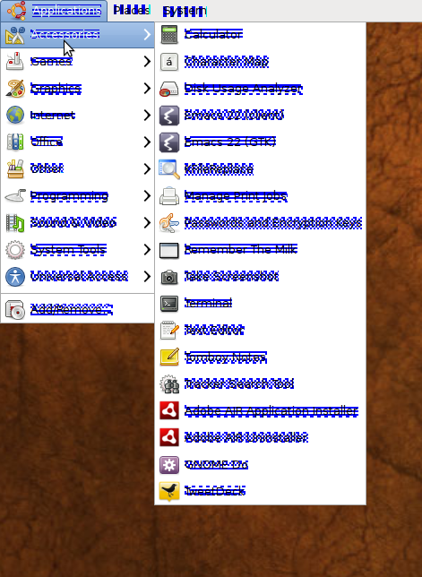

My screen fonts under [Ubuntu](http://www.ubuntu.com/ "Ubuntu") are occasionally completely screwed up. They show up in blue with overstrikes:

 I think this happens when I reboot my machine without a second monitor being attached to it, which it usually has. I suppose [X.org](http://www.x.org/ "X.Org Server") gets confused when it cannot find a monitor that used to be there.

To solve this problem you must reconfigure X.org. Just enter the following and log out and in again to your X session:

`sudo dpkg-reconfigure xorg`
