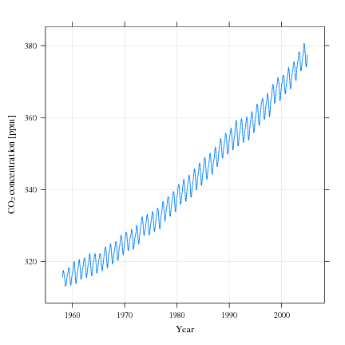
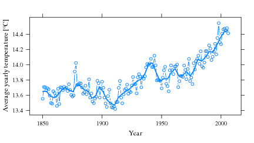

Automating buildings costs money. Lots, lots of money. The return on investment (ROI) is usually very low, and it takes a long, long time (on the order of 5 to 10 years) for such an investment to pay for itself.

To make matters worse, people who rent the home or apartment they live in have little incentive to make it energy-efficient. They have no guarantee they will still live in the same place 10 years in the future. And landlords? Why would they invest? Energy costs are always born by the tenants, so they too have little incentive.

If financial considerations won't motivate people to invest in smarter buildings, here I propose another incentive. **Building automation, if implemented globally, is one of the most cost-effective strategies for keeping the atmospheric CO2 concentration at safe levels until 2050.**

I reviewed [Thomas L. Friedman](http://www.thomaslfriedman.com/)'s _Hot, Flat and Crowded_ in [an earlier post](/smartbuildings/book-review-hot-flat-and-crowded). In that book, Mr Friedman refers to a paper published by Pacala and Socolow in _Science_ in August 2004.

I've traced that paper. You can find it here: [_Stabilization Wedges: Solving the Climate Problem for the Next 50 Years with Current Technologies_](http://www.sciencemag.org/cgi/content/abstract/305/5686/968?siteid=sci&ijkey=Y58LIjdWjMPsw&keytype=ref). Even if you don't read the full paper, _please_ do read the first couple of pages. The authors do a fantastic job at summarizing our current situation with respect with CO2 emissions and where we are headed if we do not act now. The abstract speaks for itself:

> Humanity already possesses the fundamental scientific, technical, and industrial know-how to solve the carbon and climate problem for the next half-century. A portfolio of technologies now exists to meet the world's energy needs over the next 50 years and limit atmospheric CO2 to a trajectory that avoids a doubling of the preindustrial concentration. Every element in this portfolio has passed beyond the laboratory bench and demonstration project; many are already implemented somewhere at full industrial scale. Although no element is a credible candidate for doing the entire job (or even half the job) by itself, the portfolio as a whole is large enough that not every element has to be used.

Let me summarize the key figures, and _please commit them to memory:_

### 280 ppm CO2 atmospheric concentration

For the most part of human history, the CO2 concentration in the atmosphere remained relatively stable at 280 ppm (parts per million). The industrial revolution coincided with the start of a clear increase in CO2 concentration.

### 375 ppm CO2 atmospheric concentration

The CO2 concentration at the time of the article (2004). But remember that CO2 concentration has always increased since careful measurements started in the late fifities:

\[caption id="attachment\_301" align="alignnone" width="432" caption='CO2 atmospheric concentration measured on Mauna Loa (Hawaii) for the past 50 years, adapted from [my thesis](bayesian-controller).'\]\[/caption\]

### 500 ppm CO2 atmospheric concentration

Even allowing for (healthy) skepticism, most scientists believe that mankind _must at all costs_ prevent the CO2 levels from reaching double the preindustrial concentration, or about 560 ppm. To err on the side of caution, **we as a species should pledge never to let CO2 level cross the 500 ppm limit.**

### 7 billion tons of CO2 per year

When [Pacala and Socolow](http://en.wikipedia.org/wiki/Mitigation_of_global_warming) wrote the article, mankind was dumping in the atmosphere the equivalent of 7 billion tons of CO2 per year (7 GtC/year). **That's enough CO2 to fill 1 billion hot-air balloons each year. It is also the upper limit of allowed global emissions if we are to stabilize CO2 atmospheric concentrations at their current levels for the next 50 years.**

### 14 billion tons of CO2 per year

If we fail to act **now**, by 2054 we will be pumping out 14 billion tons of CO2 per year in the atmosphere, according to the so-called Business As Usual (BAU) scenarios. Such an emission rate will almost certainly result in a CO2 concentration of more than 500 ppm, i.e. beyond the safe upper limit. The consequences on [global warming](http://en.wikipedia.org/wiki/Global_warming) can only be disastrous.

\[caption id="attachment\_302" align="alignnone" width="432" caption='Average global temperatures for the last 150 years, adapted from [my thesis](/smartbuildings/bayesian-controller).'\]\[/caption\]

### 50 years

Stabilizing CO2 emissions is only the first half of the battle. Our goal is to stabilize them at their current levels for the next 50 years, but after that we must devise solutions to reduce them.

### 7 wedges

The paper proposed 15 potential solutions (or "wedges") for stabilizing our CO2 emissions. Each one of these is technologically feasible and has been commercially demonstrated. Any of them will prevent the increase in CO2 emissions by 1 GtC/year by 2054. Thus, to keep our CO2 emissions to current levels by 2054, we **must** implement at least **7 of these 15 strategies** on a global scale.

### Wedge 3

The third wedge proposed by the authors appears to me as the **easiest to implement**:

> Cut carbon emissions by one-fourth in buildings and appliances projected for 2054.

Yes, that's right. If we or our children are to make it safely through the second half of this century, we must implement at least 7 of 15 strategies, one of which is **the reduction in carbon emissions by 25% in buildings and appliances**.

And how, you may ask, can we achieve this? Well, there are really only two solutions. We may switch to more carbon-neutral energy sources, or we may reduce our energy demand. As I've argued in a [previous post](/smartbuildings/enjoying-a-no-energy-home), we should prefer the latter option for the following reasons:

- Our fundamental problem is our dependency on cheap sources of energy. Carbon-neutral energy sources, although much cheaper than only ten years ago, are still far from competitive.
- We have enjoyed cheap sources of energy for so long that we have never had to consider the need to reduce our demand. In other words, **we are addicted to energy, not oil**.\[caption id="attachment\_319" align="alignright" width="240" caption='Credits: [RogeSun Media](http://www.flickr.com/photos/shuttercat7/449400025/)'\]\[/caption\]
- It is much, much more cost-effective to reduce the energy demand of buildings and appliances, particularly through better home and building automation, than attempting to replace our current sources of energy with carbon-neutral ones.

  

### Conclusion: an elevator pitch for building automation

#### We currently emit 7 GtC/year in the atmosphere. If we fail to act now, we will be emitting 14 GtC/year in 2054 and the CO2 concentration will be more than twice its preindustrial level. Building automation, if implemented on a global scale, can make buildings at least 25% more energy effective, which will prevent the emission of 1 GtC/year by 2054, out of 7 GtC/year required to keep at current levels. It is arguably the most cost-effective strategy for mitigating climate change.
