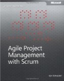

I began reading Ken Schwaber's 'Agile Project Management with Scrum' for two reasons: 1) it's a book about Scrum, and 2) it's from Ken Schwaber, one of the fathers of Scrum. Having now read it, I think these are the only reasons I don't entirely regret reading it.

The book is a series of case studies, bases on real-world experiences Schwaber has had managing projects. Each case study shows how a particular aspect of Scrum was applied, adapted, or tweaked on a real project. Schwaber devotes each chapter to a distinct aspect of Scrum, e.g. the ScrumMaster's role, the project backlog, the sprint planning, etc.

As such, the book is clearly intended for experienced ScrumMasters, which I am not. But I think an experienced ScrumMasters reading this book will find it lacking in depth. There is almost too much material in this book, covered too shallowly. Each chapter in this book might easily provide enough material for a separate book, or a workshop, or a detailed whitepaper. Even with my limited knowledge and experience of Scrum I felt frustrated by the lack of detail Schwaber gave in the book. For instance, he never shows us a real-world example of a product backlog. Instead of showing us a snapshot of a real sprint backlog taped to a team's room, the book shows us a nicely formatted table with very obviously watered-down entries.

In short, I think an experienced ScrumMaster will find this book lacking in detail, whereas the Scrum student will find it hard to relate to the case studies. As such I find it hard to recommend this book, and I think anyone interested in Scrum should rather consult Schwaber's earlier book, 'Agile Software Development with Scrum', or Henrik Kniberg's excellent 'Scrum and XP from the Trenches', also available for free from [here](http://www.infoq.com/minibooks/scrum-xp-from-the-trenches).
