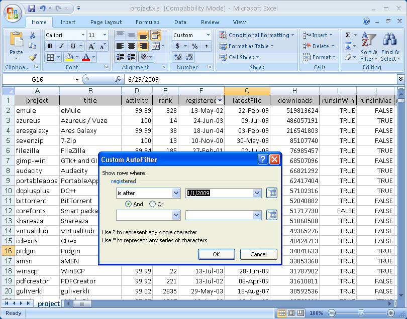

I always try very hard to keep my posts within the main topic of this blog, namely computers in the context of building automation and simulation. Occasionally I fail, like for today's post.

I'd like to tell you about a software company co-founded by a friend and fellow Toastmaster of mine, David Portabella. The company's name is \[DB4ALL\](http://www.db4all.com), and they specialize in software for retrieving structured data from the web.

(Disclaimer: I am not affiliated with this company. I have had the opportunity to play with their tool, which I sincerely think is a high-quality one, but I derive no remuneration from writing this piece.)

They've developed \`Webminer', a Java library for extracting data in a structured manner from any website. Suppose, for instance, that you need a relational database with the data from the \[CIA World Factbook\](https://www.cia.gov/library/publications/the-world-factbook/). That data, though in the public domain, cannot be obtained in the form of a relational database, but only by clicking around on the CIA website. But with 'Webminer', the smart guys at DB4ALL can write a custom application that will know how to navigate such websites, 'scrape' and 'normalize' its data, and save it to a relational database for you.

On \[DB4ALL's website\](http://www.db4all.com) you will find references to \[the two most popular datasets\](http://db4all.com/databases/) that they've mined: the above-mentioned CIA World Factbook, and the SourceForge database of open-source projects. Having such data in a relational form is invaluable for any researcher or marketing analyst. Suppose for instance that you want scientific data on the popularity of different programming languages over time in open-source projects. Well with these datasets you have all you need to get started.

This, for instance, is a screenshot of the SourceForge dataset opened in Excel: 

All in all, if you need publicly available data from a website stored in a relational database form, you should definitely consider using \[DB4ALL\](http://www.db4all.com)'s services.
