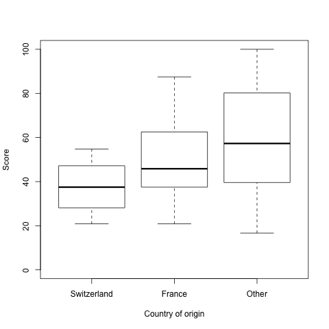

We have recently been recruiting a couple of new programmers at Neurobat. This time we submitted the candidates to an online programming test, which consists of a couple of (relatively) simple programming assignments to be completed in a given time.

Out of about 100 applications, 34 were given this test. I have collected the data from these programming tests to see whether any personal factors correlated with the applicant's performance. The results suggest that the candidate's country of origin has the biggest influence on the final score.

Out of these 34 candidates, 10 were from France, 5 from Switzerland, and the others from other countries. 6 came from outside of Europe.

Here I show the boxplots for the normalized test scores, where I plotted separately the swiss and the french candidates, and lumped everybody else in a third category. The boxplots are sorted by increasing median.

There is a clear trend suggesting that the further away a candidate comes from, the higher their test scores. However, I must stress that with such low statistics the difference is _not_ statistically significant. An analysis of variance test on the test scores against a simple 2-valued factor (swiss vs non-swiss) gives an F-value for one degree of freedom of 2.076, i.e. a p-value of 0.163. Similarly, a Wilcoxon rank sum test gives a p-value of 0.1698.

Nevertheless, the trend seems to be there, and there is some anecdotal evidence to support it. I can think of at least three hypotheses to explain it:

1. Skilled swiss-born programmers have no difficulty finding jobs in larger, better-paid companies and have little incentive to apply to small startups such as Neurobat.
2. Skilled swiss-born programmers tend to leave the country after graduation, whereas only the best and brightest foreign-born programmers are able to get the necessary work permits and/or scholarships to come to this country.
3. The swiss educational system, especially in the field of computer science, sucks (for lack of a better word).

Comments? Questions? Remarks? Feel free to post your observations below.
