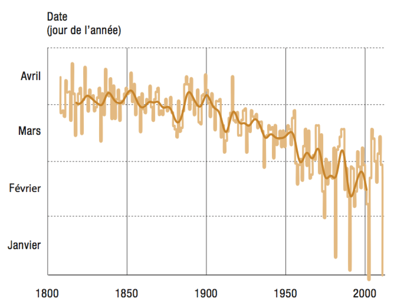
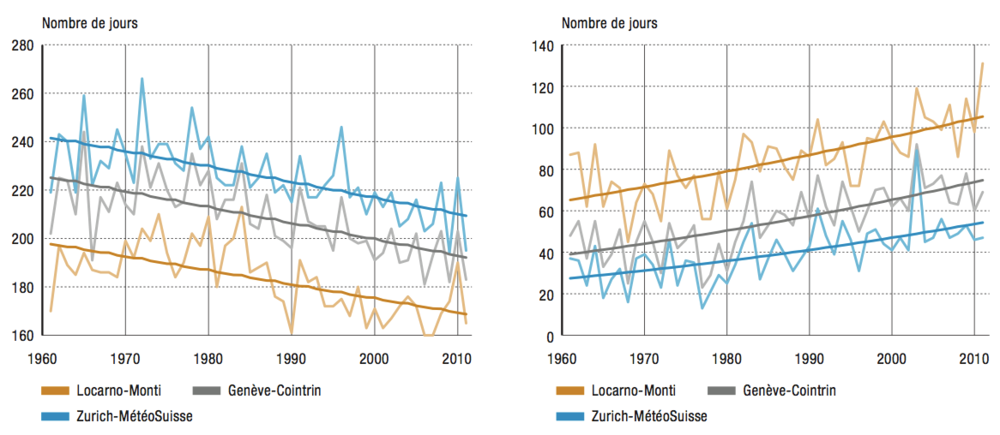

I live next to Geneva in Switzerland. If you come to Geneva, be sure to include in your visit the ramp leading up from the Parc des Bastions and running parallel to the edge of the old town. There you will find the longest bench in Europe, the last meters of which sit in the cool shadow of a chestnut tree, called the Geneva Official Chestnut. Since 1818, an official of the Geneva government records the date when the first leaves sprout on this tree; that date has become the de facto definition of the arrival of spring in Geneva.

Until about 1900, the chestnut budded between mid-March and mid-April, with a fairly stable average at the end of March. But since 1900, the budding date has literally gone downhill.

The plot below is extracted from [a report by the FOEN (Federal Office for the Environment) published in 2013](http://www.bafu.admin.ch/publikationen/publikation/01709/index.html?lang=en). It shows the evolution of the official chestnut’s budding date, along with a 20-year moving average. The chestnut now buds on average in February; the 2003 budding happened in December 2002 (!); and in 2006 the tree budded twice, once in March and once in October. This happened again in 2011, when it budded in February and in November.

Temperatures across the global may have risen by 0.8 degrees on average in a century, but “average” means that some places have gotten hotter and others have gotten colder. The landmass in the nothern hemisphere is a place that has gotten warmer; and Switzerland has warmed more than the average landmass in the northern hemisphere. According to the FOEN report, the average warming in this country since 1864 has been 0.12 degrees per decade; since 1961 it has accelerated to 0.38 degrees per decade. For the past 50 years, summer temperatures have increased by 2.5 degrees and winter temperatures by 1.5 degrees. Switzerland is the perfect, if unwilling, laboratory for observing in accelerated time the environmental effects of global warming.

Perhaps the clearest indicator of Switzerland’s warming is the number of heating days (i.e., days with an average temperature of 12 degrees or less) and cooling days (i.e., days with an average temperature of 18.3 degrees or more). These are plotted below, the heating days on the left and the cooling days on the right. The decreasing trend in the former, and the increasing trend of the latter, are evident.

We lose our glaciers at a rate of 2–3% per year; the number and intensity of heatwaves increases; so do the number of so-called tropical nights (nights during which the temper- atures exceeds 20 degrees); there is less and less snow each year; the snow line climbs by about 10 meters each year. Extreme weather events are more frequent; this month (June), the city of Montreux (on the shores of Lake Geneva) braced itself against the possibility of snow. And I’m typing this piece after three days of heatwave, and just two hours after peach-sized hailstones fell in a furious storm on Geneva, paralyzing the city (see below). For Swiss people, global warming is not a remote concept whose consequences may only be felt in a century or so. Its effects are being felt almost everyday.

<iframe width="560" height="315" src="http://www.youtube.com/embed/5zAS3B0qMfw" frameborder="0" allowfullscreen></iframe>
