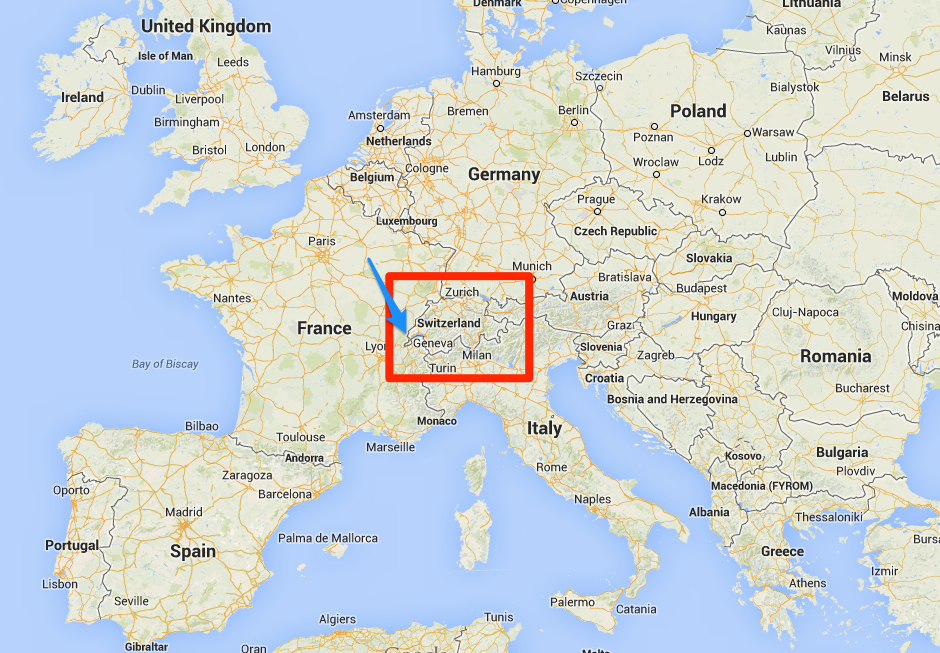
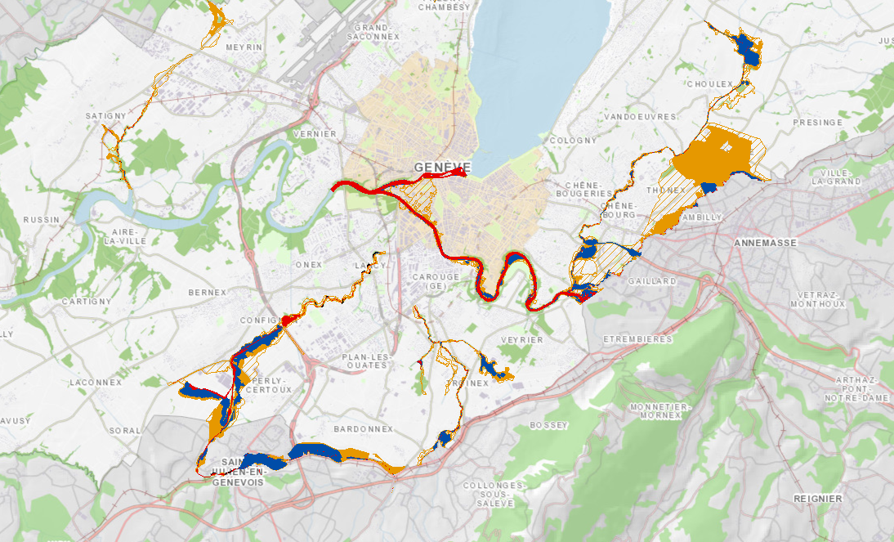
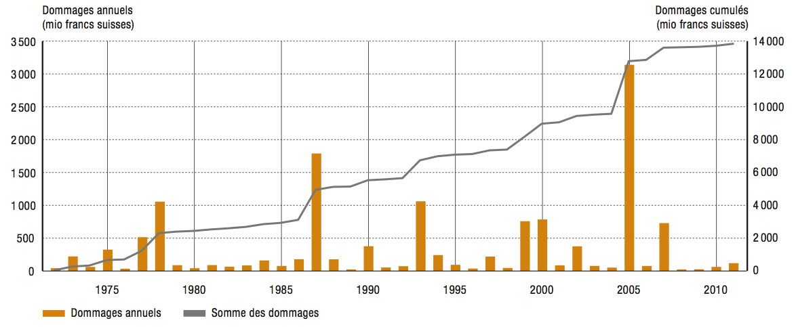

Switzerland is a small country in the middle of Europe, wedged between France, Germany, Austria and Italy (see below). [In a previous post](http://computersandbuildings.com/climate-change-in-switzerland-skipping-the-waiting-line/) I have documented the above-average rise of air temperatures in this country for the past 50 years, leading to a significant increase of extreme weather events.

Being a small country, our climate change mitigation efforts are more symbolic than effective. The swiss federal government recognizes the inevitability of rising temperatures and decreasing precipitations, and a national climate change adaptation strategy is to be published by the end of 2013.

Switzerland is prone to natural disasters, be they flash floods, landslides, avalanches, or storms. A nation-wide project is under way to map out the exposure of inhabited land to natural dangers, a project that is about to be completed by the individual cantons (the rough equivalent of a state in America). Danger zones can now be avoided for new buildings; for those already built in such zones, it's now possible to decide where to build protective installations.

For example, many waterways converge in the canton of Geneva where I live. It is also here that the lake of Geneva flows out into the Rhone river. The area is prone to floods, flash floods and storms. The exposure of inhabited land to water-related dangers is now documented by the local government and can be accessed by anyone through [a web portal maintained by the canton](http://ge.ch/geoportail/eauinfo/default.htm).

The figure below gives an example of the kind of information one can obtain through this portal. I have asked to highlight the inhabited land exposed to a risk of flooding. Red areas are the most exposed, followed by blue and orange. Two major waterways, the Rhone and the Arve river, converge in the city itself and their banks are clearly the most exposed areas in the whole canton. Other areas at risk are clearly delineated.

Maps such as these (for all kinds of natural disasters) are being prepared by all cantons of Switzerland and are deemed an essential tool against the increasing number of natural disasters. For example, weather-related events caused about 3 billion swiss francs (about 3.2 billion USD) in damages in August 2005. But such maps had correctly predicted which habitations would be the most severely hit; several lives have been saved by evacuating buildings at risk of landslides, for example. The figure below shows the yearly and cumulative cost of natural disasters in Switzerland; there is no increasing trend, in spite of an increase in extreme weather events and in population density. This stability is believed to partially attributable to these nation-wide programs.

The most recent project by the national government is [the nation-wide OWARNA (Optimierung von Warnung und Alarmierung vor Naturgefahren) platform](http://www.planat.ch/en/authorities/response/owarna/) to develop better forecasting methods and better alerting procedures. This will further help the local authorities defend themselves against natural disasters.

_Adapted from my second assignment in the [Climate Literacy class on Coursera](https://class.coursera.org/climateliteracy-001/class/index)._
