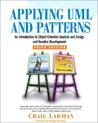

 [Applying UML and Patterns: An Introduction to Object-Oriented Analysis and Design and Iterative Development](http://www.goodreads.com/book/show/85019) by [Craig Larman](http://www.goodreads.com/author/show/48636)  My rating: [5 of 5 stars](http://www.goodreads.com/review/show/753790222)  
  
Easily one of the best books on object-oriented design I've ever read.

Through two case studies (a point-of-sale terminal application and a Monopoly game) the author goes through the entire process of eliciting use cases, domain modelling, design modelling, and implementation. The UML notation is introduced and used along the way, as are several patterns---not only the classic GoF patterns, but also some extremely useful design guidelines.

This book should be read by any senior developer who's currently involved in the early stages of a software project. Even if you do not follow its recommendations to the letter, it will certainly improve the chances of success. For example, since reading it I make a nuisance of myself by insisting on having detailed, written use cases---not simply bullet points on some powerpoint.

This book belongs on any developer's bookshelf, right next to the classics.    [View all my reviews](http://www.goodreads.com/review/show/753790222)
