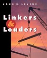

 [Linkers and Loaders](http://www.goodreads.com/book/show/1103509) by [John R. Levine](http://www.goodreads.com/author/show/11987)

My rating: [4 of 5 stars](http://www.goodreads.com/review/show/763517910)  
  
You may have written hundreds, maybe thousands of programs, but if you are like most programmers then everything that happens after the compilation is kind of mysterious. Why does the compiler have to create object files? What are they? What is this so-called linker who combines those files into a library, or an executable? What's its purpose? John Levine's book answers those questions, and more.

Item 53 in [97 Things Every Programmer Should Know: Collective Wisdom from the Experts](http://programmer.97things.oreilly.com/wiki/index.php/97_Things_Every_Programmer_Should_Know) is "The Linker Is not a Magical Program", and this book goes a long way towards taking that magic away. It carefully explains step by step what happens from the moment the code is compiled until it actually runs on the machine; and what's more important, it makes it very clear _why_ things are as they are today.

I was recommended this book in a reply to a [Stackoverflow question](http://stackoverflow.com/questions/19464987/object-files-linkers-archives-etc-where-can-i-find-an-entry-level-explanatio), and I am not disappointed. The book goes occasionally perhaps a little bit too much into technical details, which I felt could be safely skipped. Perhaps a case study, i.e. going through every single step towards running a complete program, would have been useful, instead of exposing how different systems solve the different steps one by one.

Until I read this book I simply did not understand how a program actually ran on my computer. A few details are still a bit fuzzy, but now I feel much better equipped for dealing with obscure linker errors or custom linker scripts. Highly recommended for any programmer who wants to get to the bottom of things.

[View all my reviews](http://www.goodreads.com/review/show/763517910)
