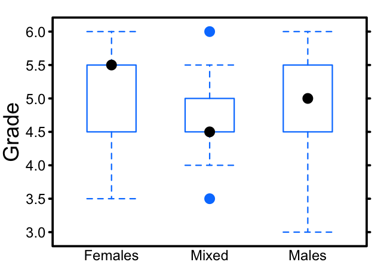

For the past three years I've taught a freshman-level programming course at the Swiss Federal Institute of Technology in Lausanne. Students are asked to form groups of 2 and to work on a semester project, consisting in the development of a simple library of numeric routines (e.g. square root function, integrals, etc). I then submit their code to a suite of unit tests (including the Valgrind memory checker) and assign them a grade linearly proportional to the number of unit tests that pass. The same grade is assigned to both members of the pair.

Most students will pair with a fellow student of the same sex. In the spring 2014 session, 43 pairs out of 52 were of the same sex. This year's class was large enough to consider carrying out statistically significant studies on the students' grades. More specifically, I wanted to examine whether pairs of girls obtained significantly different results from pairs of boys.

Here I show the boxplots of the grades assigned to the 52 pairs, depending on whether it was two females, mixed sex, or two males. The median grade for females is 5.5 out of 6, while the median grade for males is 5 out of 6.

The Welch two sample t-test (used to determine whether two samples are drawn from populations with the same mean) yields a p-value of 0.32. The 95% confidence interval for the difference in means between all-females and all-males is between -0.27 and 0.80. In other words, there is no statistically significant difference between the grades obtained by two-female pairs of students and two-male ones.

And what about the pairs of mixed sex? The boxplot suggests that their results are lower, and I can think of a hypothesis to explain that. But with a sample size of only 9 it is hard to draw any conclusion.
