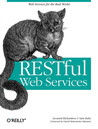

 [RESTful Web Services](http://www.goodreads.com/book/show/853961) by [Leonard Richardson](http://www.goodreads.com/author/show/3100) My rating: [5 of 5 stars](http://www.goodreads.com/review/show/796887303)

I began reading "Restful web services" while researching technical solutions for [Neurobat Online](http://neurobat.net/products/?L=2), the web service version of our intelligent heating controller. Prior to this, most (all?) web service projects I had been involved in were based on SOAP.

REST is a heavily overloaded term in our industry, and can mean different things to different people. The author avoids that controversy by coining the term "Resource-Oriented Architecture", and shows different examples of web services that can be built using this approach: a social bookmarking service inspired by Delicious, and a mapping service. Both examples are RESTful but the author does an excellent job at showing why being RESTful is not enough. To fully leverage the existing web architecture (including the full HTTP protocol) you need, he argues, to do more than merely being RESTful, and he shows how.

The author never says so explicitly, but after reading this book I found that RESTful web services have at least two significant advantages over what the author coyly calls "Big Web Service" (aka SOAP):

1. Testability: do not underestimate the advantage of exposing a service that your testing team can test with cURL instead of having to setup a tool such as SOAPUI.
    
2. Discoverability: everything is a resource, and all resources will respond to a limited number of HTTP verbs. You don't have to worry whether adding a bookmark is done through `addBookmark()` or `appendBookmark()`; if your service is RESTful, you know that you need to send a POST to some URI.
    

The biggest takeaway from this book for me was to realise that it's possible to design an application where "everything is a resource", and that all resources respond to the same set of methods. Think of it for a moment. Will this not change the way you design non-web services too? Are not all your objects resources? Imagine, for a minute, if all your classes were restricted to expose not more than 5 public methods, and if these methods had the same names. It may sound crazy, but it's quite possible that you'd end up with a cleaner design built out of many small classes with small interfaces. Is this not an easy way to clean code?

What makes this book great and not merely good is that the author doesn't simply explain what RESTful web services are about. He is also clearly opinionated about it; however he is never patronising, never condescending. He takes very occasional jabs at systems he calls "Big Web Services" but never belittles them. His message comes across as entirely believable and convincing. By example after example he shows how popular services can be designed as collections of resources, and it is up to the intelligence of the reader to judge whether which kind of design is better.
