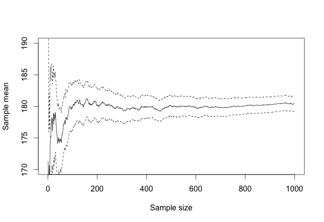
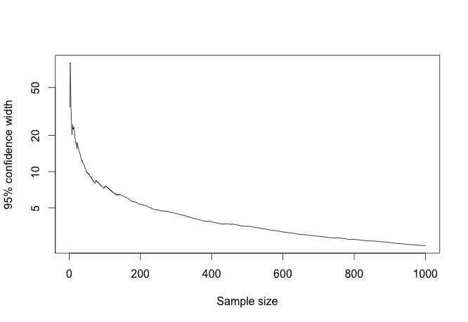

If you pick two people at random and measure their heights, what can you say about the average height of the population?

When dealing with small sample sizes (less than, say, 20) it's generally not possible to assume that the _sample_ variance is a good approximation of the _population_ variance. There simply isn't enough data, and you cannot use the normal distribution to infer meaningful confidence intervals.


Statistics is like electrical work: it's very easy to do a job that looks correct but could kill or maim someone. For example we have all, at least once, taken a small sample and used the normal distribution to get confidence intervals. Here is what we would get for the example above, assuming that the measured heights were 184 cm and 178 cm:

```
> x <- c(184, 178)
> xbar <- mean(x)
> s <- sd(x)
> qnorm(c(0.025, 0.975), xbar, s)
[1] 172.6846 189.3154
```

The confidence interval we just obtained ($172 \\le \\mu \\le 189$) looks perfectly reasonable, but it's wrong. What's worse, there's nothing _obviously_ wrong with it. If $s$ was the true population standard deviation it might even be correct; but that's extremely unlikely.

This is why [Student's t-distribution](http://en.wikipedia.org/wiki/Student%27s_t-distribution) was invented (or discovered?), to deal with small sample sizes. If we draw $N$ random samples from a normally distributed population, compute the sample mean $\\bar{x}$ and the sample standard deviation $s$, then the so-called _t-value_ $\\frac{\\bar{x}-\\mu}{s/\\sqrt{N}}$ will be distributed according to the t-distribution with $N-1$ degrees of freedom.

With our example above, $N=2$, $\\bar{x} = \\frac{184+178}{2} = 181$, and $s=\\sqrt{(3^2 + 3^2)/(N-1)}=4.24$. If we want a 95% confidence interval for the true mean $\\mu$ we use the 2.5% and the 97.5% quantiles of the t-distribution with 1 degree of freedom:

```
> N <- 2
> x <- c(184, 178)
> xbar <- mean(x)
> s <- sd(x)
> qt(c(0.025, 0.975), N-1) * s / sqrt(N) + xbar
[1] 142.8814 219.1186
```

That last result gives you the correct 95% confidence interval for the true mean: $142 \\le \\mu \\le 219$. Compare this with the interval obtained earlier: it is much wider, and therefore the uncertainty on the true mean is much higher than what the normal distribution would have let you believe.

This is, however, pretty good news. As long as your sample size is larger than 1, you can always infer correct (though perhaps useless) confidence intervals for the true mean, provided the population is normally distributed.

Recently I got angry was discussing statistics in a phone conference. The question was how many experimental test sites were necessary to estimate the CO2 reduction potential of [Neurobat's](http://neurobat.net) technology. I pointed out that no matter how many test sites we had, the t-distribution would always let us infer confidence intervals about the true CO2 reduction potential. But the statistics experts on the other side of the line disagreed, arguing that anything less than 10 was not statistically significant.

I tried the analogy above and showed that $N=2$ was enough to derive a confidence interval for the average height of the population.

"No, we don't think so", was the answer.

That's when I decided to shut up and write a blog post.

We'll run a little computer experiment. Suppose again that the height of the swiss population is drawn from a normal distribution of mean 180 cm and standard deviation 20 cm (I am totally making this up). We're going to draw one sample at a time from this distribution and see the evolution of the sample mean and the confidence interval.

The true mean $\\mu$ lies with 95% confidence within $\\left\[t\_{2.5\\%, N-1}\\times(\\frac{s}{\\sqrt{N}}+\\bar{x}), t\_{97.5\\%, N-1}\\times(\\frac{s}{\\sqrt{N}}+\\bar{x})\\right\]$. Let's form this confidence interval as we progressively sample elements from the parent population:

```
N <- 1000
mean.height <- 180
sd.height <- 20
height.sample <- rnorm(N, mean.height, sd.height)

mean.sample <- numeric(N)
sd.sample <- numeric(N)

for (i in 1:N) {
  mean.sample[i] <- mean(height.sample[1:i])
  sd.sample[i] <- sd(height.sample[1:i])
}

low.interval <- sd.sample / sqrt(1:N) * qt(0.025, 1:N - 1) + mean.sample
upper.interval <- sd.sample / sqrt(1:N) * qt(0.975, 1:N - 1) + mean.sample
```

And here is the result:

[](http://computersandbuildings.com/wp-content/uploads/2014/03/confidence_interval.png)

It's obvious that for small sample sizes, the confidence interval quickly becomes smaller than the parent standard deviation. We can see this by plotting the log of the confidence interval over time:

[](http://computersandbuildings.com/wp-content/uploads/2014/03/log_confidence_interval.png)

The confidence interval becomes smaller than the population standard deviation (20) after only 15 samples. However, even for extremely small sample sizes (less than, say, 5) the confidence interval is roughly 40 cm. The true mean can therefore be estimated within $\\pm 20$, or with about 11% error, after only 5 samples. And that is thanks to the t-distribution.
