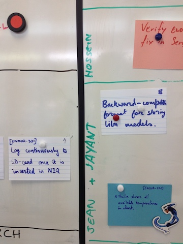

For the past few weeks we've been experimenting with a variant of the Pair Programming theme.

[Conventional wisdom](http://c2.com/cgi/wiki?PairRotationFrequency) holds that pairs should be rotated frequently, i.e. several times per day. In our experience, this has been hard to sustain. Instead, we've experimented with having two team members bond together and take collective ownership of a feature (or bug, or research item). They stick together until that feature is done. That can last anywhere between a few hours and several days.

The Pair Programming community use the metaphor of two drivers alternating being in the driver's seat. Implicit in this metaphor is the idea that you stay with your fellow driver only for part of the whole road; several different programming pairs will end up working on the same feature.

What we are proposing instead, is that the same pair sticks together until the feature is complete. If the Pair Programming community uses a land-based metaphor, I'm going to use an aerial one. I'll liken this to a pair of wingmen flying a missions, sticking together until the mission is done.

I've been pairing for almost two weeks now with our test engineer. We write the R scripts that automatically analyze, and generate a report on, this winter's test data. Speaking for myself, I'm now convinced that this practice carries the same benefits as traditional pair programming, but brings several extra benefits:

First, since we are both responsible for the quality of this work, I feel **far more accountable** to my fellow team member. If I screw up, it's our collective work that suffers. Conversely, I have a **much stronger incentive** for watching out over what he's doing while he's flying. We are 100% responsible for the quality of the work; we cannot later claim that some other pair came and introduced errors.

Secondly, it shortens the daily standup since it's now **the wings that presents what was done, what will be done, etc**. In fact, it's been the first time in years that we kept our daily standups within the allocated time.

Thirdly, it **strongly encourages us to show, not tell**, what was done the day before during the standup. This one is a bit tricky to explain; in fact I'm not sure I understand it, but I suspect some psychological rush is experienced from showing off what I, as a wingman, have accomplished with my partner. I see **many more charts, pictures, plots, printouts** at the standups since we've introduced this practice.

Fourthly, it **reduces the guilt associated with pairing with someone instead of working on one's "own" story**. I think one of the main reasons why people don't pair more often is the fear of not completing what they perceive as their "own" tasks. Indeed, perhaps it is time to revise the daily standup mantra. Forcing people to chant "Yesterday _I_ did this, today _I_'ll do that, etc" emphasizes their individual accomplishments.

A big issue with traditional Scrum is that by the end of the daily standup, everyone is so energized for the day ahead that they simply **can't be bothered to pair with someone else**. In fact, once everyone has spoken their piece, we often found it useful to re-discuss who will be doing what for the day **and with whom**. This is obviously a waste of time, that can be eliminated by this wingmen system.

How did we get started? By a simple change. So simple, in fact, that it borders on the trivial, and you can try it today. Assuming you use a whiteboard to track your work in progress, **figure out a way to indicate that a story is now owned by two people instead of one.** For us, we used to have parallel swimlanes across the whiteboard, one lane per team member. What we did was as simple as merge them together by pairs.

If you have any position of authority in your team, I dare you to try this experiment for just one week, and for just one pair of team members. You'll thank me for it.
