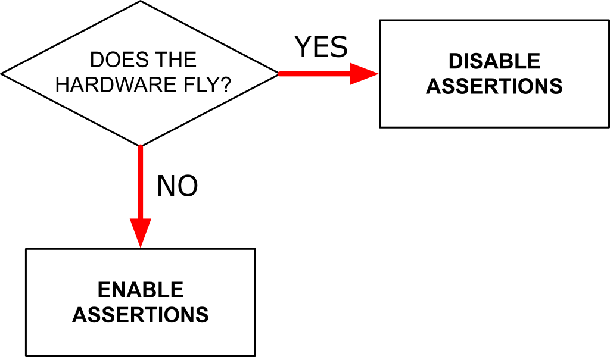

I'm currently taking the [Software Testing](https://www.udacity.com/course/cs258) class on [Udacity](https://www.udacity.com/). The instructor spent a couple of videos discussing the pros and cons of leaving software assertions turned on in your production systems. Here is my interpretation:

