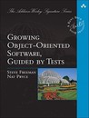

[Growing Object-Oriented Software, Guided by Tests](https://www.goodreads.com/book/show/4268826-growing-object-oriented-software-guided-by-tests) by [Steve Freeman](https://www.goodreads.com/author/show/27264.Steve_Freeman)  

I didn't know what to expect when I picked up this book. In spite of its excellent reviews I feared it was going to be another redundant addition to the mountain of books harping on the virtues of Test-Driven Development (TDD), without adding anything significant to the standard sermon.

Nothing could be further from the truth.

I read a fair share of technical books, but this book is the only one in years that I immediately began to re-read again after finishing. It is easily one of the most important books on software engineering out there, and is likely to remain so for some time to come.

The authors present what is now known as the London school of TDD, where the correctness of an object is defined by its interactions with its collaborators, not necessarily by its state. Although I had seen mocking frameworks in action before, never had I seen one being used throughout the development of a software project.

Another fascinating idea is the notion of writing an end-to-end test first, before even starting to write unit tests. We have been so thoroughly drilled on the virtues of fast tests, that it doesn't occur to us anymore that it's even possible---even preferable---to exercice the whole system, perhaps in a separate test suite.

But the best part of the book is the sample project used to illuminate these concepts. It consists in writing a desktop application with which a user can automate the process of bidding in online auctions. The graphical part is done with the Swing framework in Java, and the application talks via XMPP to the auction house. The first chapter in the case study is about setting up literally an end-to-end test, i.e. a test (written with JUnit) that will verify if the graphical display matches the XMPP communications.

From there on, the case study proceeds with the implementation of feature after feature, always following the same pattern: write the end-to-end test first, implement the feature with TDD, refactor, repeat.

No book is worth reading if it doesn't change your approach to your existing projects. This one showed me immediately where our current project (an embedded system for energy management) was lacking in terms of testing.

Go read this book, and send me flowers and chocolates.
