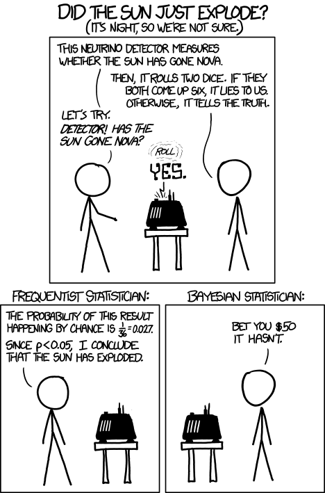

The frequentist vs bayesian debate has plagued the scientific community for almost a century now, yet most of the arguments I've seen seem to involve philosophical considerations instead of hard data.

[](http://xkcd.com/1132/)

Instead of letting the sun explode, I propose a simpler experiment to assess the performance of each approach.

The problem reads as follows (taken from [Jaynes's Probability Theory](http://amzn.com/0521592712)):

> You are traveling on a night train; on awakening from sleep, you notice that the train is stopped at some unknown town, and all you can see is a taxicab with the number 27 on it. What is then your guess as to the number N of taxicabs in the town, which would in turn give a clue as to the size of the town?

In different setting, this problem is also known as the [German tank problem](https://en.wikipedia.org/wiki/German_tank_problem), where again the goal is to estimate the total size of a population from the serial number observed on a small sample of that population.

The frequentist and bayesian approaches yield completely different estimates for the number N. To see which approach gives the most satisfactory estimates, let's generate a large number of such problems and see the error distribution that arise from either approach.

```
n.runs <- 10000
N.max <- 1000
N <- sample.int(n = N.max, size = n.runs, replace = TRUE)
m <- sapply(N, sample, size = 1)
```

We run this experiment `n.runs` times. Each time we select a random population size `N` uniformly drawn between 1 and `N.max`. We draw a random number `m` between 1 and `N`, representing the serial number that is observed.

The frequentist approach gives the following formula for estimating $N$: $\\hat{N} = 2m-1$. Intuitively, the argument runs that the expected value for $m$ will be $N/2$. $m$ is therefore our best estimate for half of $N$, and hence, our best estimate for $N$ will be twice $m$. And I'm not sure where the ${}-1$ thing comes from.

The bayesian approach is more complex and requires one to provide an estimate for the maximum possible number of taxicabs. Let's therefore assume that we know that the total number of cabs will not be larger than 1000. (The frequentist approach cannot use this information, but to make a fair comparison we will cap the frequentist estimate at 1000 if it is larger.)

Then the bayesian estimate is given by $\\hat{N} = (N\_\\textrm{max} +1 - m) / \\log(N\_\\textrm{max} / (m - 1))$.

Putting it all together, we create a data frame with the errors found for both approaches:

```
frequentist <- pmin(m * 2 - 1, N.max.bayes) - N
bayesian <- (N.max.bayes + 1 - m) / log(N.max.bayes / (m - 1)) - N
errors <- rbind(data.frame(approach = "FREQ",
                           errors = frequentist),
                data.frame(approach = "BAYES",
                           errors = bayesian))
```

The mean square error for each approach is then given by:

```
> by(errors$errors^2, errors$approach, mean)
errors$approach: FREQ
[1] 73436.81
------------------------------------------------------------------------------- 
errors$approach: BAYES
[1] 44878.61
```

The bayesian approach yields close to half the square error of the frequentist approach. The errors can also be plotted:

```
library(lattice)
histogram(~ errors | approach, errors)
```

[](http://computersandbuildings.com/wp-content/uploads/2015/11/taxicabs_errors.png)

Both error distributions are skewed towards negative values, meaning that both approaches tend to underestimate $N$. However, the bayesian errors have a tighter distribution around 0 than the frequentist ones.

The bottom line is that, given exactly the same information, the bayesian approach yields estimates whose squared error is about 60% that of the frequentist approach. For this particular problem, there is no question that the bayesian approach is the correct one.
