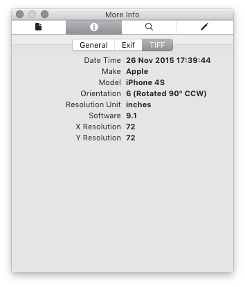

When I take a picture with my vertically-held iPhone, here is what happens when I insert it as-is in this blog:


But the picture shows up correctly when I open it in any OSX application, such as Preview. The issue is that when you take a picture with your iPhone, a meta-data tag gets written to the file telling OSX how to rotate the picture when it is displayed. You can see the tag by using the inspector in Preview:



The offender here is that `Orientation` tag, which seems to be used only by OSX applications. The best way to fix this is to remove the tag, rotate the picture correctly with Preview, and save it again.

To remove the tag, I recommend using a tool called `ExifTool`. It's a neat command-line tool that you can [download here](http://www.sno.phy.queensu.ca/~phil/exiftool/). Once downloaded, removing the tag is a simple as this:

```
$ exiftool -Orientation= filename.jpeg
```

This replace `filename.jpeg` with the same file but with the tag removed, and save a copy of the original file as `filename.jpeg.original`. Give it a try, I really recommend it.
