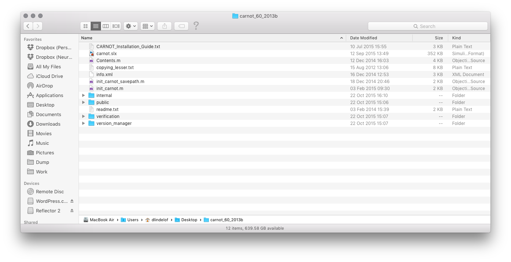
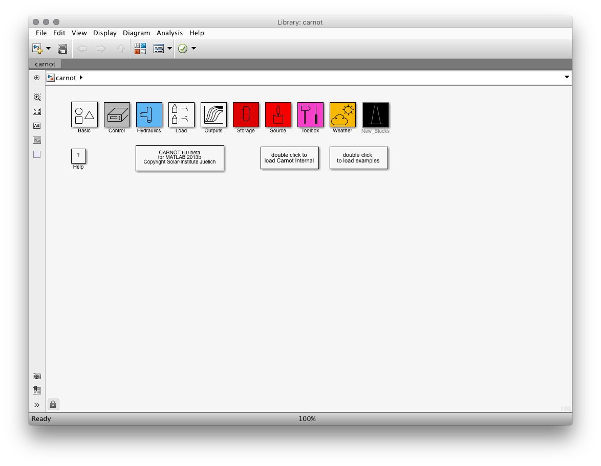

CARNOT (**C**onventional **A**nd **R**enewable e**N**ergy systems **O**ptimization **T**oolbox) is a set of MATLAB & Simulink models for simulating buildings and building systems, e.g. boilers, heat distributors etc. It's been developed by a collaboration involving several companies and universities and is generally well-regarded. It's one of several MATLAB toolboxes dedicated to the problem of simulating building physics; other toolboxes with a similar goal include the [International Building Physics Toolbox](http://www.ibpt.org/) and [SIMBAD](http://www.simbad-cstb.fr/).

CARNOT is in the process of being moved to a new hosting provider. In the meantime, I've recently obtained a copy of this toolbox and here is my experience in getting it to run under OSX.

CARNOT is distributed as a zip file, `carnot_60_2013b_public_22oct2015.zip`. I decompress it and find what looks like a Simulink top-level model called `carnot.slx`, and several sub-folders. Very encouragingly, I see there's an installation guide:

I move the decompressed folder to the folder where I keep all my in-progress projects, and create a symbolic link to it named more simply `carnot`.

The installation guide is very well written, and the main steps consist in:

1. Decompressing the toolbox;
2. Running the `init_carnot.m` script, that will setup all the paths correctly;
3. Compiling all the MEX file with the provided script.

When I ran `init_carnot.m` for the first time on my Mac, it didn't work and the error message made it very clear that most file paths have been written with the assumption that the toolbox was going to be used on Windows. At this point, I could have done either of two things:

1. Fix the issues myself as quickly as possibly and get on with the work;
2. Fix the issues myself carefully, making sure that my fixes could then be sent back to the maintainer of the package.

Being currently on a business trip, I felt like I had the leisure to go for option 2. Seeing that this toolbox was going to need some fixing, I made a git repo out of it and added all its files. (I didn't know at this point which, if any, files were generated. I figured that this was something I could worry about later and remove those files from the repo.)

I fixed the paths problem, which mostly lay in `path_carnot.m`, called by `init_carnot.m`. I created a patch from it and sent it to one of the maintainers. The paths were now correctly setup.

Next I ran `mex -setup` and this ran fine, MATLAB picked up my XCode installation with the Clang compiler. So the next step in the installation guide was to run `MakeMEX.m` from the `version_manager` directory. That ran fine for several `.c` files until it tried to compile `dir2_mex.c`. When I opened that file in the editor I saw that it depended on the Windows API. Here I had two options:

1. Try to understand what this file was doing and try to rewrite it without using the Windows API;
2. Skip the compilation of this file and hope that the rest of the toolbox would run fine without it.

The problem with option 1 was that I didn't know at this point whether there were going to be other files with the same problem. I certainly didn't want to enter that kind of endless loop of fixing file after file that depended on the Windows API. Since the build process had stoppped on encountering the first error, I had no way of knowing if there was going to be many other problems.

So that's why felt more appropriate to find where in the call `mex` was being called, and wrap that call in a `try/catch` block, yielding a warning if any file failed to be compiled. Re-running `MakeMEX` now compiled all the files correctly except the single `dir2_mex.c`, which I hoped would not be needed to run any of the simulations I was planning.

Once this was done, I could finally type `carnot` at the command line and the toolbox would open:

I was immediately drawn to the box that says `double click to open examples` and that yielded another set of errors, again related to file paths. After fixing those I could open an example model, the `example_House_SFH45`, click run, and saw the simulation running. I was all set and done.

A couple of days after writing the first draft of this article, I learned from one of the main developers that they plan to setup a proper SVN repository for the code, and that the whole toolbox was going to released under a BSD licence instead of the current LGPL. Until this is done, I've pushed my fixes to a [pubic repository on GitHub](https://github.com/neurobat/carnot), to which I have contributed some extra small fixes. But keep in mind that this is in no way the official repository for CARNOT; that will be announced shortly.
