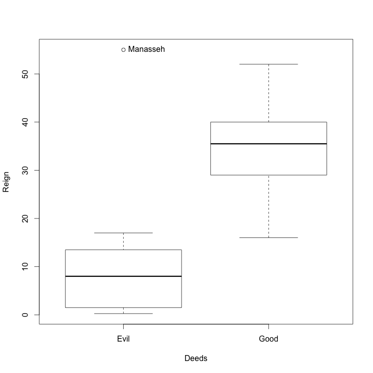

When you read through the biblical books of Kings, you may have been struck by a phrase that repeats itself for every monarch:

> In the Xth year of (king of kingdom B), (name of king) became king of (kingdom A). He reigned N years, and did (evil|good) in the sight of the Lord.

If you've read through these books several times, you will probably have noticed that the shorter reigns tend to belong to kings deemed to have done evil, with a record-breaking 3 months for Jehoahaz and Jehoiachin. Let's see if there's any relationship between reign duration and "goodness" of the king. First we prepare the data in a form suitable for analysis:

```
kings.data <- c("Name Deeds Reign
                David Good 40
                Solomon Good 40
                Rehoboam Evil 17
                Abijah Evil 3
                Asa Good 41
                Jehoshaphat Good 25
                Jehoram Evil 8
                Ahaziah Evil 1
                Joash Good 40
                Amaziah Good 29
                Azariah Good 52
                Jotham Good 16
                Ahaz Evil 16
                Hezekiah Good 29
                Manasseh Evil 55
                Amon Evil 2
                Josiah Good 31
                Jehoahaz Evil 0.25
                Jehoiakim Evil 11
                Jehoiachin Evil 0.25
                Zedekiah Evil 11")

kings <- read.table(textConnection(kings.data),
                    header = TRUE,
                    row.names = 1)
```

The `kings` data frame holds one row for each king. The row names are the names of the kings; the column `Deeds` is a two-level factor telling if their reign was deemed good or evil. (We assume here that Solomon was a good guy in spite of what happened towards the end of his life.) The `Reign` column records the length of the reign as given in the Bible in years, with fractional values for reigns shorter than one year.

We have 11 evil kings and 10 good kings:

```
> table(kings$Deeds)

Evil Good 
  11   10 
```

Here we compute the median reign duration depending on the rating of the deeds:

```
> with(kings, tapply(Reign, Deeds, median))
Evil Good 
 8.0 35.5 
```

There's already a good indication that the length of the reign depends on the deeds. We can now plot the length of the reigns:

```
library(car)
Boxplot(Reign ~ Deeds,
        kings)
```

[](http://computersandbuildings.com/wp-content/uploads/2016/01/kings.png)

This plot confirms our impression: "evil" kings tend to have shorter reigns that "good" kings, with the obvious exception of Manasseh, the same one of whom it was said

> I’ve arranged for four kinds of punishment: death in battle, the corpses dropped off by killer dogs, the rest picked clean by vultures, the bones gnawed by hyenas. They’ll be a sight to see, a sight to shock the whole world—and all because of Manasseh son of Hezekiah and all he did in Jerusalem. (Jer 15:3-4)

So what does this all prove? Probably nothing. Plotting data is its own reward. :-)
