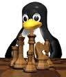
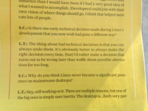
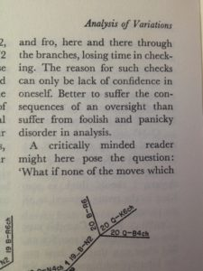

I've uncovered evidence that Linus Torvalds, creator of Linux, may entertain a secret hobby.

An interview of Linus Torvalds in a [recent issue of IEEE Spectrum](http://spectrum.ieee.org/computing/software/linux-at-25-qa-with-linus-torvalds) had the following passage:

> I'd rather make a decision that turns out to be wrong later than waffle about possible alternatives for too long.

On the surface, this sounds like your usual admonition against analysis paralysis ([Wikipedia](https://en.wikipedia.org/wiki/Analysis_paralysis)). But what Linus said echoes something that Alexander Kotov ([Wikipedia](https://en.wikipedia.org/wiki/Alexander_Kotov)), former chess grandmaster, wrote in 1971 in his _Thinking like a Grandmaster_ ([Amazon](http://www.amazon.com/Think-Like-Grandmaster-Alexander-Kotov/dp/0713478853)):

> Better to suffer the consequences of an oversight than suffer from foolish and panicky disorder in analysis.

If I didn't know better I would conclude that the same person wrote these two passages.
