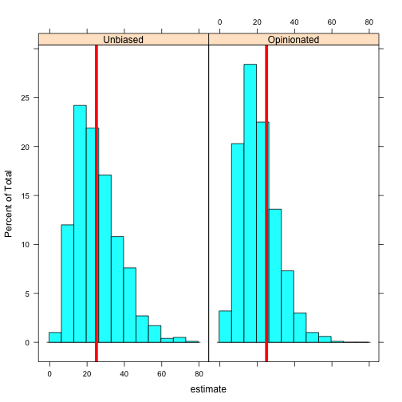

You have been lied to. By me.

[](http://computersandbuildings.com/wp-content/uploads/2016/03/killian.jpg)

I taught once a programming class and introduced my students to the notion of an _unbiased estimator_ of the variance of a population. The problem can be stated as follows: given a set of observations $(x\_1, x\_2, ..., x\_n)$, what can you say about the variance of the population from which this sample is drawn?

Classical textbooks, [MathWorld](http://mathworld.wolfram.com/SampleVariance.html), the [Khan Academy](https://www.khanacademy.org/math/probability/descriptive-statistics/variance-std-deviation/v/sample-variance), and [Wikipedia](https://en.wikipedia.org/wiki/Variance#Population_variance_and_sample_variance) all give you the formula for the so-called _unbiased estimator_ of the population variance:

$$\\hat{s}^2 = \\frac{1}{n-1}\\sum\_{i=1}^n (x\_i - \\bar{x})^2$$

where $\\bar{x}$ is the sample mean. The expected error of this estimator is zero:

$$E\[\\hat{s}^2 - \\sigma^2\] = 0$$

where $\\sigma^2$ is the \`\`true'' population variance. Put another way, the expected value of this estimator is exactly the population variance:

$$E\[\\hat{s}^2\] = \\sigma^2$$

So far so good. The expected error is zero, therefore it's the best estimator, right? This is what orthodox statistics (and teachers like me who don't know better) will have you believe.

But Jaynes ([Probability Theory](http://amzn.com/0521592712)) points out that in practical problems one does not care about the expected error of the estimated variances (or of _any_ estimator for that matter). What matters is how _accurate_ this estimator is, i.e. how close it is to the true variance. And this calls for an estimator that will minimise the _expected squared error_ $E\[(\\hat{s}^2 - \\sigma^2)^2\]$. But we can also write this expected squared error as:

$$E\[(\\hat{s}^2 - \\sigma^2)^2\] = (E\[\\hat{s}^2\] - \\sigma^2)^2 + \\mathrm{Var}(\\hat{s}^2)$$

The expected squared error of our estimator is thus the sum of two terms: the square of the expected error, and the variance of the estimator. When following the cookbooks of orthodox statistics, _only the first term is minimised_ and there is no guarantee that the total error is minimised.

For samples drawn from a Gaussian distribution, Jaynes shows that an estimator that minimises the total (squared) error is

$$\\hat{s}^2 = \\frac{1}{n+1}\\sum\_{i=1}^n (x\_i - \\bar{x})^2$$

Notice that the $n-1$ denominator has been replaced with $n+1$. In a fit of fancifulness I'll call this an _opinionated_ estimator. Let's test how well this estimator performs.

First we generate 1000 random sets of 10 samples with mean 0 and variance 25:

```
samples <- matrix(rnorm(10000, sd = 5), ncol = 10)
```

For each group of 10 samples, we estimate the population variance first with the canonical $n-1$ denominator. This is what R's built-in `var` function will do, according to its documentation:

```
unbiased <- apply(samples, MARGIN = 1, var)
```

Next we estimate the population variance with the $n+1$ denominator. We take a little shortcut here by multiplying the unbiased estimator by $(n-1)/(n+1)$, but it makes no difference:

```
opinionated <- apply(samples, MARGIN = 1, function(x) var(x) * (length(x) - 1) / (length(x) + 1))
```

Finally we combine everything in one convenient data frame:

```
estimators <- rbind(data.frame(estimator = "Unbiased", estimate = unbiased),
                    data.frame(estimator = "Opinionated", estimate = opinionated))

histogram(~ estimate | estimator, estimators,
          panel = function(...) {
            panel.histogram(...)
            panel.abline(v = 25, col = "red", lwd = 5)
          })
```

[](http://computersandbuildings.com/wp-content/uploads/2016/03/unnamed-chunk-5-1.png)

It's a bit hard to tell visually which one is \`\`better''. But let's compute the average squared error for each estimator:

```
aggregate(estimate ~ estimator, estimators, function(x) mean((x - 25)^2))

##     estimator estimate
## 1    Unbiased 145.1007
## 2 Opinionated 115.5074
```

This shows clearly that the $n+1$ denominator yields a smaller total (squared) error than the so-called unbiased $n-1$ estimator, at leat for a sample drawn from a Gaussian distribution.

So do your brain a favour and question everything I tell you. Including this post.
