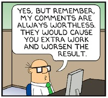

Once you publish a paper in a journal, you are expected to regularly review papers for that journal. It's part of the normal scientific process. Some may consider it a chore, but I see it as an opportunity to keep in touch with my field and to help quality papers get published.

When I was first asked to review a paper there was very little help available on the subject. Things have considerably improved since; for example, Elsevier maintains an [Elsevier for Reviewers](https://www.elsevier.com/reviewers) website with plenty of information. I recommend you start there for some basic reviewer training. But the last time I checked, that site would not yet tell you anything about how to read a paper or how to actually write a reviewer report.

Here is a workflow that works for me. Once I receive a reviewer invitation, here's what I do:

##### Accept a reviewer invitation immediately

The whole scientific process depends on reliable and speedy reviewers. Do unto others as you would have them do to you. When I am invited to review an article, that takes priority over any other writing.

I usually read articles as PDF on my iPad, with the [GoodReader](https://www.goodreader.com/) app. I immediately accept reviewer invitations and download the PDF version of the article, save it to an iCould folder where GoodReader can find it, and download it to my iPad.

##### Read a first time generously

As soon as possible I read through the article, from beginning to end. Ideally in a single sitting, but if that's not possible I do it in several. The goal is to form a general idea of what the article is about, how it is structured, and to prime my mind for what to look out for on the next reading.

##### Read a second time more critically

Next I re-read the article, but far slower and more critically. This is where I use GoodReader's annotation tools: I highlight passages that I think need to be mentioned in my report; I strike through passages that I think can be omitted; I underline with squiggly lines passages that don't read well and deserve to be changed. Sometimes I add a comment box summarising a point I don't want to forget in my report.

When I highlight a passage I seldom record _why_ I highlighted them. If I cannot remember why I highlighted a passage by the time I write the report, it probably wasn't important.

##### Write the report

I don't know how it goes for other journals, but the one I review most frequently for ([_Energy & Buildings_](http://www.journals.elsevier.com/energy-and-buildings/)) provides the reviewer with a free-form text field in which to enter their observations. (There is also a text form for private comments to the editor, but I seldom use that.) It's important to realise that the comments from all the reviewers will be collated together and sent to the author, and sometimes also to the reviewers to notify them of the editor's decision.

You can also include supplementary files with your review. The only time I've found this useful was when I needed to typeset mathematics in my review. However, I discovered that the supplementary files are _not_ forwarded to the other reviewers, and I now avoid them.

Your report will therefore be written in plain text. I try to stick to the following template:

> <express thanks and congratulations for the paper> <summarise the paper's main points> <if there are major concerns about the paper, enumerate them here as a numbered list, most important ones first> <for each section of the paper, enumerate the other (minor) suggestions/remarks as a numbered list, in the order in which they are found in the paper>

Keep in mind that the author will be required to respond to each of the reviewer's comments. If you provide them in a numbered list you make life simpler for them.

When I write the report I go through each of my annotations, one by one, and write a comment for each of them, either to the list of minor comments or to the major ones. By the time I reach the end of the paper, all my annotations will have a corresponding comment.

I write my report in [Markdown](https://daringfireball.net/projects/markdown/) with [Vim](http://www.vim.org/). That way I do not need to worry about getting the numbering of the comments correct; I am free to re-order my comments, especially the ones that deal with major concerns, so that the most important ones come first. When I am satisfied I run the report through `pandoc`, and generate a text file:

pandoc -o %:r.txt %

After a final check I copy/paste the contents of that text file into the review submission platform.

##### Language issues

To this day I'm not sure whether the reviewer or the editor is responsible for fixing typos or other language errors. These days I tend to skip them, unless I find sentences whose meaning has become completely obscure. Otherwise I usually add to my list of major concerns a sentence such as:

> There are many typos and grammatical mistakes throughout the paper. For example the last sentence of the first paragraph of the Introduction reads as follows:
> 
> \> ... that allows for a more active participation of the demand side in the operation a control task of the power system.

or even:

> The language quality of this paper does not meet the standards for an international journal, and I found the paper very hard to follow.

In general I do not try to reformulate any passages. For many authors, English is a second language and I appreciate how hard it can be to communicate with clarity, even for native speakers. When necessary I might suggest that the authors have the paper reviewed by a native speaker.

##### Summary

That, in a nutshell, how I review papers. I know it can feel like a chore, but I strongly encourage you to participate in the process. I hope this workflow might help you get started. If you have any comments, I'd love to hear them.
