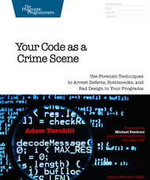
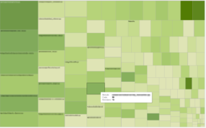

Adam Tornhill's [Your Code as a Crime Scene](https://pragprog.com/book/atcrime/your-code-as-a-crime-scene) (YCAACS) has lain open next to my laptop for several months now. I'm usually a fast reader and a technical book rarely lasts that long, unless the book is crammed with practical tips and advice that I want to try as I go along. YCAACS is no exception.

[](https://pragprog.com/book/atcrime/your-code-as-a-crime-scene)

The book introduces a technique completely new to me: the mining of your code repository's history for patterns known to correlate with code defects. For example, do the most complex modules in your project tend to become even more complex over time, suggesting that your [technical debt](https://en.wikipedia.org/wiki/Technical_debt) is growing out of control? Each self-contained chapter presents a different analysis you can try out. In this post I will walk through the most simple example: correlating the number of revisions to a module with that module's complexity.

I'll start with one of our current internal project called `romulus`. We begin the analysis by extracting the repository log for the last two months, formatted in a way to make the analysis easier:

```
git log --pretty=format:'[%h] %aN %ad %s' --date=short --numstat --after=2016-05-01 > romulus.log
```

The key argument here is `--numstat`: this reports the number of lines added or deleted for each file. It will tell us how frequently a given file, or module, has changed during that reporting period.

Next we use the [`code-maat`](https://github.com/adamtornhill/code-maat) tool written by the author of YCAACS. It's a tool that will analyse the log of a code repository and extract different summary statistics. For our example, all we want to know is how frequently each module has been changed:

```
maat -l romulus.log -c git -a revisions > romulus_revs.csv
```

Next we need to correlate those changes with the complexity of each file. We won't be using any fancy complexity metric here: the number of lines of code will suffice. We use [`cloc`](https://github.com/AlDanial/cloc):

```
cloc * --by-file --csv --quiet > romulus_sizes.csv
```

We now have two CSV files:

- `romulus_revs.csv`: the number of revisions of each file in our repository
- `romulus_sizes.csv`: the size of each file

By doing the equivalent of a SQL JOIN on these files, you obtain for each file its number of revisions and size. You can do this in the analysis tool of your choice. I do it in Tableau and show the result as a heatmap, where each rectangle represents a module. The size of the rectangle is proportional to the size, or complexity, of the module and its color darkness is proportional to the number of times it has changed over time. With Tableau you can hover over any of these rectangles and a window will pop-up, giving detailed information about that module:



So what does this heatmap tell me? There's no obvious outlier here; a couple of modules in the upper right corner have recently seen a lot of change, but I know that these modules implement some of the stories we are currently working on so no surprise there. This map has, however, a tendency to become darker towards the left side, where the largest modules are shown. This suggests that some modules have been growing over time, possibly out of control. Clearly, this must be investigated and these modules should perhaps deserve more testing and/or refactoring than the average.

"Your Code as a Crime Scene" is a fantastic book. Every chapter has a couple of ideas that you can try right away on your project. I suspect this will be of most value to technical leads and testers, both of whom I consider the guardians of code quality. I'm less sure that the other developers will be able to apply the ideas from the book that easily though. Doing it properly does take time, requires a certain mindset, and a certain familiarity with data analytics. But if your team includes someone willing and capable of doing it, I'm sure you will all benefit from it.
