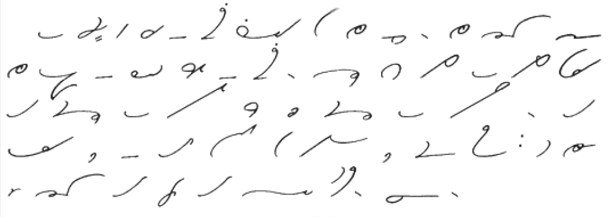

_This piece is a writing assignment for the [Learning How To Learn](https://www.coursera.org/learn/learning-how-to-learn/home/welcome) online class, in which we are asked to reflect on a recent learning challenge._

Shorthand---the ability to write at possibly over 200 words per minute---is a dying skill. The ubiquitous use of computers and laptops for taking notes and meeting minutes has turned shorthand into a curiosity, a skill reserved for a dying generation or some die-hard hobbyists. Which is a shame---there's a kind of elegance and beauty to some of the shorthand systems out there, and who wouldn't want to be able to write and read scripts like this:

<figure>

<figcaption>

The Lord's Prayer in Gregg Shorthand. Public Domain, https://commons.wikimedia.org/w/index.php?curid=306847

</figcaption>

</figure>

Shorthand belongs to a family of skills that were considered essential perhaps 50 years ago, but have been made all but obsolete by technology, such as:

- Using a slide ruler
- Note taking
- Touch typing
- Handwriting
- Mnemotechnics
- Shorthand

Yet I claim that many of these, if not most, should still be taught in our primary schools; in this piece I reflect on my experience in learning the Gregg Shorthand system.

As far as knowledge work goes, I've had a rather typical education: Master in Physics, PhD in Physics, self-taught in Computer Programming, Statistics, and Data Science. I've always taken my professional development very seriously and have almost always got some MOOC going on.

Being something of a compulsive note taker, I became interested in the various shorthand systems in 2005. I researched the different systems, and concluded that the [Gregg system](https://en.wikipedia.org/wiki/Gregg_shorthand) would be ideal for me, striking a good balance between ease of learning vs writing speed. So I began to learn the system, relying at first on the vast collection of [free resources available online](https://gregg.angelfishy.net/).

But in the last 14 years or so, my enthusiasm for learning shorthand has ebbed and flowed. My commitment to learning went through spikes and valleys. I never lost interest, but other interests would inevitably take priority. With hindsight, I believe the three largest mental hurdles were the following:

- **No incentive:** I never entertained any illusion of gaining something tangible from learning shorthand, so my only motivation was my own curiosity.
- **Lack of resources:** in spite of the website mentioned above, I feel that there aren't that many resources out there for learning shorthand. I couldn't find any reading material written in shorthand, for example. Nor could I find any online class.
- **Lack of priority:** just as with anything else, the first excuse for dropping out will be the lack of time. But that's seldom the root cause. More likely, I would frequently let other things take priority over the regular practice time needed for learning a new skill such as shorthand.

So what to do? How to get good at shorthand, when the only tangible benefit, to be honest, is the satisfaction of having learned something cool? Here is what seems to be working for me:

- **The book:** the free resources available online are absolutely incredible, but they're, well, free. When I download a free book I'm not vested in it; there's no sunk cost, so no compulsion to make something good come out of my "loss". Not so with a physical book. I bought _[The GREGG Shorthand Manual Simplified](https://www.amazon.com/dp/0070245487/ref=cm_sw_r_tw_dp_U_x_pTM7Cb15P3JB4)_, so that I would feel bad whenever I saw the book on my desk gathering dust.
- **The community:** sharing a ridiculous obsession with others is always more fun than being alone. I discovered a [Reddit group](https://www.reddit.com/r/shorthand/) dedicated to shorthand in general, and I joined it. Being part of such a community was a great boost to my motivation, and provided me with a place to ask questions about difficult reading exercises.
- **Self-testing:** the book mentioned above features many reading exercises, but doesn't give the answers. It made it difficult for me to assess whether I was making progress. Instead, I discovered that [AnkiApp](https://www.ankiapp.com/), one of many flashcards apps out there, would let me download and install a deck of flashcards for practising shorthand reading.  
    But what about the book's reading exercises? How could I make sure I understood them correctly without bothering the Reddit community? I discovered a [website where you can enter text in English](http://steno.tu-clausthal.de/Gregg.php), and it would be rendered into Gregg shorthand (to this day, I have been unable to locate a tool that would read Gregg and turn it into English). I now had all the necessary means to test myself.

Practising Gregg shorthand has now been part of my daily routine for the past couple of months; I can read the Lord's Prayer above, albeit slowly. I am still far from being able to take meeting notes in shorthand, but I'm confident I will be able to do so in a few months.
