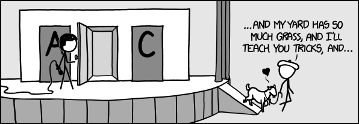

I take it we're all familiar with the infamous [Monty Hall problem](https://en.wikipedia.org/wiki/Monty_Hall_problem):

> Suppose you're on a game show, and you're given the choice of three doors: Behind one door is a car; behind the others, goats. You pick a door, say A, and the host, who knows what's behind the doors, opens another door, say C, which has a goat. He then says to you, “Do you want to pick door B?” Is it to your advantage to switch your choice?

The correct strategy consists in accepting the offer to switch doors. The expected gain when doing so is 2/3, vs 1/3 when choosing not to change doors (there are only two doors left closed, so one of them must have the car; hence the expected gains sum to 1).

<figure>



<figcaption>

[https://xkcd.com/1282/](https://xkcd.com/1282/)

</figcaption>

</figure>

The mathematical proof is straightforward but most people (including me) have a hard time understanding intuitively what's going on. There are plenty of explanations available online, but I've recently simulated the problem and come across one that I think is simpler and more elegant than anything I've seen so far. And I didn't make it up; the simulation code did. Here's how.

## Classic Monty

Let's simulate 10,000 rounds of the game. The `car` vector will hold the door which has the car behind it:

```r
n <- 10000
car <- sample(c('A', 'B', 'C'), size = n, replace = TRUE)
```

Quick check that the door appears randomly assigned:

```r
table(car)
## car
##    A    B    C 
## 3329 3310 3361
```

Let's now simulate the door being opened by Monty. Without loss of generality, let's assume you choose door A. Then if the car is behind door A, Monty will open door B or C at random; else he will open the door that has a goat.

```r
door <- ifelse(
  car == 'A',
  sample(c('B', 'C'), size = n, replace = TRUE), # chosen at random 
  ifelse(car == 'B', 'C', 'B'))  # otherwise whichever door has a goat
```

Now the gain, when declining to switch, is given by how many cases have the car behind door A:

```r
sum(car == 'A') / n
## [1] 0.3329
```

As expected, it is about 1/3.

The gain, when switching doors, is given by how many times the unopened door has the car:

```r
unopened <- ifelse(door == 'B', 'C', 'B')
sum(car == unopened) / n
## [1] 0.6671
```

But the car is either behind the unopened door or behind A; you win if the car is not behind A. So the last expression is equivalent to

```r
sum(car != 'A') / n
## [1] 0.6671
```

And this gives exactly the same result. The probability of winning the car when declining to switch is the probability that the car is behind door A. The probability of winning when switching is _just the probability that the car is not behind door A_, i.e., 2/3. And that's the simplest, most elegant explanation of the paradox I've ever found.

But there's more. Notice that in our final expression, we had no need to know which door was opened. And this has interesting consequences for a variation of the game which I'll call the _deterministic Monty Hall_.

## Deterministic Monty

In the classic version of the game, Monty will select a door at random between B and C if the car happens to be behind A, the door chosen by the player. Let's now suppose instead that when the car is behind A, Monty _always_ chooses to open door B. Will that information change our strategy?

On one hand, we would feel that when Monty opens door B, the car will more likely be behind door A, and perhaps we should instead choose to stay. Well, let's simulate this.

```r
door_deterministic <- ifelse(
  car == 'A', 'B', # not chosen at random anymore
  ifelse(car == 'B', 'C', 'B'))
```

The expression for the expected gains are very similar. If choosing to stay, the expected gain remains

```r
sum(car == 'A') / n
## [1] 0.3329
```

While when choosing to switch, the gain becomes

```r
unopened_deterministic <- ifelse(door_deterministic == 'B', 'C', 'B')
sum(car == unopened_deterministic) / n
## [1] 0.6671
```

But this last expression is _again_ simply equal to

```r
sum(car != 'A') / n
## [1] 0.6671
```

because no matter which strategy Monty used, the car still has to be behind A or the unopened door.

Now this was completely counterintuitive to me: surely, knowing Monty's strategy should give you an edge? But let's consider separately the two possibilities:

### Monty opens B

Unlike the preceding scenario, this happens in _all_ scenarios where the car is behind A or C (2/3 of the cases). And among these scenarios, in exactly half the cases the car is behind A. So you know that the car is equally likely to be behind A or C, and switching doors will neither help nor hurt you. So this scenario contributes $2/3 \\times 1/2 = 1/3$ to the total expected gain.

### Monty opens C

This can only happen when the car is behind B, so you certainly benefit from switching doors. But this happens only 1/3 of the time, and this scenario contributes $1/3 \\times 1 = 1/3$ to the total expected gain.

So in this variant of the game, your total expected gain remains exactly 2/3.

### “Computational” proof

I'm not sure this would be accepted as a rigorous proof, but when I wrote the expression for the expected gain I always ended up with `sum(car != 'A') / n`, no matter what Monty's strategy was. Or in plain English:

> The expected gain when switching doors is the probability that the car was not behind A in the first place.

This, of course, is:

- obvious
- independent of Monty's strategy
- always equal to 2/3
- possibly the most succinct explanation of Monty's paradox I've come across

But it never hurts to double-check what the maths tell us.

## Mathematical proof

Let's work out the probability that the car should be behind door B when Monty opens door C.

$\\DeclareMathOperator{\\Open}{Open}$

\\begin{align\*}  
\\Pr(B \\mid \\Open(C)) &= \\frac{\\Pr(\\Open(C) \\mid B) \\times \\Pr(B)}{\\Pr(\\Open(C))} && \\text{by Bayes} \\\\  
&= \\frac{1 \\times \\Pr(B)}{\\Pr(\\Open(C))} && \\text{because $B \\implies \\Open(C)$} \\\\  
&= \\frac{1/3}{\\Pr(\\Open(C))} && \\text{because each door is equally probable} \\\\  
&= \\frac{1}{3} \\frac{1}{\\Pr(\\Open(C) \\mid A) \\times \\Pr(A) + \\Pr(\\Open(C) \\mid B) \\times \\Pr(B)} && \\text{because $A$ or $B$ must be true when $C$ is open} \\\\  
&= \\frac{1}{\\Pr(\\Open(C) \\mid A) + \\Pr(\\Open(C) \\mid B)} && \\text{because $\\Pr(A) = \\Pr(B) = 1/3$}, \\\\  
\\end{align\*}

and similarly for $\\Pr(C \\mid \\Open(B))$. This result does not depend on Monty’s strategy, but the final figures do:

\\begin{align\*}  
\\text{Random choice:} && \\Pr(B \\mid \\Open(C)) &= 2/3 \\\\  
&& \\Pr(C \\mid \\Open(B)) &= 2/3 \\\\  
\\text{Deterministic:} && \\Pr(B \\mid \\Open(C)) &= 1 \\\\  
&& \\Pr(C \\mid \\Open(B)) &= 1/2,  
\\end{align\*}

but the _expected gain_ when switching doors (without knowing Monty's strategy) depends on $\\Pr(\\Open(B))$ and $\\Pr(\\Open(C))$. When Monty's choice is random, $\\Pr(\\Open(B)) = \\Pr(\\Open(C)) = 1/2$, but when his choice is deterministic, we have $\\Pr(\\Open(B)) = 2/3$ and $\\Pr(\\Open(C)) = 1/3$. Either way, you can easily check that the expected gain is 2/3.

Still. What the computer program taught me was a much simpler way. All you had to do was observe that

$$\\Pr(B \\mid \\Open(C)) = \\Pr(\\neg A \\mid \\Open(C)) = \\Pr(\\neg A) = 2/3,$$

since $A$ and $\\Open(C)$ are independent in the random variant. In the deterministic case we're not really interested in $\\Pr(B \\mid \\Open(C))$ but in the probability that the car is not behind $A$, when all we know is that some door will be open. But as the computer program tells us, these are independent probabilities, so again the probability of win is simply $\\Pr(\\neg A) = 2/3.$
