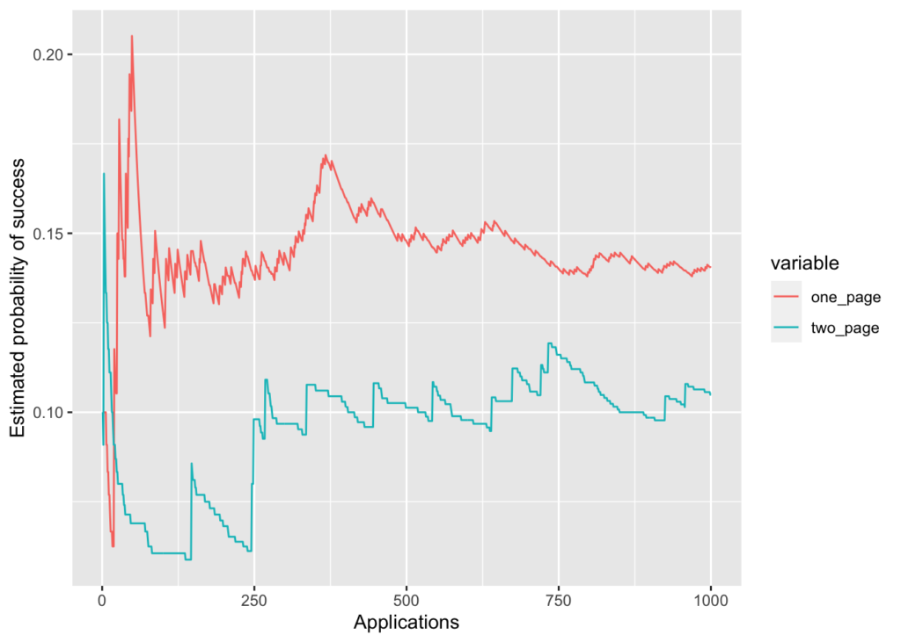

Internet wisdom is divided on whether one-page resumes are more effective at landing you an interview than two-page ones. Most of the advice out there seems much opinion- or anecdotal-based, with very little scientific basis.

Well, let’s fix that.

Being currently open to work, I thought this would be the right time to test this scientifically. I have two versions of my resume:

- [A two-page, employment + education on first page, extra information on the second page](https://davidlindelof.com/wp-content/uploads/2020/11/Lindelof_CV.pdf) such as online courses, hobbies etc.
- [A one-page, dense, responsibilities + achievements only](https://davidlindelof.com/wp-content/uploads/2020/11/Lindelof-Resume-Dec-20.pdf), follows template from the [Career Tools resume workbook](https://www.manager-tools.com/products/resume-workbook).

The purpose of a resume is to land you an interview, so we’ll track for each resume how many applications yield a call for an interview. Non-responses after one week are treated as failures. We’ll model the effectiveness of a resume as a binomial distribution: all other things being considered equal, we’ll assume all applications using the same resume type have the same probability ($p1$ or $p2$) of landing an interview. We’d like to estimate these probabilities, and decide if one resume is more effective than the other.

<!--more-->

In a traditional randomized trial, we would randomly assign each job offer to a resume and record the success rate. But let’s estimate the [statistical power](https://en.wikipedia.org/wiki/Power_of_a_test) of such a test. From past experience, and also from many plots such as [this one](https://www.reddit.com/r/ProductManagement/comments/j3654d/8_weeks_of_job_search_spree_ended_happily_two/) posted on Reddit, it seems reasonable to assign a baseline success rate of about 0.1 (i.e., about one application in 10 yields an interview). Suppose the one-page version is twice as effective and we apply to 100 positions with each. Then the statistical power, i.e. the probability of detecting a statistically significant effect, is given by:

```r
library(Exact)
power.exact.test(p1 = 0.2, p2 = 0.1, n1 = 100, n2 = 100)
```

```
## 
##      Z-pooled Exact Test 
## 
##          n1, n2 = 100, 100
##          p1, p2 = 0.2, 0.1
##           alpha = 0.05
##           power = 0.501577
##     alternative = two.sided
##           delta = 0
```

That is, we have only about 50% chances of detecting the effect with 0.05 confidence. This is not going to work; at a rate of about 10 applications per month, this would require 20 months.

Instead I’m going to frame this as a [multi-armed bandit](https://en.wikipedia.org/wiki/Multi-armed_bandit) problem: I have two resumes and I don’t know which one is the most effective, so I’d like to test them both _but_ give preference to the one that seems to have the highest rate of success—also known as trading off exploration vs exploitation.

We’ll begin by assuming again that we think each has about 10% chance of success, but since this is based on a limited experience it makes sense to treat this probability as the expected value of a beta distribution parameterized by, say, 1 success and 9 failures.

So whenever we apply for a new job, we:

- draw a new $p1$ and $p2$ from each beta distribution
- apply to the one with the highest drawn probability
- update the selected resume’s beta distribution according to its success or failure.

Let’s simulate this, assuming that we know immediately if the application was successful or not. Let’s take the “true” probabilities to be 0.14 and 0.11 for the one-page and two-page resumes respectively. We’ll keep track of the simulation state in a simple list:

```r
new_stepper <- function() {
  state <- list(k1 = 1, n1 = 10, p1 = 0.14, k2 = 1, n2 = 10, p2 = 0.11)
  step <- function() {
    old_state <- state
    state <<- next_state(state)
    old_state
  }
  step
}
```

`new_stepper()` returns a closure that keeps a reference to the simulation state. Each call to that closure updates the state using the `next_state` function:

```r
next_state <- function(state) {
  p1 <- rbeta(1, state$k1, state$n1 - state$k1)
  p2 <- rbeta(1, state$k2, state$n2 - state$k2)
  pull1 <- p1 > p2
  result <- rbinom(1, 1, ifelse(pull1, state$p1, state$p2))
  if (pull1) {
    state$n1 <- state$n1 + 1
    state$k1 <- state$k1 + result
  } else {
    state$n2 <- state$n2 + 1
    state$k2 <- state$k2 + result
  }
  state
}
```

So let’s now simulate 1000 steps:

```r
step <- new_stepper()
sim <- data.frame(t(replicate(1000, unlist(step()))))
```

The estimated effectiveness of each resume is given by the number of successes divided by the number of applications made with that resume:

```r
sim$one_page <- sim$k1 / sim$n1
sim$two_page <- sim$k2 / sim$n2
sim$id <- 1:nrow(sim)
```

The follow plot shows how that estimated probability evolves over time:

```r
library(reshape2)
library(ggplot2)
sim_long <- melt(sim, measure.vars = c('one_page', 'two_page'))
ggplot(sim_long, aes(x = id, y = value, col = variable)) +
  geom_line() +
  xlab('Applications') +
  ylab('Estimated probability of success')
```

<figure>



<figcaption>

_Wouldn't that be nice_

</figcaption>

</figure>

As you can see, the algorithm decides pretty rapidly (after about 70 applications) that the one-page resume is more effective.

So here’s the protocol I’ve begun to follow since about mid-November:

- Apply only to jobs that I would normally have applied to
- Go through the entire application procedure, including writing cover letter etc, until uploading the resume becomes unavoidable (I do this mainly to avoid any personal bias when writing cover letters)
- Draw $p1$ and $p2$ as described above; select resume type with highest $p$
- Adjust the resume according to the job requirements, but keep the changes to a minimum and don’t change the overall format
- Finish the application, and record a failure until a call for an interview comes in.

I’ll be sure to report on the results in a future blog post.
