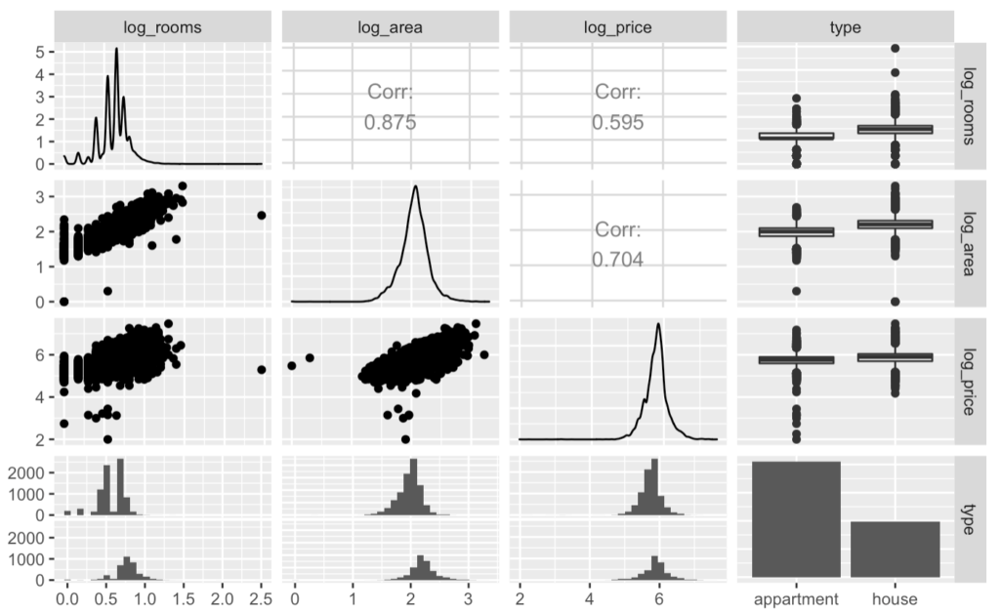

Here's a fun weekend project: scrape the real estate classifieds of the website of your choice, and do some analytics on the data. I did just that last weekend, using the [Scrapy](https://scrapy.org/) Python library for web scraping, which I then let loose on one of the major real estate classifieds website in Switzerland (can't tell you which one---not sure they would love me for it).

After about 10 minutes I had the data for 12'124 apartments or houses for sale across Switzerland, with room count, area, price, city, and canton.

I've imported the data in R, and log-transformed the room count, area, and price because of extreme skewness. Here's the resulting scatterplot matrix, obtained with `ggpairs()`:

There's a number of interesting features, even from this raw, unclean dataset:

- there are about twice as many apartments for sale than houses
- the room count comes in discrete values in steps of 0.5 (half rooms are frequently used for "smaller" rooms such as a small kitchen, a small hallway, etc)
- the room count is highly correlated with area, as expected
- the price is more correlated with the area than with the room count
- there are several extreme outliers:
    - a property with 290 rooms (was a typo; the owner meant an _area_ of 290 m2)
    - some properties with abnormally low area (one of them was a house with a listed room count of 1 and area of 1 m2\---obviously didn't bother to enter correct data)
    - and more interesting, several properties with abnormally low prices; the lowest-priced item is a 3.5-room, 80 m2 apartment in Fribourg priced at CHF 99.-.

Before we go any further, we'll obviously have to clean up these faulty data points. There doesn't seem to be many of them so I'll do that manually, and write a follow-up post if I find anything interesting.
