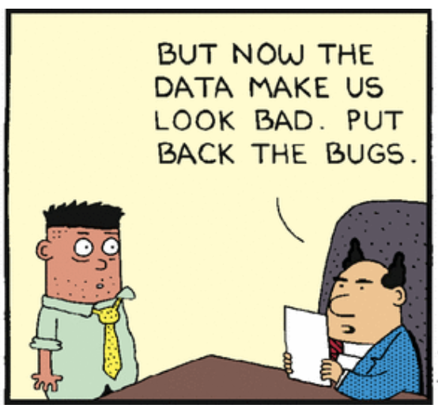

Machine-learning applications frequently feature SQL queries, which range from simple projections to complex aggregations over several join operations.

There doesn’t seem to be much guidance on how to verify that these queries are correct. All mainstream programming languages have embraced unit tests as the primary tool to verify the correctness of the language’s smallest building blocks---all, that is, except SQL.

And yet, SQL is a programming language and SQL queries are computer programs, which should be tested just like every other unit of the application.

<figure>



<figcaption>

_I'm not responsible_

</figcaption>

</figure>

All mainstream languages have libraries for writing unit tests: small computer programs that verify that each software module works as expected. But SQL poses a special challenge, as it can be difficult to use SQL to set up a test, execute it, and verify the output. SQL is a declarative language, usually embedded in a "host" programming language---a language in a language.

So to unit test SQL we need to use that host language to set up the data tables used in our queries, orchestrate the execution of the SQL queries, and verify the correctness of the results.

<!--more-->

One additional complication is that every relational database system defines its own SQL dialect, so that a query that runs fine on system A might not even parse on system B. Therefore, as much as technically feasible, we’ll prefer database systems that can be instantiated in memory during unit tests, but are otherwise the same as those running in production. Oracle and Teradata users, I have no idea if what follows will work for you.

Many machine-learning applications use the [Apache Spark](https://spark.apache.org/) engine to collect and aggregate data from (possibly huge) datasets; it has bindings to several programming languages but also offers an SQL interface. And you can easily start an instance on your local machine for testing and development. Therefore, in this piece we’ll use PySpark (a Python binding for Spark) to prepare our data in a desired state, execute SQL code against it, and verify the results.

But first things first. We begin by installing the required Python packages:

```bash
  $ pip install ipython pyspark pytest pandas numpy
```

Before we do anything fancy, let’s make sure we understand how to run SQL code against a Spark session. We’ll write everything as PyTest unit tests, starting with a short test that will send `SELECT 1`, convert the result to a Pandas `DataFrame`, and check the results:

```python
import pandas as pd
from pyspark.sql import SparkSession

def test_can_send_sql_to_spark():
    spark = (SparkSession
             .builder
             .appName("utsql")
             .getOrCreate())
    df: pd.DataFrame = spark.sql("SELECT 1").toPandas()

    assert len(df) == 1
    assert len(df.columns) == 1
    assert df.iloc[0, 0] == 1
```

We verify that the tests pass:

```bash
$ pytest --disable-warnings
============================= test session starts =============================
platform darwin -- Python 3.7.5, pytest-5.1.2, py-1.8.0, pluggy-0.13.0
rootdir: /Users/dlindelof/Work/app/utsql
collected 1 item
1/test_spark_api.py . [100%]

======================== 1 passed, 7 warnings in 4.82s ========================
```

You’re right---4.82 seconds is an awfully long time for a single unit test. But most of that time is spent instantiating Spark, and will therefore be shared by all the tests we write.

To write more interesting queries we’ll have to populate our Spark session with data. The fundamental building block of PySpark’s API is the Spark `DataFrame` (not to be confused with Pandas' `DataFrame`), which you can think of as a distributed table. A Spark `DataFrame` can be created in many ways; a very convenient one is from a list of dictionaries:

```python
>>> d = [{'name': 'Alice', 'age': 1}]
>>> df = spark.createDataFrame(d)
>>> df
DataFrame[age: bigint, name: string]
>>> df.collect()
[Row(age=1, name='Alice')]
>>>
```

As you can see, Spark does a pretty good job at inferring the data types from the dicts you provide, albeit that behaviour used to be deprecated.

You cannot yet run SQL queries against this data frame, because no table exists that your SQL queries can refer to. To do that, use the `createOrReplaceTempView()` method:

```python
>>> df.createOrReplaceTempView('people')
>>> spark.sql("SELECT * FROM people").toPandas()
   age   name
0    1  Alice
```

That SQL query returned a data frame with just one row, with the data we provided. We didn’t need to write a table schema, as Spark inferred it for us. Before we move on, let’s capture what we have learned in a unit test.

```python
import pandas as pd
from pyspark.sql import SparkSession

def test_can_create_sql_table():
    spark = (SparkSession
             .builder
             .appName("utsql")
             .getOrCreate())

    d = [{'name': 'Alice', 'age': 1}]
    expected_pdf = pd.DataFrame(d)

    sdf = spark.createDataFrame(d)
    sdf.createOrReplaceTempView('people')
    actual_pdf = spark.sql("SELECT name, age FROM people").toPandas()  # We need to be explicit about how the columns are ordered

    assert expected_pdf.equals(actual_pdf)

    spark.catalog.dropTempView('people')  # Delete the table after we’re done
```

That’s it, really; we now know how to prepare a database with tables and rows of data; we know how to run SQL queries against it; and we know how to check assertions on the rows returned by the database. You can probably stop here and put this to use on your project, but if you’ll bear with me I’d like to walk you through a little non-trivial example.

Let’s say we run a book publishing company. We keep track of authors, titles, and sales. We’d like to list all authors, together with any book they may have (co-)authored that has sold more than 1000 copies. We’re going to see whether we can craft such a query using the equivalent of Test-Driven Development for SQL. The SQL query itself will be held in a string called `QUERY`.

Let's assume the production database consists of three tables, defined as follows:

```sql
CREATE TABLE authors (
  id SERIAL PRIMARY KEY,
  name varchar
);

CREATE TABLE books (
  id SERIAL PRIMARY KEY,
  title varchar
);

CREATE TABLE authorships (
  authorid INTEGER,
  bookid INTEGER,
  FOREIGN KEY (authorid) REFERENCES authors(id),
  FOREIGN KEY (bookid) REFERENCES books(id)
);

CREATE TABLE sales (
  bookid INTEGER,
  sales INTEGER,
  FOREIGN KEY (bookid) REFERENCES books(id)
);
```

The `authorships` table keeps track of which author (co-)authored which book, and is necessary due to the many-to-many relationship between authors and titles.

In TDD one always starts with the simplest case first. That’s frequently the degenerate case, so we’re simply going to check that we return an empty data frame when we have no published authors. We begin by setting up an empty table of authors, which lets me introduce another handy technique: setting up an empty table conforming to a given schema.

In most database systems you can easily create an empty table by issuing the right `CREATE TABLE` statement. But to do so in PySpark you need to have Hive support, which you probably don’t have on your local machine, and we won’t cover here. We _could_ specify the schema manually via `StructType`, but see how ungainly this becomes, even for just one column:

```python
>>> import pyspark.sql.types as T
>>> spark.createDataFrame([], schema=T.StructType([T.StructField('name', T.StringType(), True)]))
Out[15]: DataFrame[name: string]
```

Instead, we’ll do it in two steps: first, create a one-row data frame with data that _could_ have come from that table (a _prototype_); then, create an empty data frame, but specify that its schema must be the same as the prototype’s:

```python
>>> template = spark.createDataFrame([{'id': 0, 'name': ''}])
>>> empty_authors = spark.createDataFrame([], schema=template.schema)
>>> empty_authors
Out[31]: DataFrame[id: bigint, name: string]
>>> empty_authors.show()
+---+----+
| id|name|
+---+----+
+---+----+
```

So let’s write that test:

```python
from pyspark.sql import SparkSession

def test_empty_database_yields_no_authors():
    spark = (SparkSession
             .builder
             .appName("utsql")
             .getOrCreate())
    template = spark.createDataFrame([{'id': 0, 'name': ''}])
    empty_authors = spark.createDataFrame([], schema=template.schema)
    empty_authors.createOrReplaceTempView('authors')

    df = spark.sql(QUERY).toPandas()

    assert df.empty

    spark.catalog.dropTempView('authors')
```

Running the test fails because we haven’t defined `QUERY`:

```
FAILED utsql/2/test_authors.py::test_empty_database_yields_no_authors - NameError: name 'QUERY' is not defined
```

So let’s populate `QUERY` with the simplest SQL code that returns an empty table:

```python
from pyspark.sql import SparkSession

QUERY = "SELECT 1 WHERE 1 = 0"

def test_empty_database_yields_no_authors():
    spark = (SparkSession
             .builder
             .appName("utsql")
             .getOrCreate())
    template = spark.createDataFrame([{'id': 0, 'name': ''}])
    empty_authors = spark.createDataFrame([], schema=template.schema)
    empty_authors.createOrReplaceTempView('authors')

    df = spark.sql(QUERY).toPandas()

    assert df.empty

    spark.catalog.dropTempView('authors')
```

The tests pass now, but the unit test has become somewhat ungainly: there’s code to create a Spark session and to create an empty table, which we are going to need over and over again. Let’s turn that `SparkSession` object into a PyTest fixture: part of the scaffolding that you can define for your tests:

```python
import pytest
from pyspark.sql import SparkSession

QUERY = "SELECT 1 WHERE 1 = 0"

@pytest.fixture(scope='module')
def spark():
    return (SparkSession
            .builder
            .appName('utsql')
            .getOrCreate())

def test_empty_database_yields_no_authors(spark):
    template = spark.createDataFrame([{'id': 0, 'name': ''}])
    empty_authors = spark.createDataFrame([], schema=template.schema)
    empty_authors.createOrReplaceTempView('authors')

    df = spark.sql(QUERY).toPandas()

    assert df.empty

    spark.catalog.dropTempView('authors')
```

The tests still pass. Good, now let’s factor out the code that creates an empty table:

```python
import pytest
from pyspark.sql import SparkSession

QUERY = "SELECT 1 WHERE 1 = 0"

@pytest.fixture(scope='module')
def spark():
    return (SparkSession
            .builder
            .appName('utsql')
            .getOrCreate())

def create_empty_table(like: dict, name: str, spark: SparkSession):
    template = spark.createDataFrame([like])
    empty = spark.createDataFrame([], schema=template.schema)
    empty.createOrReplaceTempView(name)

def test_empty_database_yields_no_authors(spark):
    create_empty_table(like={'id': 0, 'name': ''}, name='authors', spark=spark)

    df = spark.sql(QUERY).toPandas()

    assert df.empty

    spark.catalog.dropTempView('authors')
```

Great, the tests still pass. We have now a utility function for creating empty tables of arbitrary schemas.

So let’s now implement the first case that will _force_ us to change our query: one author has written one book that has sold 1000 copies. The query should return a single row with that author and the book. First we need to populate the database that reflect the tables in the "real" database, and change our assertion:

```python
import pytest
from pyspark.sql import SparkSession

QUERY = "SELECT 1 WHERE 1 = 0"

@pytest.fixture(scope='module')
def spark():
    return (SparkSession
            .builder
            .appName('utsql')
            .getOrCreate())

def create_empty_table(like: dict, name: str, spark: SparkSession):
    template = spark.createDataFrame([like])
    empty = spark.createDataFrame([], schema=template.schema)
    empty.createOrReplaceTempView(name)

def test_empty_database_yields_no_authors(spark):
    create_empty_table(like={'id': 0, 'name': ''}, name='authors', spark=spark)

    df = spark.sql(QUERY).toPandas()

    assert df.empty

    spark.catalog.dropTempView('authors')

def test_single_book_that_sold_more_than_1000_copies_yields_single_row(spark):
    author = {'id': 0, 'name': 'Larry Wall'}
    spark.createDataFrame([author]).createOrReplaceTempView('authors')

    book = {'id': 0, 'title': 'Programming Perl'}
    spark.createDataFrame([book]).createOrReplaceTempView('books')

    authorship = {'authorid': author['id'], 'bookid': book['id']}
    spark.createDataFrame([authorship]).createOrReplaceTempView('authorships')

    sales = {'bookid': book['id'], 'sales': 1000}
    spark.createDataFrame([sales]).createOrReplaceTempView('sales')

    df = spark.sql(QUERY).toPandas()

    assert len(df) == 1

    [spark.catalog.dropTempView(table) for table in ['authors', 'books', 'authorships', 'sales']]
```

Running these tests fails: the data frame that’s returned has 0 rows and we expect 1. Let’s do the simplest fix (cheat?) that will pass the test while keeping the other one passing:

```python
import pytest
from pyspark.sql import SparkSession

QUERY = """
SELECT 1
FROM books
JOIN authorships
ON books.id = authorships.bookid
JOIN authors
ON authorships.authorid = authors.id"""

@pytest.fixture(scope='module')
def spark():
    return (SparkSession
            .builder
            .appName('utsql')
            .getOrCreate())

def create_empty_table(like: dict, name: str, spark: SparkSession):
    template = spark.createDataFrame([like])
    empty = spark.createDataFrame([], schema=template.schema)
    empty.createOrReplaceTempView(name)

def test_empty_database_yields_no_authors(spark):
    create_empty_table(like={'id': 0, 'name': ''}, name='authors', spark=spark)

    df = spark.sql(QUERY).toPandas()

    assert df.empty

    spark.catalog.dropTempView('authors')

def test_single_book_that_sold_more_than_1000_copies_yields_single_row(spark):
    author = {'id': 0, 'name': 'Larry Wall'}
    spark.createDataFrame([author]).createOrReplaceTempView('authors')

    book = {'id': 0, 'title': 'Programming Perl'}
    spark.createDataFrame([book]).createOrReplaceTempView('books')

    authorship = {'authorid': author['id'], 'bookid': book['id']}
    spark.createDataFrame([authorship]).createOrReplaceTempView('authorships')

    sales = {'bookid': book['id'], 'sales': 1000}
    spark.createDataFrame([sales]).createOrReplaceTempView('sales')

    df = spark.sql(QUERY).toPandas()

    assert len(df) == 1

    [spark.catalog.dropTempView(table) for table in ['authors', 'books', 'authorships', 'sales']]
```

The second test passes, but the first one fails because no `books` table exists. One feels that perhaps we should populate the Spark session with empty tables just after creation. I’m going to do that but in a slightly different way. I’ll keep a `module`\-scoped function that creates the Spark session, but for each test we’re going to populate that session with empty tables, yield the session, and clean up afterwards. That way, any test is free to update the tables it needs, confident that the others will be present but empty:

```python
import pytest
from pyspark.sql import SparkSession

QUERY = """
SELECT 1
FROM books
JOIN authorships
ON books.id = authorships.bookid
JOIN authors
ON authorships.authorid = authors.id"""

@pytest.fixture(scope='module')
def spark_session():
    return (SparkSession
            .builder
            .appName('utsql')
            .getOrCreate())

@pytest.fixture()
def spark(spark_session):
    create_empty_table(like={'id': 0, 'name': ''}, name='authors', spark=spark_session)
    create_empty_table(like={'id': 0, 'title': ''}, name='books', spark=spark_session)
    create_empty_table(like={'authorid': 0, 'bookid': 0}, name='authorships', spark=spark_session)
    create_empty_table(like={'bookid': 0, 'sales': 0}, name='sales', spark=spark_session)

    yield spark_session

    [spark_session.catalog.dropTempView(table) for table in ('authors', 'books', 'authorships', 'sales')]

def create_empty_table(like: dict, name: str, spark: SparkSession):
    template = spark.createDataFrame([like])
    empty = spark.createDataFrame([], schema=template.schema)
    empty.createOrReplaceTempView(name)

def test_empty_database_yields_no_authors(spark):
    df = spark.sql(QUERY).toPandas()

    assert df.empty

def test_single_book_that_sold_more_than_1000_copies_yields_single_row(spark):
    author = {'id': 0, 'name': 'Larry Wall'}
    spark.createDataFrame([author]).createOrReplaceTempView('authors')

    book = {'id': 0, 'title': 'Programming Perl'}
    spark.createDataFrame([book]).createOrReplaceTempView('books')

    authorship = {'authorid': author['id'], 'bookid': book['id']}
    spark.createDataFrame([authorship]).createOrReplaceTempView('authorships')

    sales = {'bookid': book['id'], 'sales': 1000}
    spark.createDataFrame([sales]).createOrReplaceTempView('sales')

    df = spark.sql(QUERY).toPandas()

    assert len(df) == 1
```

All tests pass now and the code is well-factored. But you’re probably horrified about that literal `1` in the `SELECT` clause. We wanted a list of titles and author names, so let’s amend our test and our query to ensure we test for that:

```python
import numpy as np
import pytest
from pyspark.sql import SparkSession

QUERY = """
SELECT title, name
FROM books
JOIN authorships
ON books.id = authorships.bookid
JOIN authors
ON authorships.authorid = authors.id"""

@pytest.fixture(scope='module')
def spark_session():
    return (SparkSession
            .builder
            .appName('utsql')
            .getOrCreate())

@pytest.fixture()
def spark(spark_session):
    create_empty_table(like={'id': 0, 'name': ''}, name='authors', spark=spark_session)
    create_empty_table(like={'id': 0, 'title': ''}, name='books', spark=spark_session)
    create_empty_table(like={'authorid': 0, 'bookid': 0}, name='authorships', spark=spark_session)
    create_empty_table(like={'bookid': 0, 'sales': 0}, name='sales', spark=spark_session)

    yield spark_session

    [spark_session.catalog.dropTempView(table) for table in ('authors', 'books', 'authorships', 'sales')]

def create_empty_table(like: dict, name: str, spark: SparkSession):
    template = spark.createDataFrame([like])
    empty = spark.createDataFrame([], schema=template.schema)
    empty.createOrReplaceTempView(name)

def test_empty_database_yields_no_authors(spark):
    df = spark.sql(QUERY).toPandas()

    assert df.empty

def test_single_book_that_sold_more_than_1000_copies_yields_single_row(spark):
    author = {'id': 0, 'name': 'Larry Wall'}
    spark.createDataFrame([author]).createOrReplaceTempView('authors')

    book = {'id': 0, 'title': 'Programming Perl'}
    spark.createDataFrame([book]).createOrReplaceTempView('books')

    authorship = {'authorid': author['id'], 'bookid': book['id']}
    spark.createDataFrame([authorship]).createOrReplaceTempView('authorships')

    sales = {'bookid': book['id'], 'sales': 1000}
    spark.createDataFrame([sales]).createOrReplaceTempView('sales')

    df = spark.sql(QUERY).toPandas()

    assert len(df) == 1
    assert np.all(df.columns == ['title', 'name'])
```

Let’s move on to the next test, where we’ll be forced to filter out sales of less than 1000 units:

```python
import pytest
from pyspark.sql import SparkSession

QUERY = """
SELECT title, name
FROM books
JOIN authorships
ON books.id = authorships.bookid
JOIN authors
ON authorships.authorid = authors.id"""

@pytest.fixture(scope='module')
def spark_session():
    return (SparkSession
            .builder
            .appName('utsql')
            .getOrCreate())

@pytest.fixture()
def spark(spark_session):
    create_empty_table(like={'id': 0, 'name': ''}, name='authors', spark=spark_session)
    create_empty_table(like={'id': 0, 'title': ''}, name='books', spark=spark_session)
    create_empty_table(like={'authorid': 0, 'bookid': 0}, name='authorships', spark=spark_session)
    create_empty_table(like={'bookid': 0, 'sales': 0}, name='sales', spark=spark_session)

    yield spark_session

    [spark_session.catalog.dropTempView(table) for table in ('authors', 'books', 'authorships', 'sales')]

def create_empty_table(like: dict, name: str, spark: SparkSession):
    template = spark.createDataFrame([like])
    empty = spark.createDataFrame([], schema=template.schema)
    empty.createOrReplaceTempView(name)

def test_empty_database_yields_no_authors(spark):
    df = spark.sql(QUERY).toPandas()

    assert df.empty

def test_single_book_that_sold_more_than_1000_copies_yields_single_row(spark):
    author = {'id': 0, 'name': 'Larry Wall'}
    spark.createDataFrame([author]).createOrReplaceTempView('authors')

    book = {'id': 0, 'title': 'Programming Perl'}
    spark.createDataFrame([book]).createOrReplaceTempView('books')

    authorship = {'authorid': author['id'], 'bookid': book['id']}
    spark.createDataFrame([authorship]).createOrReplaceTempView('authorships')

    sales = {'bookid': book['id'], 'sales': 1000}
    spark.createDataFrame([sales]).createOrReplaceTempView('sales')

    df = spark.sql(QUERY).toPandas()

    assert len(df) == 1

def test_single_book_that_sold_less_than_1000_copies_yields_empty_table(spark):
    author = {'id': 0, 'name': 'Larry Wall'}
    spark.createDataFrame([author]).createOrReplaceTempView('authors')

    book = {'id': 0, 'title': 'Programming Perl'}
    spark.createDataFrame([book]).createOrReplaceTempView('books')

    authorship = {'authorid': author['id'], 'bookid': book['id']}
    spark.createDataFrame([authorship]).createOrReplaceTempView('authorships')

    sales = {'bookid': book['id'], 'sales': 999}
    spark.createDataFrame([sales]).createOrReplaceTempView('sales')

    df = spark.sql(QUERY).toPandas()

    assert len(df) == 0
```

The first two tests still pass, but the new one fails because it returns a one-row data frame. Let’s add the missing `WHERE` clause to the query:

```python
import pytest
from pyspark.sql import SparkSession

QUERY = """
SELECT title, name
FROM books
JOIN authorships
ON books.id = authorships.bookid
JOIN authors
ON authorships.authorid = authors.id
JOIN sales
ON books.id = sales.bookid
WHERE sales >= 1000"""

@pytest.fixture(scope='module')
def spark_session():
    return (SparkSession
            .builder
            .appName('utsql')
            .getOrCreate())

@pytest.fixture()
def spark(spark_session):
    create_empty_table(like={'id': 0, 'name': ''}, name='authors', spark=spark_session)
    create_empty_table(like={'id': 0, 'title': ''}, name='books', spark=spark_session)
    create_empty_table(like={'authorid': 0, 'bookid': 0}, name='authorships', spark=spark_session)
    create_empty_table(like={'bookid': 0, 'sales': 0}, name='sales', spark=spark_session)

    yield spark_session

    [spark_session.catalog.dropTempView(table) for table in ('authors', 'books', 'authorships', 'sales')]

def create_empty_table(like: dict, name: str, spark: SparkSession):
    template = spark.createDataFrame([like])
    empty = spark.createDataFrame([], schema=template.schema)
    empty.createOrReplaceTempView(name)

def test_empty_database_yields_no_authors(spark):
    df = spark.sql(QUERY).toPandas()

    assert df.empty

def test_single_book_that_sold_more_than_1000_copies_yields_single_row(spark):
    author = {'id': 0, 'name': 'Larry Wall'}
    spark.createDataFrame([author]).createOrReplaceTempView('authors')

    book = {'id': 0, 'title': 'Programming Perl'}
    spark.createDataFrame([book]).createOrReplaceTempView('books')

    authorship = {'authorid': author['id'], 'bookid': book['id']}
    spark.createDataFrame([authorship]).createOrReplaceTempView('authorships')

    sales = {'bookid': book['id'], 'sales': 1000}
    spark.createDataFrame([sales]).createOrReplaceTempView('sales')

    df = spark.sql(QUERY).toPandas()

    assert len(df) == 1

def test_single_book_that_sold_less_than_1000_copies_yields_empty_table(spark):
    author = {'id': 0, 'name': 'Larry Wall'}
    spark.createDataFrame([author]).createOrReplaceTempView('authors')

    book = {'id': 0, 'title': 'Programming Perl'}
    spark.createDataFrame([book]).createOrReplaceTempView('books')

    authorship = {'authorid': author['id'], 'bookid': book['id']}
    spark.createDataFrame([authorship]).createOrReplaceTempView('authorships')

    sales = {'bookid': book['id'], 'sales': 999}
    spark.createDataFrame([sales]).createOrReplaceTempView('sales')

    df = spark.sql(QUERY).toPandas()

    assert len(df) == 0
```

And the tests pass. We’re probably done at this point, but astute readers will have noted that _Programming Pearl_ was actually co-written by Larry Wall and Randal L. Schwartz, so let’s verify that our query also works for multi-author works:

```python
import pytest
from pyspark.sql import SparkSession

QUERY = """
SELECT title, name
FROM books
JOIN authorships
ON books.id = authorships.bookid
JOIN authors
ON authorships.authorid = authors.id
JOIN sales
ON books.id = sales.bookid
WHERE sales >= 1000"""

@pytest.fixture(scope='module')
def spark_session():
    return (SparkSession
            .builder
            .appName('utsql')
            .getOrCreate())

@pytest.fixture()
def spark(spark_session):
    create_empty_table(like={'id': 0, 'name': ''}, name='authors', spark=spark_session)
    create_empty_table(like={'id': 0, 'title': ''}, name='books', spark=spark_session)
    create_empty_table(like={'authorid': 0, 'bookid': 0}, name='authorships', spark=spark_session)
    create_empty_table(like={'bookid': 0, 'sales': 0}, name='sales', spark=spark_session)

    yield spark_session

    [spark_session.catalog.dropTempView(table) for table in ('authors', 'books', 'authorships', 'sales')]

def create_empty_table(like: dict, name: str, spark: SparkSession):
    template = spark.createDataFrame([like])
    empty = spark.createDataFrame([], schema=template.schema)
    empty.createOrReplaceTempView(name)

def test_empty_database_yields_no_authors(spark):
    df = spark.sql(QUERY).toPandas()

    assert df.empty

def test_single_book_that_sold_more_than_1000_copies_yields_single_row(spark):
    author = {'id': 0, 'name': 'Larry Wall'}
    spark.createDataFrame([author]).createOrReplaceTempView('authors')

    book = {'id': 0, 'title': 'Programming Perl'}
    spark.createDataFrame([book]).createOrReplaceTempView('books')

    authorship = {'authorid': author['id'], 'bookid': book['id']}
    spark.createDataFrame([authorship]).createOrReplaceTempView('authorships')

    sales = {'bookid': book['id'], 'sales': 1000}
    spark.createDataFrame([sales]).createOrReplaceTempView('sales')

    df = spark.sql(QUERY).toPandas()

    assert len(df) == 1

def test_single_book_that_sold_less_than_1000_copies_yields_empty_table(spark):
    author = {'id': 0, 'name': 'Larry Wall'}
    spark.createDataFrame([author]).createOrReplaceTempView('authors')

    book = {'id': 0, 'title': 'Programming Perl'}
    spark.createDataFrame([book]).createOrReplaceTempView('books')

    authorship = {'authorid': author['id'], 'bookid': book['id']}
    spark.createDataFrame([authorship]).createOrReplaceTempView('authorships')

    sales = {'bookid': book['id'], 'sales': 999}
    spark.createDataFrame([sales]).createOrReplaceTempView('sales')

    df = spark.sql(QUERY).toPandas()

    assert len(df) == 0

def test_book_with_two_authors_that_sold_more_than_1000_copies_yields_two_rows(spark):
    author1 = {'id': 0, 'name': 'Larry Wall'}
    author2 = {'id': 1, 'name': 'Randal L. Schwartz'}
    spark.createDataFrame([author1, author2]).createOrReplaceTempView('authors')

    book = {'id': 0, 'title': 'Programming Pearl'}
    spark.createDataFrame([book]).createOrReplaceTempView('books')

    authorship1 = {'authorid': author1['id'], 'bookid': book['id']}
    authorship2 = {'authorid': author2['id'], 'bookid': book['id']}
    spark.createDataFrame([authorship1, authorship2]).createOrReplaceTempView('authorships')

    sales = {'bookid': book['id'], 'sales': 1000}
    spark.createDataFrame([sales]).createOrReplaceTempView('sales')

    df = spark.sql(QUERY).toPandas()

    assert len(df) == 2
    assert {author1['name'], author2['name']} == set(df.name)
```

And the tests still pass. That’s probably enough testing for this simple use case, but I’m sure you can imagine far more complex scenarios. For example, one can easily use the [Hypothesis](https://hypothesis.readthedocs.io/en/latest/) package to generate random tables, run the query, and programmatically verify that the output satisfies the desired property. But that’s a post for another day.
