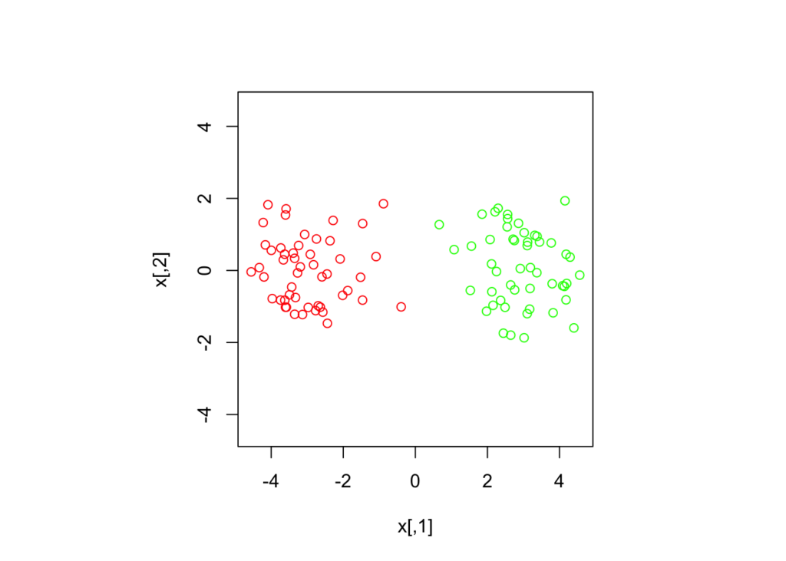
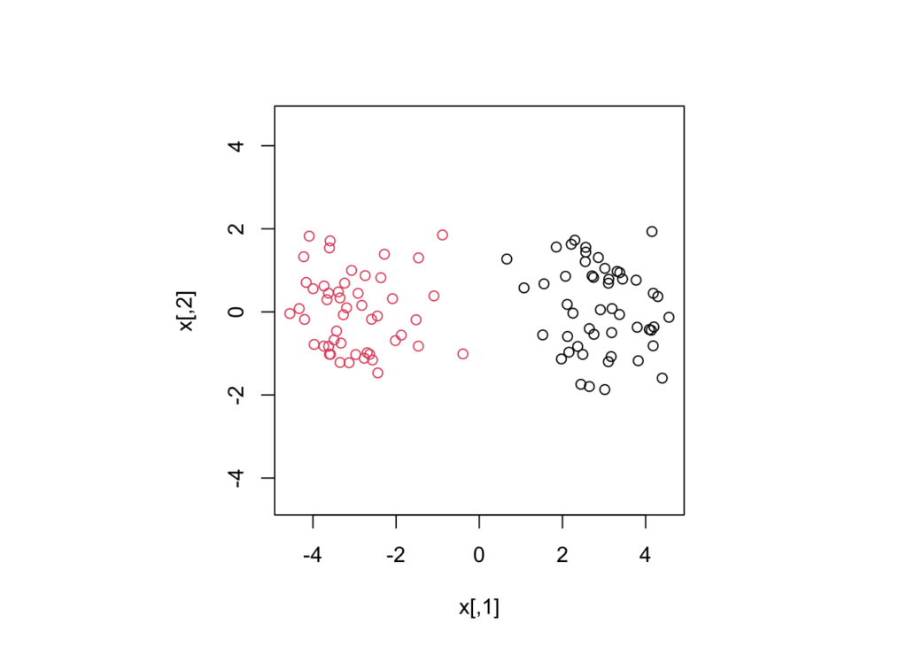
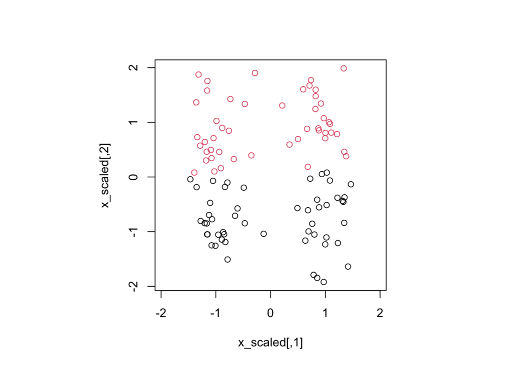

Many statistical learning algorithms perform better when the covariates are on similar scales. For example, it is common practice to standardize the features used by an artificial neural network so that the gradient of its objective function doesn’t depend on the physical units in which the features are described.

The same advice is frequently given for K-means clustering (see [Do Clustering algorithms need feature scaling in the pre-processing stage?](https://datascience.stackexchange.com/q/22795/69539), [Are mean normalization and feature scaling needed for k-means clustering?](https://stats.stackexchange.com/q/21222/4370), and [In cluster analysis should I scale (standardize) my data if variables are in the same units?](https://stats.stackexchange.com/q/372521/4370)), but there’s a great counter-example given in [The Elements of Statistical Learning](https://g.co/kgs/wvHyxB) that I try to reproduce here.


Consider two point clouds ($n=50$ each), randomly drawn around two origins 3 units away from the origin:

<!--more-->

```r
set.seed(495)
n <- 100
d <- 3
x <- matrix(rnorm(n * 2, sd = 1), ncol = 2)
x[1:(n/2), 1] <- x[1:(n/2), 1] - d
x[(n/2 + 1):n, 1] <- x[(n/2 + 1):n, 1] + d
```



The K-means algorithm has no problem in classifying these points:

```r
km <- kmeans(x, centers = 2)
km$centers
```

```
##        [,1]         [,2]
## 1  2.922143  0.098422541
## 2 -2.991026 -0.003131757
```



Let’s see now what happens when we standardize each feature. Since their mean is already zero, we merely divide by their standard deviation:

```r
x_scaled <- x
x_scaled[, 1] <- x_scaled[, 1] / sd(x_scaled[, 1])
x_scaled[, 2] <- x_scaled[, 2] / sd(x_scaled[, 2])
```

And we run again the K-means algorithm on these new data:

```r
km_scaled <- kmeans(x_scaled, centers = 2)
```



We see that K-means has completely failed to identify the clusters, because ‘standardizing’ the features has destroyed the clear separation between the clusters.

So what’s the lesson here? Clearly, for K-means you should not blindly standardize the features unless there are clear reasons to do so. In this toy example, we didn’t know what the features represent, so it’s impossible to say whether standardizing the features was the right thing to do. Perhaps the clusters seen pre-standardization were mere artefacts of our choice of units! As a rule of thumb, I suggest that features that are expressed in the same units and that represent the same ‘stuff’ (such as width and length) should not be standardized. If you have deeper insights into this I’d love to hear your comments.
