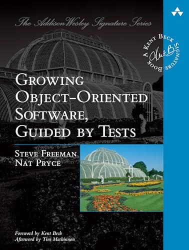
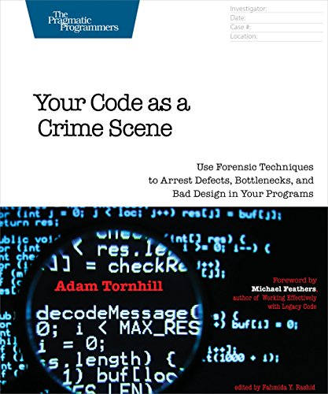
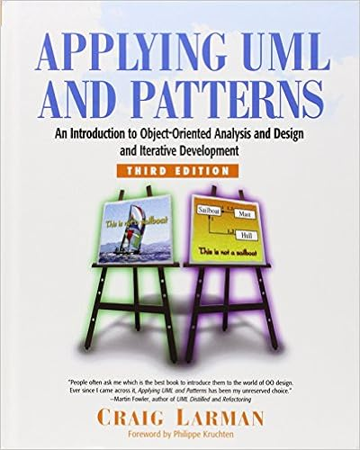
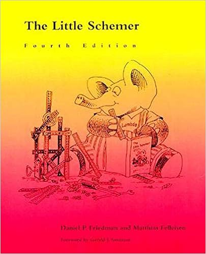
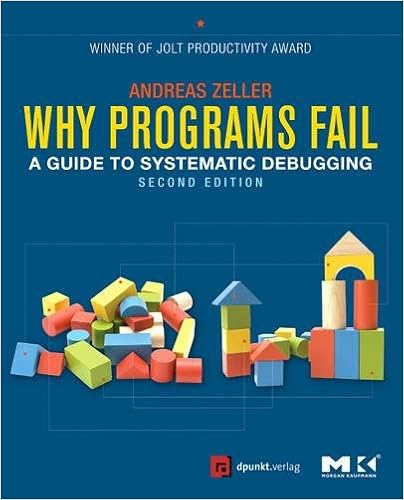
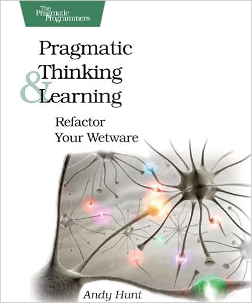
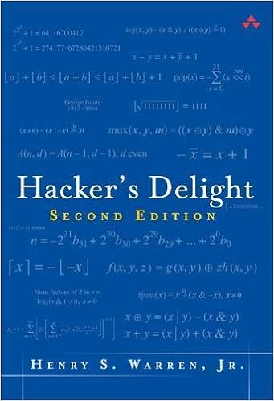
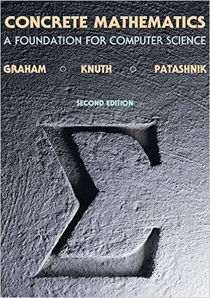

Ask any programmer what their favourite programming book is, and their answer will be one of the usual suspects: _Code Complete, The Pragmatic Programmer,_ or _Design Patterns._ And rightly so; these are outstanding and highly-regarded works that belong to every programmer's bookshelf. (If you're just starting out building up your bookshelf, [Jeff Atwood has some great recommendations](https://blog.codinghorror.com/recommended-reading-for-developers/)).

But once you get past the "essential" books you'll find that there are many incredibly good programming books out there that people don't talk much about, but which were essential in taking me to the next levels in my professional growth.

Here's a partial list of such books; I'm sure there are many others, feel free to mention them in the comments.

## [Growing Object-Oriented Software, Guided by Tests](https://lesen.amazon.de/kp/embed?asin=B002TIOYVW&preview=newtab&linkCode=kpe&ref_=cm_sw_r_kb_dp_GZV27G0F7TCFK4VE5JM6)



<!--more-->

Imagine looking over the shoulders of a master programmer as she develops a real-world application, feature by feature, beginning each feature with an automated end-to-end integration test, and ending it with a round of refactoring. This is what you get reading this book, as the authors walk you through the development of an automated auction bidding system.

Unlike traditional books on test-driven development (TDD), this one begins by setting up a test harness around the _entire system_, simulating the chat-based API of the auction system. That makes it possible to write end-to-end tests for each use case, _before_ switching to TDD to write the classes that implement the use case.

It's the only book I know that covers a complete case study like this. It's quite possibly the only programming book I've read twice, and it has had a profound impact on the way I now develop machine-learning systems. This book inspired me to begin a machine-learning project in R with a test harness mimicking the production database systems; [I've given an overview of the project elsewhere](https://davidlindelof.com/machine-learning-in-r-start-with-an-end-to-end-test/).

This book also helped me understand the importance of mocking class collaborators: classes whose behaviour needs to be stubbed in order to write unit tests. I used to frown on excessive use of collaborators; now I fully embrace them. But one of the book's key takeaway messages is perhaps too easy to overlook in some languages such as Python: _never mock a class you don't own_. Except for primitive, stable classes (such as `String`), it's almost always better to write a thin wrapper for third-party libraries (heavily covered by its own integration tests), and then mock _the wrapper_ (which you own) instead of the third-party library (which you don't).

## [Your Code as a Crime Scene](https://lesen.amazon.de/kp/embed?asin=B00ZB5XWBI&preview=newtab&linkCode=kpe&ref_=cm_sw_r_kb_dp_TFMG2EGZE39B63Q4GPEX)



Version-control systems such as Git are essential for coordinating work between team members and for occasionally rolling back a system that fails in production. But they also provide priceless insights into potential issues with your development process.

Adam Tornhill wrote this amazing introduction to _Software Forensics_: mining the history of your version-control system to detect signs of bad design (such as overly complex classes or excessive coupling), and forecasting where bugs are more likely to lurk.

Every chapter is immediately actionable, whether by a software engineering manager or by the team itself. During my startup days I was able to run this on our codebase, correlating change frequency with module size, and came up with a [heatmap I've documented elsewhere](https://davidlindelof.com/predicting-where-the-bugs-are/), showing where to focus testing efforts. Sure enough, the largest, most frequently changed modules were the most prone to defects.

It's a novel way to exploit the information in your version-control system which, as far as I know, has never been proposed elsewhere (and certainly not in software engineering classes). As an additional benefit, it may also put more pressure on the team to be disciplined in keeping the version-control system log clean and tidy.

## [Applying UML and Patterns](https://www.amazon.com/dp/0131489062/ref=cm_sw_em_r_mt_dp_HKGR39RMX1RNMV3C6M6T)

[](https://www.amazon.com/dp/0131489062)

When used correctly, UML can be a great tool for communicating design decisions in an unambiguous manner. Even as a data scientist, I frequently use UML in my notes to understand the relationships between the entities represented in the datasets. Sadly, misguided attempts to generate code from UML and other myths have given UML an undeserved reputation for being a failed attempt at design formalism, and UML doesn't seem to be widely used (or understood) these days.

This book is another "peek over the shoulders of a giant" book where we follow the evolution of two non-trivial applications: a board game and a cash register. Design decisions are expressed with UML throughout the book and updated as the developer learns more about the problem space. I still vividly remember the _Aha!_ moment when the author realised that the playing piece and the player were not separate concepts, and did not need their own classes; they were effectively the same class.

## [The Little Schemer](https://www.amazon.com/dp/0262560992/ref=cm_sw_em_r_mt_dp_2ZRT5Q0DPDT2KB8NGAP2) series

[](https://www.amazon.com/dp/0262560992)

_Is it true that this is an atom?_  
`atom`

Yes, because `atom` is a string of characters beginning with the letter `a`.

Hard to forget the opening question of _The Little Schemer_, a mind-blowing exposition of the Scheme programming language that begins with atoms (as above) and ends with the [Y-combinator](https://en.wikipedia.org/wiki/Fixed-point_combinator#Y_combinator) and a Scheme parser. It's been said before and I'll say it again: if you intend to be a professional programmer you need to learn a LISP dialect such as Scheme. I'm not saying you need to be proficient in it, or even to write your own program in it; but you need to understand its paradigms, and see how far it's possible to push the code-as-data concept that's been slowly but surely re-discovered in modern programming languages.

## [Refactoring Databases](https://www.amazon.com/dp/B001QAP36E/ref=cm_sw_em_r_mt_dp_CNR605ZVVD62TC5N8CHS)

![Refactoring Databases: Evolutionary Database Design (Addison-Wesley Signature Series (Fowler)) by \[Scott W. Ambler, Pramod J. Sadalage, Martin Fowler, John Graham, Sachin Rekhi, Paul Dorsey\]](images/51mMhFDXhHL.jpg)

Databases are frequently used by more than one application in a given organization. Therefore, changing the structure of the schema as the need arises becomes a scary proposition, because one small change to the schema can affect an unknown number of dependents. But it doesn't need to be that way. Indeed, refactoring a database is just as desirable as refactoring traditional computer code, or even more so. This book shows you how to do it in a safe way, how to communicate the changes to your stakeholders, and how to give them enough time to adapt to the changes.

_Refactoring Databases_ contains a number of techniques to improve the structure of your database as you understand better the business in which it operates. It teaches you techniques based on views and triggers that let you gradually roll out changes over time, announce them to stakeholders, give them a deadline by when they must adapt to the new changes, and deprecate the old schema.

In a prior gig I applied the techniques in this book and was able to maintain _three_ different schemas concurrently in the same database. We never felt the need to "finish" any schema migration because the system of views and triggers made it possible to support the three schemas indefinitely.

So who should read this book? Database administrators would be an obvious answer; after all, they are the ones who are going to apply the techniques in this book. But more broadly than that, the whole development team needs to be aware of these techniques because they make possible what was thought to be impossible, that is, rolling out changes to the database without breaking any dependent application.

These are techniques that software developers, who work on an application talking to a database, must be aware of. Furthermore, if your organisation is agile enough to change its database schema, you need to be aware of this possibility. Therefore you need to structure your application so it becomes immune to those changes, and this book will show you how.

## [Why Programs Fail](https://www.amazon.com/dp/B0092L8LCW/ref=cm_sw_em_r_mt_dp_6SYV5NRSK8Z0CGD5FX6Q)



Between 40% and 80% of software costs are spent on maintenance, adding new features, or fixing bugs ([Facts and Fallacies of Software Engineering](https://www.amazon.com/dp/B001TKD4RG/ref=cm_sw_em_r_mt_dp_4Y79VTTW33F60NZPGD63)). I'm not sure how much time is spent fixing bugs alone but it's clearly a significant part of the software lifecycle costs. Yet all our curricula and programming books are mainly focused on the initial software development part.

_Why Programs Fail_ is the only book I know that is entirely devoted to the subject of debugging. Instead of the traditional method of stepping through the program with a debugger, mindlessly observing the program until something doesn't seem right, Andrea Zeller proposes a far more active use of the debugger, informed by hypothesis testing and the construction of mental models of how the program should behave.

This book taught me a method to find the root cause, or fault, of any software error by successively refuting a sequence of hypotheses on the cause of the error. My engineering notebooks are full of entries that follow the same pattern:

1. Form a hypothesis on what the defect might be (_can it be that the average of this array of floats is smaller than all the array elements?_)
2. Write a prediction based on the hypothesis (_with this set of inputs, the variable `avg` will be smaller than the elements, triggering the assertion failure on next line_)
3. Run an experiment that will refute the prediction if it's wrong; typically, this means running the code in the debugger, setting local variables or function arguments to the desired values
4. Observe the output (_wow, indeed `avg` is smaller than all the elements_)
5. Confirm of refute the original hypothesis. Refine the hypothesis (_maybe this is caused by floating-point rounding errors?_), and return to 1) until the defect has been isolated. [Maybe write a blog post about it](https://davidlindelof.com/where-all-floating-point-values-are-above-average/).

There's a lot more in the book and Andreas Zeller also has [a highly recommended free course on Udacity covering the same topics](https://www.udacity.com/course/software-debugging--cs259), such as delta-debugging (reducing failure-causing input to the smallest possible failing case) and fuzz testing (randomly evolving the program input to find failures). Both techniques are used today in advanced error-finding tools such as [Hypothesis](https://hypothesis.readthedocs.io/en/latest/) and the [American Fuzzy Lop](https://github.com/google/AFL). Both have been parts of my standard toolkit for years.

## Honorable mentions

The following books are not strictly speaking programming books, yet I believe they belong on the shelf of any serious programmer who cares about their craft or their brain.

### [Pragmatic Thinking and Learning](https://www.amazon.com/dp/1934356050/ref=cm_sw_em_r_mt_dp_K4Y19YEF0SWR98SPN986)



Andy Hunt, co-author of _The Pragmatic Programmer_ and co-founder of _The Pragmatic Bookshelf_, has collected in a single accessible volume all that you need to know about how your brain works and how to use it better. He does an excellent job at explaining the two main modes by which the brain operates, the _Rich_ mode and the _Linear_ mode, and the importance of regularly switching from one to the other.

The book also includes great tips on how to learn efficiently, how to manage your focus, and how to think of your own journey towards expertise.

Over the years I've come across many other resources that discuss how the brain works and how to make it work better, but there was almost never anything new that hadn't been described by Andy in this book.

## [Hacker's delight](https://www.amazon.com/dp/0321842685/ref=cm_sw_em_r_mt_dp_G2AQSVZP5NQK4FP2HVWR)



On the face of it, _Hacker's Delight_ will only be of interest to compiler writers. Who else needs to know that

```cpp
if (x == a)
  x = b;
else
  x = a;
```

can be replaced with a more efficient

```cpp
x = a ^ b ^ x;
```

I freely admit that there's nothing in this book that I could ever have found useful in my day to day work, yet I love this book. As the title implies, reading this book is a _delight_ for the curious mind who wants to dive deeper into how machines work. It truly is a delightful, beautifully typeset book that belongs right up there next to your _Art of Computer Programming_ series.

## [Concrete mathematics](https://www.amazon.com/dp/0201558025/ref=cm_sw_em_r_mt_dp_8FJH12JKM95GXQKB440P)



When it comes to day-to-day programming, _Concrete Mathematics_ is probably the least useful book on this list--but boy was it a joy to read. Clearly intended for a theoretical computer scientist, this book is far more accessible than its older cousins forming the _Art of Computer Programming_ series. It covers everything you need to know about the analysis of algorithms and related topics.

But what's really fascinating about this book is the way it shows how a mathematician _thinks_. Take for example the analysis of the Tower of Hanoi algorithm that introduces the book. It starts with the first few examples, which are enough to form a guess of what the most general formula is; and this guess later informs the search for mathematical proofs. This is _not_ how the analysis of algorithms is generally taught, and I'm really grateful to the authors for showing me that they are human too.

Oh, and did I mention the marginal notes contributed by the authors' students? These are worth the price of the book alone, such as this gem:

_The summation symbol looks like a distorted pacman._
