I've been collecting all [xkcd comics](https://xkcd.com/) related to Data Science and/or Statistics. Here they are, but if you think I'm missing any please let me know in the comments. Use at will in your data visualisations but remember to attribute. Sorted in reverse chronological order.

[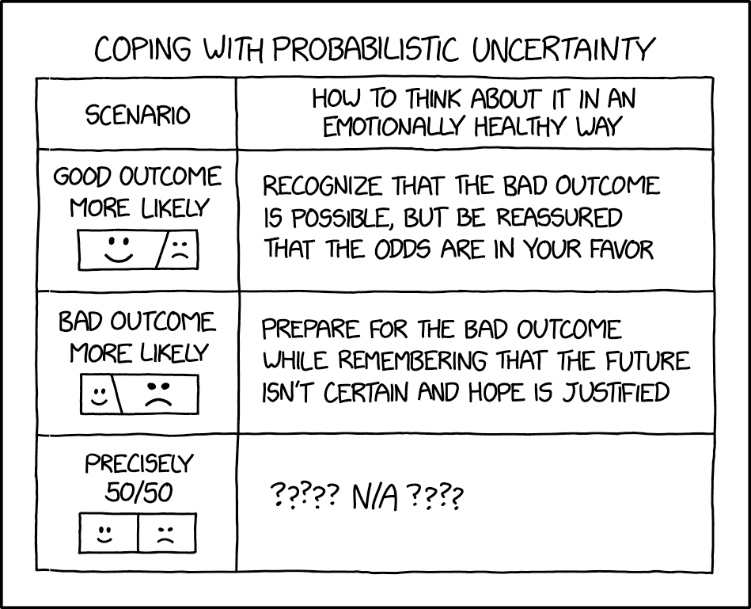](https://xkcd.com/3007/)

[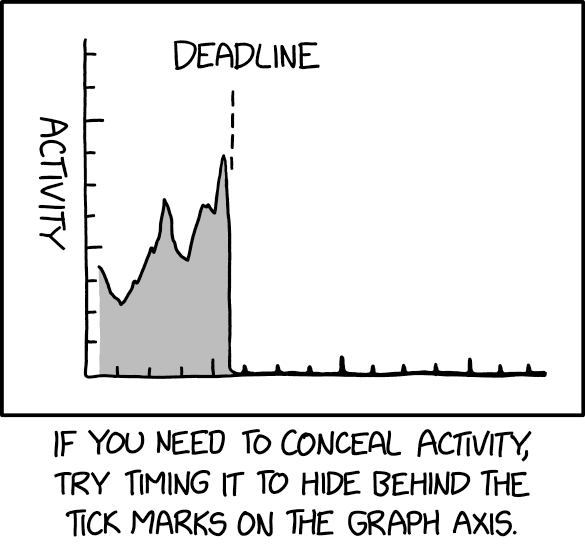](https://xkcd.com/2918/)

[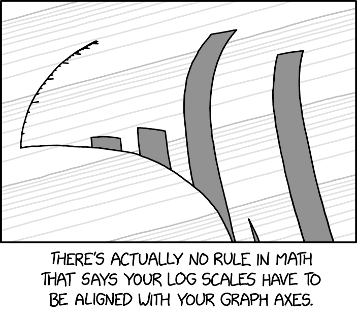](https://xkcd.com/2884/)

[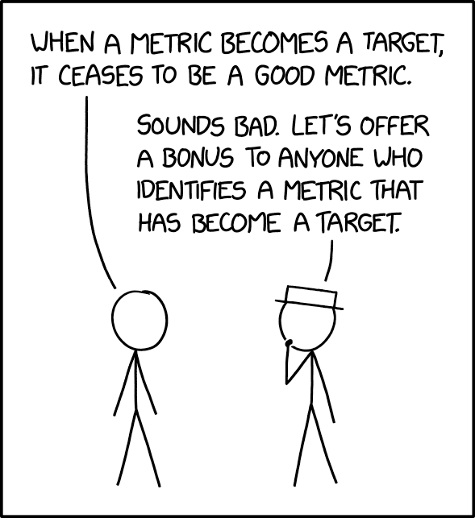](https://xkcd.com/2899/)

[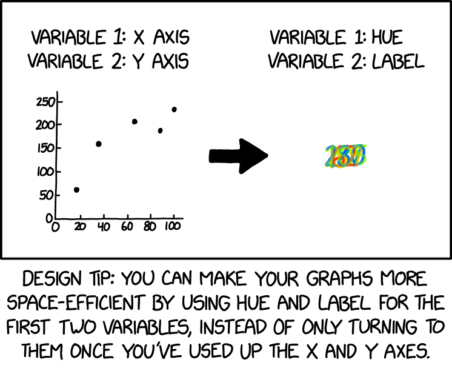](https://xkcd.com/2864/)

[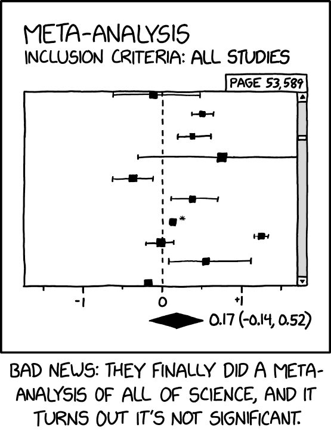](https://xkcd.com/2755/)

<figure>

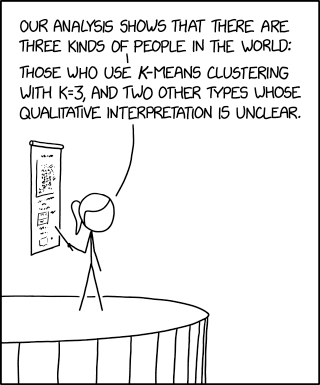

<figcaption>

[K-Means Clustering](https://xkcd.com/2731/)

</figcaption>

</figure>

<figure>

<figcaption>

[Methodology Trial](https://xkcd.com/2726/)

</figcaption>

</figure>

<figure>

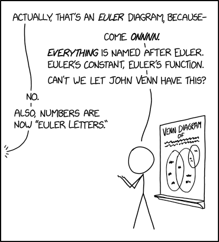

<figcaption>

[Euler Diagrams](https://xkcd.com/2721/)

</figcaption>

</figure>

<figure>

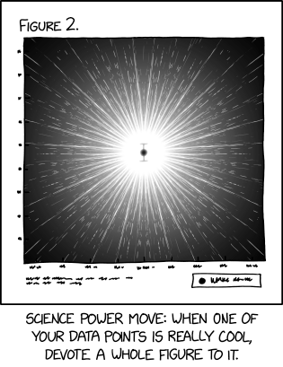

<figcaption>

[Data Point](https://xkcd.com/2713/)

</figcaption>

</figure>

<figure>

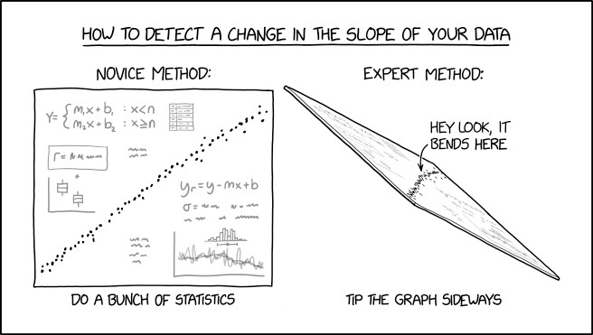

<figcaption>

[Change in Slope](https://xkcd.com/2701/)

</figcaption>

</figure>

<figure>

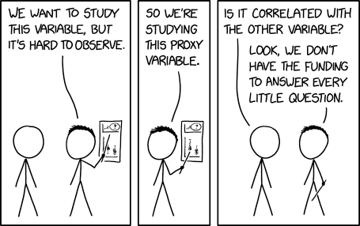

<figcaption>

[Proxy Variable](https://xkcd.com/2652)

</figcaption>

</figure>

<figure>

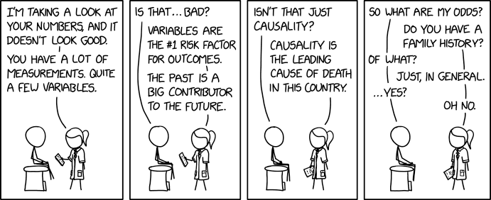

<figcaption>

[Health Data](https://xkcd.com/2620)

</figcaption>

</figure>

<figure>

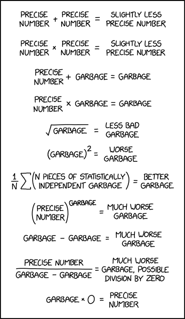

<figcaption>

[Garbage Math](https://xkcd.com/2295/)

</figcaption>

</figure>

<figure>

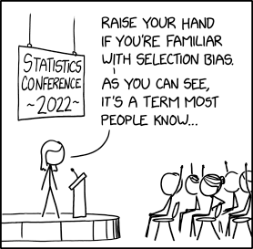

<figcaption>

[Selection Bias](https://xkcd.com/2618/)

</figcaption>

</figure>

<figure>

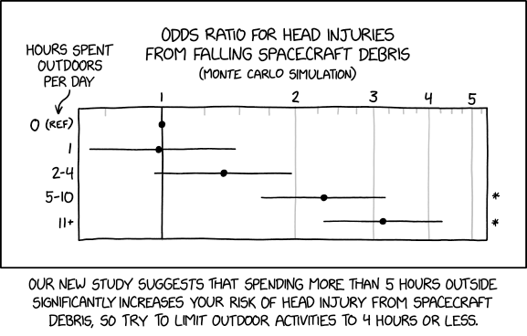

<figcaption>

[Spacecraft Debris Odds Ratio](https://xkcd.com/2599/)

</figcaption>

</figure>

<figure>

<figcaption>

[Control Group](https://xkcd.com/2576/)

</figcaption>

</figure>

<figure>

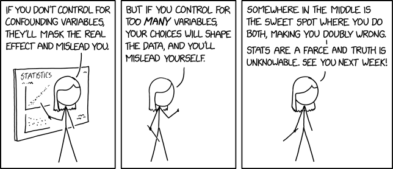

<figcaption>

[Confounding Variables](https://xkcd.com/2560/)

</figcaption>

</figure>

<figure>

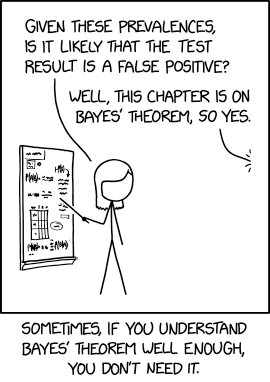

<figcaption>

[Bayes' Theorem](https://xkcd.com/2545/)

</figcaption>

</figure>

<figure>

<figcaption>

[Slope Hypothesis Testing](https://xkcd.com/2533/)

</figcaption>

</figure>

<figure>

<figcaption>

[Flawed Data](https://xkcd.com/2494/)

</figcaption>

</figure>

<figure>

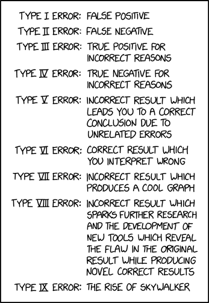

<figcaption>

[Error Types](https://xkcd.com/2303/)

</figcaption>

</figure>

<figure>

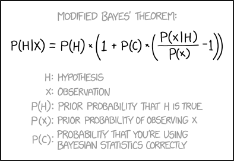

<figcaption>

[Modified Bayes' Theorem](https://xkcd.com/2059/)

</figcaption>

</figure>

<figure>

<figcaption>

[Curve-Fitting](https://xkcd.com/2048/)

</figcaption>

</figure>

<figure>

<figcaption>

[Machine Learning](https://xkcd.com/1838/)

</figcaption>

</figure>

<figure>

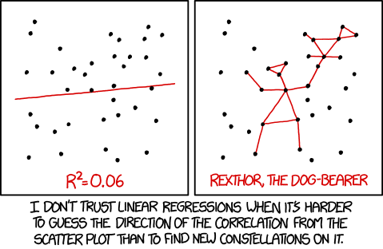

<figcaption>

[Linear Regression](https://xkcd.com/1725/)

</figcaption>

</figure>

<figure>

<figcaption>

[P-Values](https://xkcd.com/1478/)

</figcaption>

</figure>

<figure>

<figcaption>

[t Distribution](https://xkcd.com/1347/)

</figcaption>

</figure>

<figure>

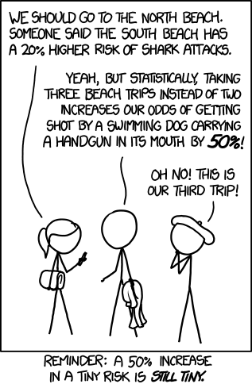

<figcaption>

[Increased Risk](https://xkcd.com/1252/)

</figcaption>

</figure>

<figure>

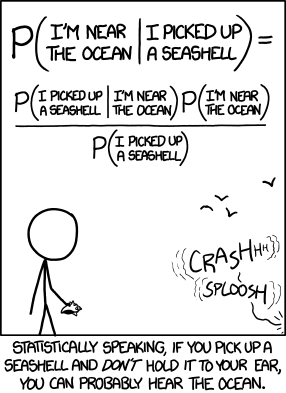

<figcaption>

[Seashell](https://xkcd.com/1236/)

</figcaption>

</figure>

<figure>

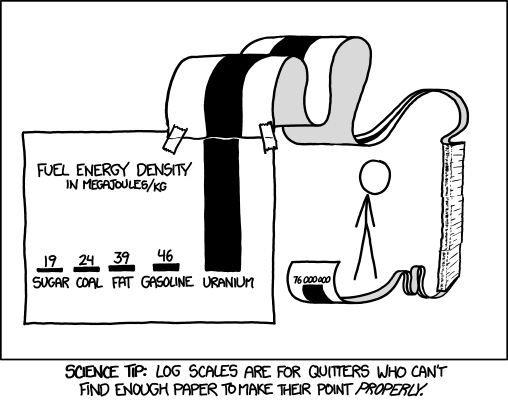

<figcaption>

[Log Scale](https://xkcd.com/1162/)

</figcaption>

</figure>

<figure>

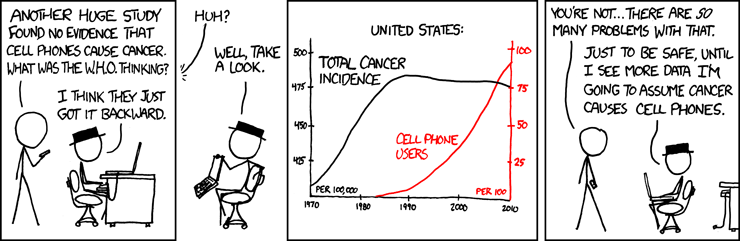

<figcaption>

[Cell Phones](https://xkcd.com/925/)

</figcaption>

</figure>

<figure>

<figcaption>

[Significant](https://xkcd.com/882/)

</figcaption>

</figure>

<figure>

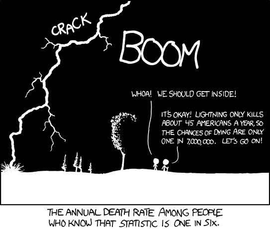

<figcaption>

[Conditional Risk](https://xkcd.com/795/)

</figcaption>

</figure>

<figure>

<figcaption>

[Correlation](https://xkcd.com/552/)

</figcaption>

</figure>

<figure>

<figcaption>

[Boyfriend](https://xkcd.com/539/)

</figcaption>

</figure>
