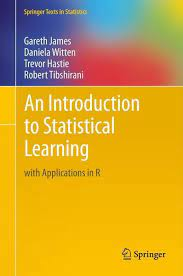
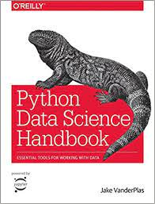
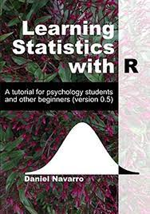
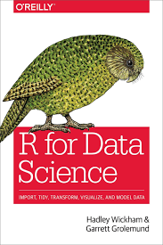
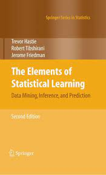
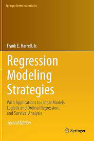
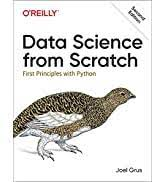
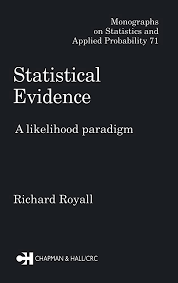
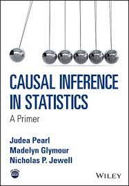

A while back I had the pleasure to address a team of user experience researchers at YouTube, and I got asked for a few resources that could help someone pretty good at science, math, and programming who wanted to get into data science. Here's the list I gave. These have worked for me in the past, with the caveat that I'm _very_ partial towards books.

## **Absolute must-reads**

<figure>

<figcaption>

[An Introduction to Statistical Learning](https://www.statlearning.com/) 

</figcaption>

</figure>

<figure>

<figcaption>

[Python Data Science Handbook](https://jakevdp.github.io/PythonDataScienceHandbook/)

</figcaption>

</figure>

Both are freely available, outstanding books that cover a LOT of ground. The former uses R and goes somewhat deeper in theory, while the latter uses Python and is perhaps more practical, covering iPython, Numpy, and the scikit-learn ecosystem.

## **Great too**

<figure>

<figcaption>

[Learning Statistics with R](https://learningstatisticswithr.com/)

</figcaption>

</figure>

One of the clearest expositions of fundamental statistical concepts I've read. It's also well written and avoids dry, lifeless prose; the author does a great job at discussing the pros and cons of each technique, and frequently gives templates on how to present the results. One of the most memorable passages was his/her (read the text to understand…) rant against the use of p-values AFTER looking at the data. Free book.

<figure>

<figcaption>

[R for Data Science](https://r4ds.had.co.nz/)

</figcaption>

</figure>

Hadley Wickam's companion book to [the tidyverse](https://www.tidyverse.org/). Essential reading if you're into R and use the tidyverse. More oriented towards data manipulation and programming than actual statistical modeling. Free book.

## **For the brave**

<figure>

<figcaption>

[The Elements of Statistical Learning](https://web.stanford.edu/~hastie/ElemStatLearn/)

</figcaption>

</figure>

The "grown-up" version of ISLR (mentioned above). Covers a lot of theoretical ground, including a great discussion of the variance-bias tradeoff so beloved of interviewers. That book taught me to stop [blindly normalizing covariates](https://davidlindelof.com/feature-standardization-considered-harmful/) before running clustering algorithms.

<figure>

<figcaption>

[Regression Modeling Strategies](https://hbiostat.org/doc/rms.pdf)

</figcaption>

</figure>

Harrell is to statistics what Wickham is to data manipulation: the opinionated author of some amazing R packages that do a better job than the ones provided in base R. It's a very dry text though, and probably better read in conjunction with [some explanatory blog posts](https://www.nicholas-ollberding.com/post/an-introduction-to-the-harrell-verse-predictive-modeling-using-the-hmisc-and-rms-packages/). Furthermore, it can be difficult to find resources online because these packages are not as widely adopted as the tidyverse.

## **Summer reading**

<figure>

<figcaption>

[Data Science from Scratch](https://www.amazon.com/Data-Science-Scratch-Principles-Python/dp/149190142X)

</figcaption>

</figure>

[Joel Grus is amazing](https://www.youtube.com/watch?v=7jiPeIFXb6U). In this book he shows how to code (and test!) many constructs used in Data Science, culminating with a pseudo-relational database.

## **Oh you think you know statistics?**

<figure>

<figcaption>

[Statistical Evidence](https://www.amazon.com/Statistical-Evidence-Likelihood-Monographs-Probability/dp/0412044110)

</figcaption>

</figure>

<figure>

<figcaption>

[Causal Inference in Statistics: A Primer](https://www.amazon.com/Causal-Inference-Statistics-Judea-Pearl/dp/1119186846)

</figcaption>

</figure>

I'm including these two books because I think reading them will make you a better statistician. The former is a short but mind-blowing read that will make you rethink every analysis you've ever done. The latter is the must-read text if you're going to do any kind of causal inference.

## **Non-book resources**

[Machine Learning](https://www.coursera.org/learn/machine-learning)

[Deep Learning](https://www.coursera.org/specializations/deep-learning)

[AI nanodegree](https://www.udacity.com/course/ai-artificial-intelligence-nanodegree--nd898)

These are some online courses I've taken and which I can wholeheartedly recommend, especially the first one which covers pretty much most concepts used in DS / ML. The Deep Learning specialization is more oriented towards neural networks, while Udacity's AI nanodegree has probably nothing to do with DS but is a great intro to topics like building game-playing AI or path-finding algorithms.

Am I missing something? Feel free to add your own recommendations in the comments below.
