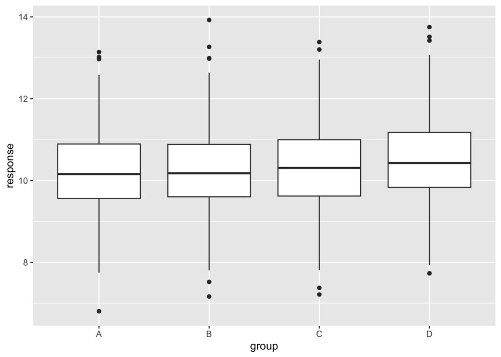

To detect small effects in experiments you need to reduce the experimental noise as much as possible. You can do it by working with larger sample sizes, but that doesn’t scale well. A far better approach consists in controlling for covariates that are correlated with your response.

I recently gave a talk at our company on the design of online experiments, and someone pointed out that our automated experiment analysis tool implemented “slicing”, that is, running separate analyses on subsets of the data. Wasn’t that the same thing as controlling for covariates?


Controlling for covariates means you include them in your statistical model. Running separate analyses means each of your sub-analyses has a smaller sample size; you may gain in precision because your response will be less variable in each subset, but you lose the benefits that come from using a larger sample size.

Let’s illustrate this with a simulation. Let’s say we wish to measure the impact of some treatment, whose effect is about 10 times smaller than the standard deviation of the error term:

```r
mu <- 10  # some intercept
err <- 1  # standard deviation of the error
treat_effect <- 0.1  # the treatment effect to estimate
```

Let’s say we have a total of 1000 units in each arm of this two-sample experiment, and that they belong to 4 different equal-sized groups labeled `A`, `B`, `C`, and `D`:

```r
n <- 1000

predictor <- 
  data.frame(
    group = gl(4, n / 4, n * 2, labels = c('A', 'B', 'C', 'D')),
    treat = gl(2, n, labels = c('treat', 'control')))
```

Let’s simulate the response. For simplicity, let’s say that the group membership has an impact on the response equal to the treatment effect:

```r
group_effect <- treat_effect

response <-
  with(
    predictor,
    mu + as.integer(group) * group_effect + (treat == 'treat') * treat_effect + rnorm(n * 2, sd = err))

df <- cbind(predictor, response)

summary(df)
```

```
 group       treat         response     
 A:500   treat  :1000   Min.   : 6.368  
 B:500   control:1000   1st Qu.: 9.607  
 C:500                  Median :10.335  
 D:500                  Mean   :10.325  
                        3rd Qu.:11.015  
                        Max.   :13.757  
```

The following plot shows how the response is distributed in each group. This is one of those instances where you need statistical models to detect effects that are hard to see in a plot:

```r
ggplot2::ggplot(df, ggplot2::aes(x = group, y = response)) +
  ggplot2::geom_boxplot()
```



Fitting the full model yields the following confidence intervals:

```r
mod_full <- lm(response ~ group + treat, df)
confint(mod_full)
```

```
                    2.5 %      97.5 %
(Intercept)  10.122391874 10.32334506
groupB        0.009174272  0.26336218
groupC        0.106049411  0.36023732
groupD        0.116794148  0.37098206
treatcontrol -0.193199676 -0.01346168
```

All coefficients are estimated correctly, and the width of the confidence interval of the treatment effect is about 0.18. The treatment effect is statistically significant. Recall that the error is taken to have a standard deviation of 1, and that $n=1000$ per arm, so we would except the 95% confidence interval on the treatment effect to be $2 \\times 1.96 \\times \\sigma \\times \\sqrt{2/n}$, or about 0.18. We are not very far off.

What happens now if, instead of controlling for the group, we "sliced" the analysis, i.e. we fit four separate models, one per group? On one hand we will have a smaller error than if we fitted a global model that did not control for the group covariate; on the other hand we will have fewer observations per group, which will hurt our confidence intervals. Let’s check:

```r
confint(lm(response ~ treat, df, subset = group == 'A'))
```

```
                  2.5 %      97.5 %
(Intercept)  10.0482082 10.30293094
treatcontrol -0.2967421  0.06349024
```

```r
confint(lm(response ~ treat, df, subset = group == 'B'))
```

```
                  2.5 %      97.5 %
(Intercept)  10.2324904 10.48601591
treatcontrol -0.3688051 -0.01026586
```

```r
confint(lm(response ~ treat, df, subset = group == 'C'))
```

```
                 2.5 %      97.5 %
(Intercept)  10.303706 10.55182387
treatcontrol -0.309723  0.04116836
```

```r
confint(lm(response ~ treat, df, subset = group == 'D'))
```

```
                  2.5 %      97.5 %
(Intercept)  10.4170354 10.66328177
treatcontrol -0.3825046 -0.03425957
```

The estimates for the treatment effect remain unbiased, but now the confidence intervals are about 0.35—or $2 \\times 1.96 \\times \\sqrt{2/(n/4)}$, which is what you would expect for a sample size that's four times smaller. That's twice as large as when fitting the whole data with a model that includes the group covariate. In fact most of the groups now have statistically unsignificant results.

I’m all for automated experiment analysis tools; but when the goal is to detect small effects, I think there’s currently no substitute for a manual analysis by a trained statistician (which I am not). Increasing sample sizes can only take you so far; remember that the confidence intervals scale with $\\sqrt{n}$ only. It is almost always better to search for a set of covariates correlated with the response, and include them in your statistical model. And that’s what controlling for a covariate means.
