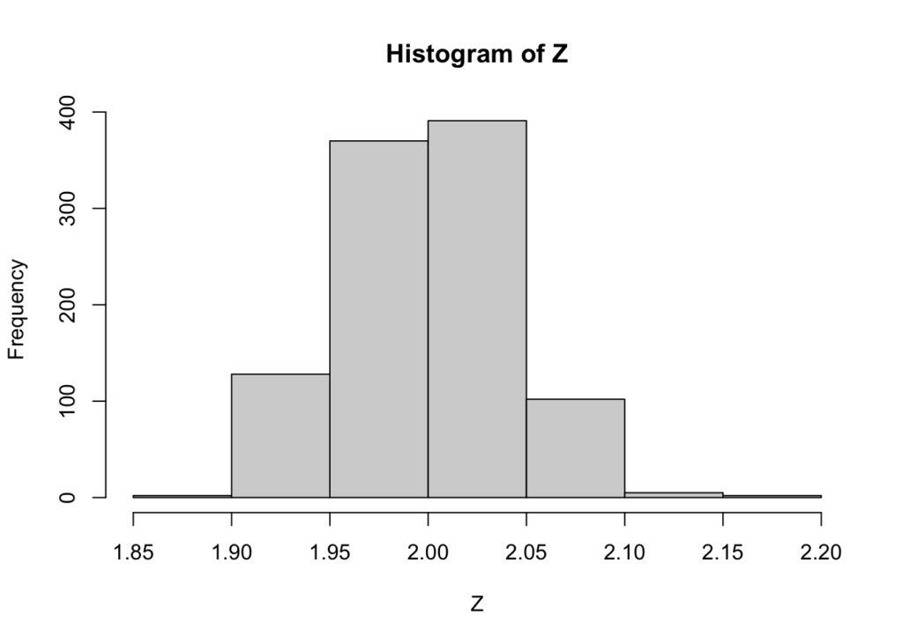
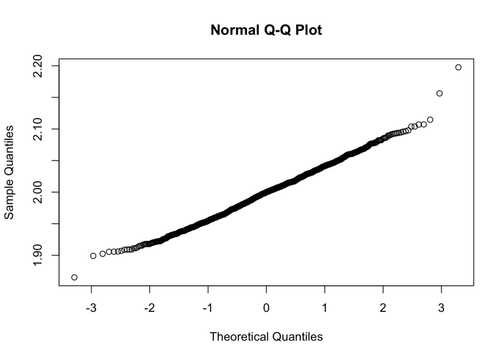
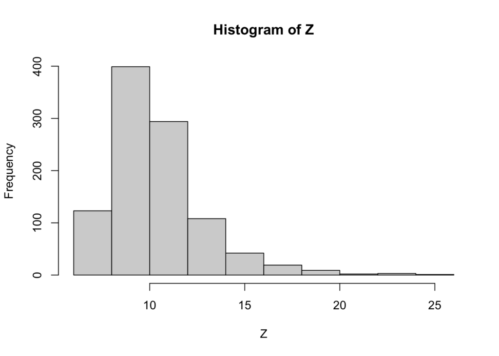
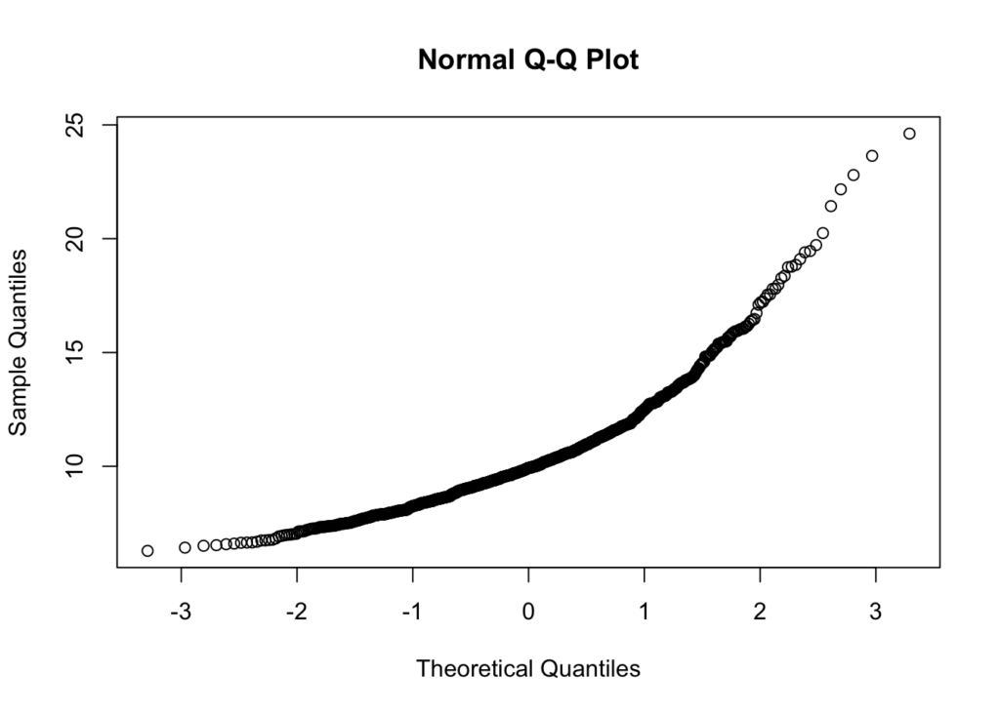

In _[Trustworthy Online Controller Experiments](https://a.co/d/b6Emaxo)_ I came across this quote, referring to a ratio metric $M = \\frac{X}{Y}$, which states that:

> Because $X$ and $Y$ are jointly bivariate normal in the limit, $M$, as the ratio of the two averages, is also normally distributed.

That's only partially true. According to [https://en.wikipedia.org/wiki/Ratio\_distribution](Wikipedia), the ratio of two uncorrelated noncentral normal variables $X = N(\\mu\_X, \\sigma\_X^2)$ and $Y = N(\\mu\_Y, \\sigma\_Y^2)$ has mean $\\mu\_X / \\mu\_Y$ and variance approximately $\\frac{\\mu\_X^2}{\\mu\_Y^2}\\left( \\frac{\\sigma\_X^2}{\\mu\_X^2} + \\frac{\\sigma\_Y^2}{\\mu\_Y^2} \\right)$. The article implies that this is true when $Y$ is unlikely to assume negative values, say $\\mu\_Y > 3 \\sigma\_Y$.

As always, the best way to believe something is to see it yourself. Let's generate some uncorrelated normal variables far from 0 and their ratio:

```r
ux = 100
sdx = 2
uy = 50
sdy = 0.5

X <- rnorm(1000, mean = ux, sd = sdx)
Y <- rnorm(1000, mean = uy, sd = sdy)
Z <- X / Y
```

Their ratio looks normal enough:

```r
hist(Z)
```



Which is confirmed by a q-q plot:

```r
qqnorm(Z)
```



What about the mean and variance?

```r
mean(Z)
```

```
[1] 1.998794
```

```r
ux / uy
```

```
[1] 2
```

```r
var(Z)
```

```
[1] 0.001783404
```

```
ux^2 / uy^2 * (sdx^2 / ux^2 + sdy^2 / uy^2)
```

```
[1] 0.002
```

Both the mean and variance are _very_ close to their theoretical values.

But what happens now when the denominator $Y$ has a mean close to 0?

```r
ux = 100
sdx = 2
uy = 10
sdy = 2

X <- rnorm(1000, mean = ux, sd = sdx)
Y <- rnorm(1000, mean = uy, sd = sdy)
Z <- X / Y
```

Hard to call the resulting ratio normally distributed:

```r
hist(Z)
```



Which is also clear with a q-q plot:

```r
qqnorm(Z)
```



In other words, it is generally true that ratio metrics where the denominator is far from 0 will also be close enough to a normal distribution for practical purposes. But when the denominator's mean is, say, closer than 5 sigmas from 0 that assumption breaks down.
