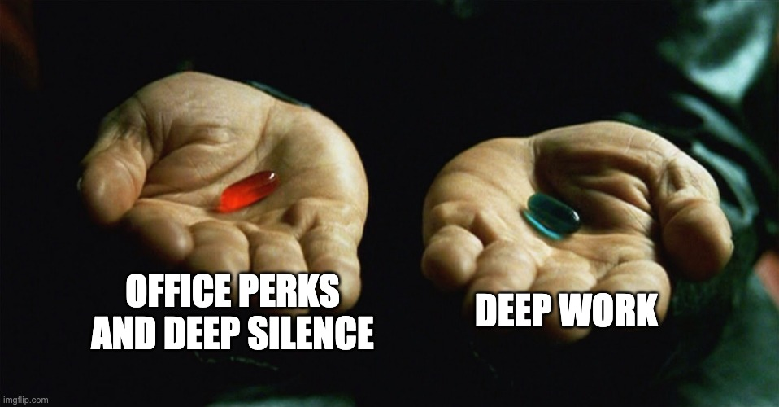

It's Monday afternoon. It's a holiday but I have a couple of things to catch up from last week that I didn't finish. The rest of the family is either on holiday camp or taking a nap in the bedroom. I'm working from home. But the home is anything but silent.

I can hear the girls' muffled chatting, from the sound of it they're making up some story with their dolls. The village church bell just tolled a single note for the quarter past the hour. My phone's notification just dinged, and in a rare moment of self discipline I don't pick it up. Some birds are chirping outside. The convection oven in the kitchen has had a malfunction in years and emits a beep every 10 seconds that I have learned to ignore. Occasionally a plane comes in overhead to land on Geneva's airport; there's only one landing strip and depending on the direction of the wind, planes come in from the direction of our village. And on top of it all I hear some kind of background whine that's very soft--I usually don't notice it but it's definitely there and I don't know if it comes from outside of me or from inside my head.

That's a lot of noise. It's also the best possible working conditions I've ever experienced. Today I've chosen to deliberately notice all these sounds and now I cannot unhear them.

Then there's the visual distractions. I've been working for the past three years from a corner in the living room, the rest of which fills my field of view, as well as parts of the kitchen.

These working conditions sound bad but they can be fixed. I usually set a screen between me and the rest of the living room, and almost always do my deep focus work wearing noise-canceling over-the-ear headphones, playing focus-friendly music. My family knows that when daddy wears the headphones, he is not to be disturbed unless there's blood or fire. It mostly works.

Like many others, I used to work in an open-space office. Noise-wise and visual distraction-wise, open-space offices are possibly better than working from home. On more than one occasion, visitors from abroad have been impressed by the museum-grade silence filling a Swiss open-space office. But open-space offices offer a richer set of options for not concentrating on your deep work. Entire days can go by, being interrupted by colleagues, taking a walk to the cafeterias, listening in on neighboring conversations, attending more meetings than you should because you fear you'll miss out. And the siren song of office perks, of course.

The choice is between perfect quiet filled with distractions, or constant information-free background sounds that you can learn to ignore with monk-like focus. I've tried it all and I know what works for me. Do you?
