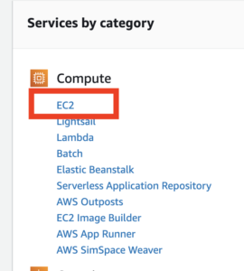
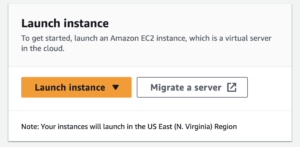
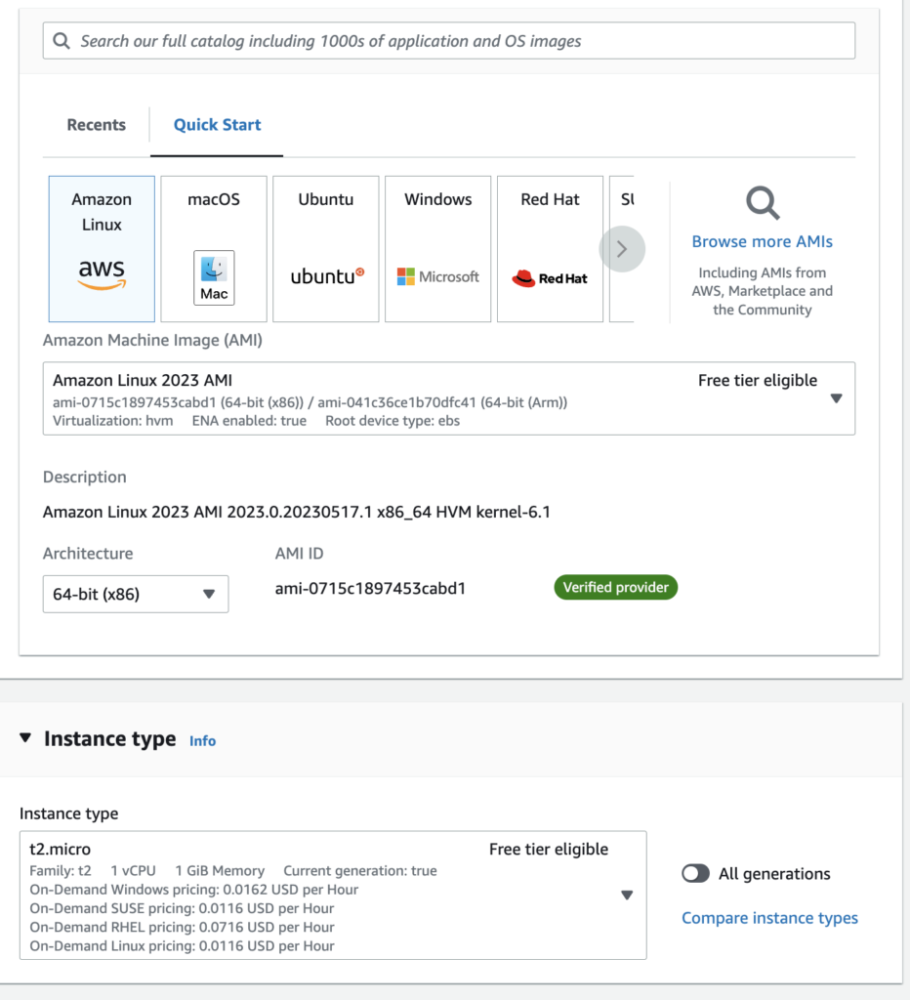
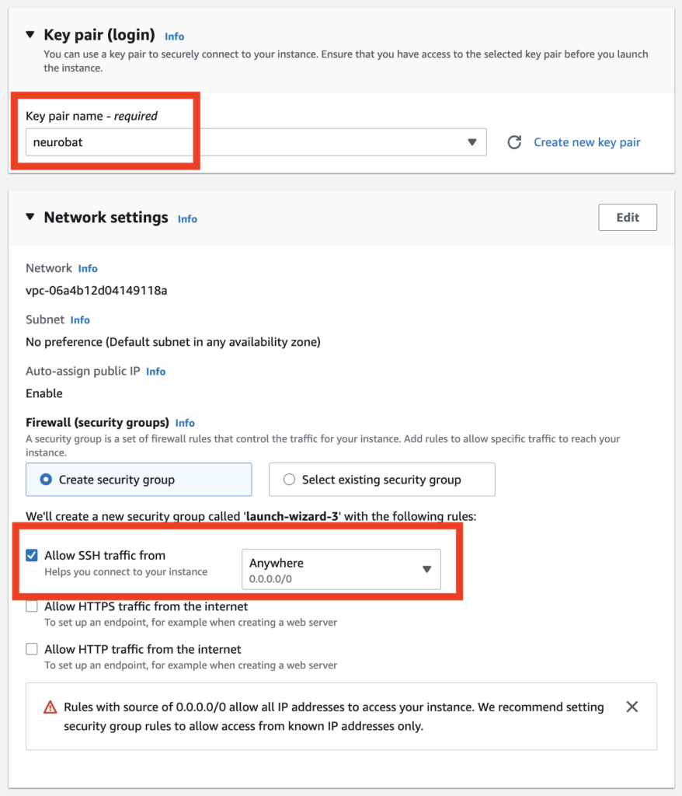
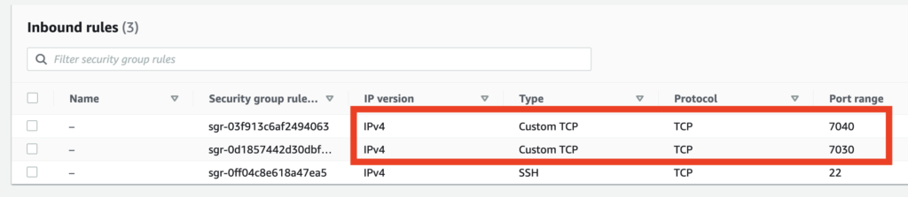

When the startup shut down there were still dozens of netbooks out there in the wild collecting data on the residential houses fitted with our adaptive heating control algorithms, hopelessly attempting to connect to our VPN server that didn't exist anymore in order to upload all that data to our now-defunct database. That's a lot of data, sitting and growing on a lot of internet-connected devices.

Some of us came together and figured it could be possible to resume collecting that data, and showcase the benefits of having our system installed on your house. The first problem was, how do we connect to these netbooks? And at near-zero cost?

Warning: hacks ahead.

We figured that step one would be to establish a reverse SSH tunnel to each of these netbooks. A reverse SSH tunnel is set up when an otherwise-inaccessible device (in our case, the netbooks) connects to a publicly available SSH server, opens a port on the server, and forwards ("tunnels") all incoming connections to that port back to the device. This is the best solution to connect to a device that's not exposed to the public internet short of setting up a proper VPN solution.


To set up a reverse SSH tunnel you first need a publicly available machine running an SSH server and that will accept reverse tunnels. The good news is that you can all have one by [signing up to Amazon Web Services](https://aws.amazon.com/free/?trk=f17b4b4e-aa1b-4189-b0c4-81a19b53f625&sc_channel=ps&ef_id=CjwKCAjwscGjBhAXEiwAswQqNPxA3h4EaldAOteOFNJWQtQmuWHHFB-EcdIVMoZIByFZ2rC0nQSm-RoCRpEQAvD_BwE:G:s&s_kwcid=AL!4422!3!645186168166!e!!g!!aws!19579892551!148838343321&all-free-tier.sort-by=item.additionalFields.SortRank&all-free-tier.sort-order=asc&awsf.Free%20Tier%20Types=*all&awsf.Free%20Tier%20Categories=*all) (AWS) and going to the Elastic Cloud 2 (EC2) service:



Next you want to launch an instance:



You really want the smallest, freeest possible machine here that runs Linux:



Make sure you have generated a key pair for this instance (and that you have saved the private key!) and that the machine accepts SSH from anywhere:



But when you set up an SSH tunnel you will also need to make sure the EC2 instance accepts SSH traffic on the ports that will be opened by the tunnel. These are up to you; I have created two tunnels, one on port 7030 and one on 7040, so navigate to the settings for the security group of your instance and make sure the instance will accept TCP traffic to these ports:



That's all on the server side. On the netbook side you need to do three things: 1) get the private key, 2) change the file permissions on the key, 3) establish the tunnel.

Getting the private key to the netbook is entirely up to you. What I did, and which is absolutely not recommended, was to place the private key `neurobat.pem` on the same web server hosting this blog. Then I was able to get the key with

```bash
wget --no-check-certificate davidlindelof.com/<path-to-key>
```

(Notice the `--no-check-certificate` argument. Those netbooks are hopelessly out of date and won't accept HTTPS certificates anymore.)

Next you need to set the right permissions on the key, or SSH will not accept them:

```bash
chmod 400 <path-to-key>
```

And finally you can set up the tunnel, say on port 7000:

```bash
ssh -i <path-to-key> -fN -R :7000:localhost:22 ec2-user@<ec2-ip-address>
```

If all went well you'll now be able to ssh into the remote device by sshing to your EC2 instance on port 7000:

```bash
ssh <username-on-device>@<ec2-ip-address> -p 7000
```

As an extra precaution you might also want to look into using the [autossh](https://wiki.gentoo.org/wiki/Autossh) program, which can detect connection drops and attempt to reconnect.

Clunky? Sure. Hacky? You bet. Brittle? Oh my god. But it did the job and I can now work on doing things the "right" way, i.e. setting up a proper VPN solution, probably based on [OpenVPN](https://openvpn.net/) or something.
