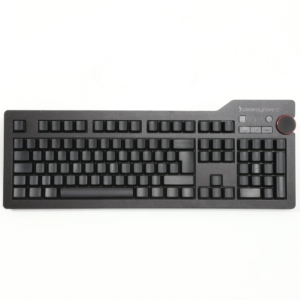
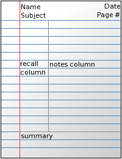
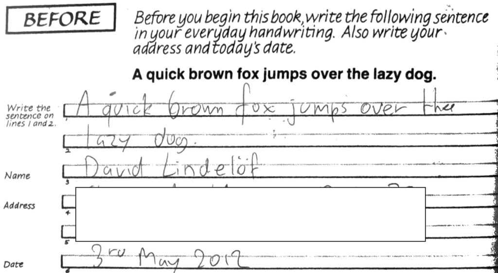
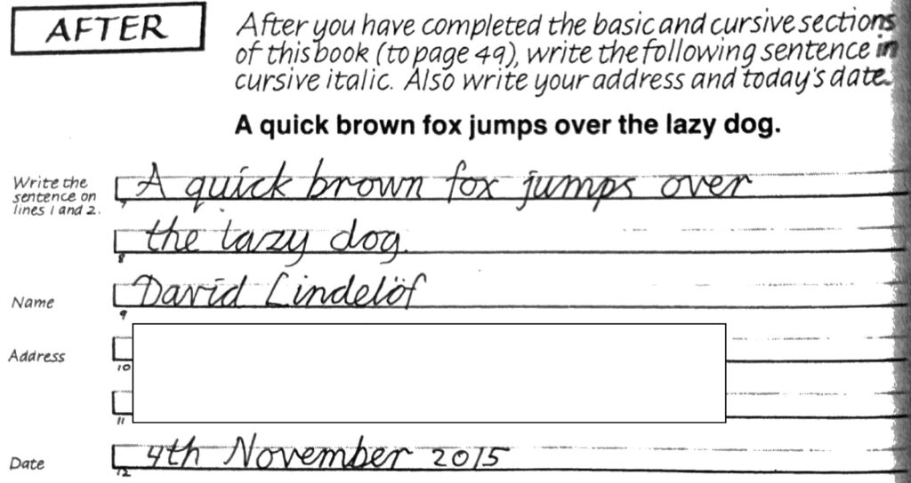

Before he became Spider-Man in the 1960s, Peter Parker was a chemistry and physics genius, an expert photographer, and--get this--_even knew how to tie a tie_. But he was also a shy, nerdy high-school student who couldn't have been more than 16-18 years old:

Wait, a high school student going around in a suit and tie? I know this is Marvel but where did they get _that_ idea from?

There seems to be plenty of evidence from comics, books, and movies that youngsters back then were far more mature than today. Could it be that schools used to teach kids fundamental skills earlier than they are taught today? Are there fundamental skills that schools don't teach anymore? In this post I'll list a few skills that I think are essential for success in life, yet are hardly taught anymore, not even in college.

## Public speaking

I can still remember the first time I had to give a public presentation about some lab work I had done with a classmate, something about a hypersensitive magnetometer called [a SQUID](https://en.wikipedia.org/wiki/SQUID). Must have been in my sophomore year. It was a small audience of perhaps 10 teaching assistants, but I hated every minute of it. I basically stood there, reading out from on a stack of cards.

I can't remember how I learned about it, but I eventually learned about [Toastmasters](https://www.toastmasters.org/), the international organisation dedicated to promoting leadership and public speaking, and found out that my college had its own local club. I remained a member of Toastmasters for the better part of a decade. I'm not afraid anymore of speaking in public, quite the contrary; I actively seek opportunities to do so, both professionally and privately (I once preached to a community of christian Thais).

Joining a local Toastmasters club is easily one of the best investments in time you can do for yourself.

## Mind mapping

I don't understand why they don't teach this simple technique already in primary school, but [mind mapping](https://en.wikipedia.org/wiki/Mind_map) (the practice of graphically capturing free associations about a given topic) is usually the first thing I do to prepare a presentation, an article, a design document, or even a blog post like this one.

I understand there's pretty good free software that supports mind-mapping ([Miro](https://miro.com/) is one that comes highly recommended), but I learned the technique from one of [Tony Buzan's books](https://a.co/d/4sHVcgu), with a heavy focus on handwriting. That's the technique I still prefer, and my notebooks are full of them.

## Mnemonics

I don't know the PIN number of my credit card, but I'll never, ever be able to forget it. Years ago I taught myself the [Major system](https://en.wikipedia.org/wiki/Mnemonic_major_system), a technique for memorizing numbers, and have used it for phone numbers, PIN numbers, and other short numbers.

It is certainly not the only mnemonic system out there; you have almost certainly heard about the [Memory palace](https://en.wikipedia.org/wiki/Method_of_loci) technique, which I occasionally use to memorize grocery lists (although I don't practice it often enough to call myself proficient).

Yes, I know you can use it to memorize decks of cards and other impressive parlour tricks but I've never felt the need to push the skill to that level. But memorizing numbers or lists? Anytime. I also hear that practicing that skill helps develop the ability to concentrate.

## Touch typing

I spent almost 10 years learning Emacs. I think most of my graduate thesis was written with Emacs, using a combination of [Emacs extensions](https://ess.r-project.org/) for LaTeX and R. I loved every bit of it. I still think it's one of the best editors out there. Yet, I switched to vi. Why? Because I taught myself touch typing.

[Touch typing](https://en.wikipedia.org/wiki/Touch_typing) is the ability to type without looking at the keyboard, relying instead on muscle memory to find the positions of the keys. Ever wondered what those small raised indentations on the F and J key are for? They're for repositioning your index fingers when you touch type.

What's that got to do with vi? Well vi is designed with touch typists in mind. Navigating through a document is done with the H (left), J (up), K (down), and L (right) keys. Similarly, the most common editing operations are done through keys on the home row (D for delete, F for find, S for substitute etc).

I have invested in a [Das Keyboard](https://www.daskeyboard.com/) with blank keys and work most of the time without looking at the keys. Am I any good at it? I'm not sure. But I'm definitely a faster typer than when I began to learn touch typing, and can transcribe a passage from a book or an article without looking either at the screen or the keyboard. And boy do I love vi now (more on that below).  

## Note-taking

I've kept practically all the notes I've taken, both privately and professionally, for more than a decade. As much as possible I try to take notes in a single, nice, bound notebook rather than on a pad of disposable paper.

But that's not what this is about. This is about taking meeting notes. (What follows applies equally well to taking lecture notes.)

Most meetings should have a dedicated note-taker. Meeting notes are important to ensure that there's a written artifact that captures the information and decisions made during the meeting. But most people take notes by opening a Word or Google Doc and write a bullet point for every information item they notice. This is a terrible way to keep meeting notes.

First, ditch the laptop. There's plenty of evidence that handwriting does something to the brain that increases recall. Second, use the [Cornell note-taking system](https://en.wikipedia.org/wiki/Cornell_Notes). In a nutshell, you draw a vertical line across the page that divides it into two columns, the rightmost of which is about double the width of the leftmost. Don't draw the line to the bottom but keep a few lines for your summary.

In the note-taking column on the right you capture the key ideas from the meeting or the lecture. Use symbols or abbreviations liberally. Keywords or key question are recorded in the recall column (on the left). If necessary, use the summary space for, for example, capturing action items.

It's the best method I've come across for effective note-taking. The Manager Tools people also endorse it and have a [podcast episode about it](https://www.manager-tools.com/2007/07/how-to-take-notes). It is a mystery to me why such a system isn't taught in schools, where it would be most beneficial.

(If you want to take your note-taking skills to the next level you might want also to look into [sketchnotes](https://rohdesign.com/sketchnotes). Introduced by Mike Rohde in 2007, the idea is to combine drawing with notes. I still use that system in church, capturing sermons that way.)

## Systems thinking

Schools mainly focus on teaching one specialized topic at a time, but the world is far more complex than a collection of independent ideas. Systems thinking consists in making sense of complex behavior by considering wholes and relationships.

It may sound abstract, possibly esoteric, but you will come across many complex, non-linear systems that cannot be understood by simply breaking them down to their constituent parts. Personally I've learned a lot from Gerald Weinberg's [books about systems thinking](https://geraldmweinberg.com/Site/General_Systems.html) and how you can apply them to reason about a software development process.

## Logical fallacies / cognitive biases

Recently I witnessed the following exchange of comments debating the pros and cons of a vegan lifestyle.

> \- Doesn't a vegan diet lead to nutritional deficiency, especially of vitamin B12?  
> \- No, because many people on a non-vegan diet also suffer from B12 deficiencies.

In another video I saw someone giving this impeccable argument on why dairy milk was bad for you:

> Don’t they say that dairy milk is good for you? Sure, but remember that they said the same thing about tobacco smoke.

I'm not going to settle that debate here, but I wanted to show these examples of a [fallacy of the single cause](https://en.wikipedia.org/wiki/Fallacy_of_the_single_cause): a logical fallacy where it is implicitly assumed that a consequence can have only a single cause. (It is also, possibly, an example of a [straw man](https://en.wikipedia.org/wiki/Straw_man).)

I believe the importance of recognizing such fallacies cannot be understated, yet I have yet to come across a classroom where this gets taught.

Wikipedia has a [great list of fallacies](https://en.wikipedia.org/wiki/List_of_fallacies), and also an equally [great list of cognitive biases](https://en.wikipedia.org/wiki/List_of_cognitive_biases). My favorite? The [Chewbacca defense](https://en.wikipedia.org/wiki/Chewbacca_defense), of course.

## Conditional probabilities

This is probably a special example of the [base rate fallacy](https://en.wikipedia.org/wiki/Base_rate_fallacy) (one of the many logical fallacies mentioned in the previous section) but it shows up often enough that it deserves its own category.

Consider the following example: let's say you have a diagnostic test for a rare disease. The test has a false positive rate of 0.01% (a specificity of 99.99%), and a false negative rate of 0% (if you have the disease, the test will for sure show positive). The disease’s prevalence is 0.00001%. You get a positive test result. Should you be worried? What’s the probability that you really have the disease?

Most people would say that the probability should be extremely high; probably not as high as 99.9% but not too far off either. I won’t do the math here but the answer, it turns out, is just 1 in a thousand. Not zero exactly, but far from near certainty.

## Hand writing

I’m going to bet that you think you have a terrible handwriting. So do most of us. And that’s not even the fault of the school system. My son, in middle school here in Switzerland, had to learn a certain way of tracing letters and God forbid that he should deviate from the norm. Only problem was that the handwriting system he was taught was not only ugly, it was also slow and impractical.

Some years ago I became interested in improving my own handwriting and came across the [Getty-Dubay handwriting system](https://handwritingsuccess.com/). It’s a self study guide, a beautiful book (entirely handwritten itself!) that teaches you two handwriting systems, an italic one and a cursive one. Here’s a sample of my handwriting before the course and after:

Most adults I know would definitely benefit from working through this course.

## Bookkeeping

I don’t mean professional bookkeeping here, where you keep the books for a commercial entity. I mean personal finance, where you track all your expenses and balance a budget.

For years now I’ve been tracking my expenses— first, rather unsuccessfully, with the [Gnucash](https://www.gnucash.org/) open source software, but since 2016 with [You Need A Budget](https://www.ynab.com/).

The nice thing about YNAB is that not only will you learn the basic of accounting, especially the double entry system, but you’ll also adopt their budgeting philosophy where every dollar gets to work. YNAB has a ton of resources and videos explaining these concepts.

## Text editor

If you’re reading this blog, chances are that most of your output flows through your fingers into a computer. And there are two obstacles on the way that prevent you from typing as fast as you think: the keyboard and the text editor.

We’ve dealt with the keyboard earlier, let’s talk about the editor. There used to be a time when you could spend your entire day in the same text editor: read your email, program, write, and organize your day. The text editor was such a key piece of your daily workflow that learning to use it well was key to increased productivity.

With the advent of advanced IDEs it has become rare to spend one’s entire time in a single text editor; but old habits die hard and most IDEs offer keybindings that mimic most functionalities of those text editors.

Learning and mastering a single text editor remains a valuable skill to have; not only will you have a go-to tool for all text editing work, but odds are that you will be able to transfer those skills when you need to use an IDE or some similar environment.

## Conclusion

That sums it up. This post was way longer than I thought it would be. I'm not suggesting that everything above should be reintroduced in the school curriculum at once, but there's no reason why educators (or parents, even) couldn't cover the basics of some of these in an hour or two.
