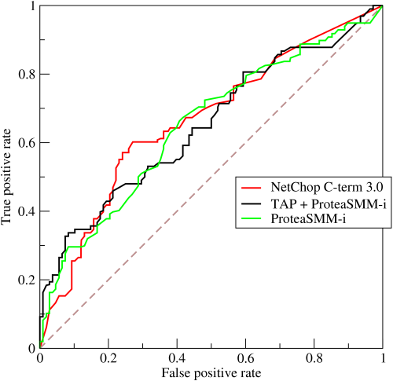

When you run a binary classifier over a population you get an estimate of the proportion of true positives in that population. This is known as the _prevalence_.

But that estimate is _biased_, because no classifier is perfect. For example, if your classifier tells you that you have 20% of positive cases, but its precision is known to be only 50%, you would expect the true prevalence to be $0.2 \\times 0.5 = 0.1$, i.e. 10%. But that's assuming perfect recall (all true positives are flagged by the classifier). If the recall is less than 1, then you know the classifier missed some true positives, so you _also_ need to normalize the prevalence estimate by the recall.

This leads to the common formula for getting the true prevalence $\\Pr(y=1)$ from the positive prediction rate $\\Pr(\\hat{y}=1)$:

$$  
\\Pr(y=1) = \\Pr(\\hat{y}=1) \\times \\frac{Precision}{Recall}  
$$

But suppose that you want to run the classifier more than once. For example, you might want to do this at regular intervals to detect trends in the prevalence. You can't use this formula anymore, because _precision depends on the prevalence_. To use the formula above you would have to re-estimate the precision regularly (say, with human eval), but [then you could just as well also re-estimate the prevalence itself](https://stats.stackexchange.com/questions/273237/estimating-prevalence-from-a-classifiers-precision-and-recall).

How do we get out of circular reasoning? It turns out that binary classifiers have other performance metrics (besides precision) that do not depend on the prevalence. These include not only the recall $R$ but also the specificity $S$, and these metrics can be used to adjust $\\Pr(\\hat{y}=1)$ to get an unbiased estimate of the true prevalence using this formula (sometimes called _prevalence adjustment_):

$$\\Pr(y=1) = \\frac{\\Pr(\\hat{y}=1) - (1 - S)}{R - (1 - S)}$$  
where:

- $\\Pr(y=1)$ is the true prevalence

- $S$ is the specificity

- $R$ is the sensitivity or recall

- $\\Pr(\\hat{y}=1)$ is the proportion of positives

The proof is straightforward:

$$  
\\begin{aligned}  
\\Pr(\\hat{y}=1) &= \\Pr(\\hat{y}=1, y = 1) + \\Pr(\\hat{y}=1, y = 0) \\\\  
&= \\Pr(\\hat{y}=1 | y = 1) \\times \\Pr(y = 1) + \\Pr(\\hat{y}=1 | y = 0) \\times \\Pr(y = 0) \\\\  
&= R \\times \\Pr(y = 1) + (1 - S) \\times (1 - Pr(y = 1))  
\\end{aligned}  
$$  
Solving for $\\Pr(y = 1)$ yields the formula above.

Notice that this formula breaks down when the denominator $R - (1 - S)$ becomes 0, or when recall becomes equal to the false positive rate $1-S$. But remember what a typical ROC curve looks like:



An ROC curve like this one plots recall $R$ (aka true positive rate) against the false positive rate $1-S$, so a classifier for which $R = (1-S)$ is a classifier falling on the diagonal of the ROC diagram. This is a classifier that is, essentially, guessing randomly. True cases and false cases are equally likely to be classified positively by this classifier, so the classifier is completely non-informative, and you can't learn anything from it--and certainly not the true prevalence.

Enough theory, let's see if this works in practice:

```r
# randomly draw some covariate
x <- runif(10000, -1, 1)

# take the logit and draw the outcome
logit <- plogis(x)
y <- runif(10000) < logit

# fit a logistic regression model  
m <- glm(y ~ x, family = binomial)

# make some predictions, using an absurdly low threshold
y_hat <- predict(m, type = "response") < 0.3

# get the recall (aka sensitivity) and specificity
c <- caret::confusionMatrix(factor(y_hat), factor(y), positive = "TRUE")
recall <- unname(c$byClass['Sensitivity'])
specificity <- unname(c$byClass['Specificity'])

# get the adjusted prevalence
(mean(y_hat) - (1 - specificity)) / (recall - (1 - specificity))

# compare with actual prevalence
mean(y)
```

In this simulation I get `recall = 0.049` and `specificity = 0.875`. The predicted prevalence is a ridiculously biased `0.087`, but the adjusted prevalence is essentially equal to the true prevalence (`0.498`).

To sum up: this shows how, using a classifier's recall and specificity, you can adjusted the predicted prevalence to track it over time, assuming that recall and specificity are stable over time. _You cannot do this using precision and recall_ because precision depends on the prevalence, whereas recall and specificity don't.
