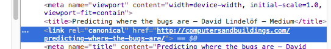

I'm the kind of guy who will take a veeeeery long time before making any kinds of decisions. Like whether to practice on Project Euler or working on my side project. Or, lately, whether to start blogging on Medium instead of my old Wordpress blog.

I'm obviously not the only one struggling over that question. judging by the number of posts found by Google seeking to answer that same question.

The most informative answer was provided, however, by the good folks at [ElegantThemes](https://www.elegantthemes.com/blog/resources/medium-vs-wordpress-where-should-your-blog-live). Little did I know that Medium provided such a good integration with WordPress, through their [Import tool](https://medium.com/p/import). When you write your blog post, simply copy/paste its URL to that tool's window and your post should appear in your Medium account too.

I tried it on one of my recent posts and the import went mostly well, except that one image didn't get imported at all and I had to insert it myself. Not a big deal; Medium will let you edit your imported story before publishing it. The other neat feature (and it really is a big thing) is that the story on Medium will get its so-called canonical link pointing to the story on your blog, and this is a huge win:

So in principle, there's no need to choose between Medium and WordPress and I'm going to stick to publishing on WordPress for a while. In fact, I'll test now the Medium plugin for Wordpress which supposedly will cross-post directly to Medium. If you read this on Medium, it worked.
